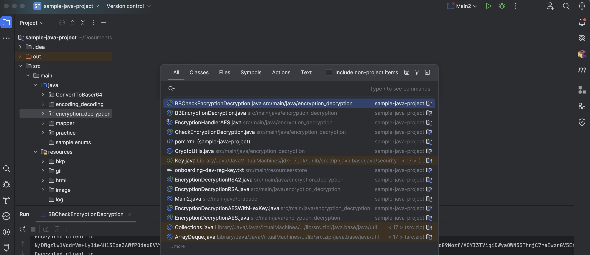
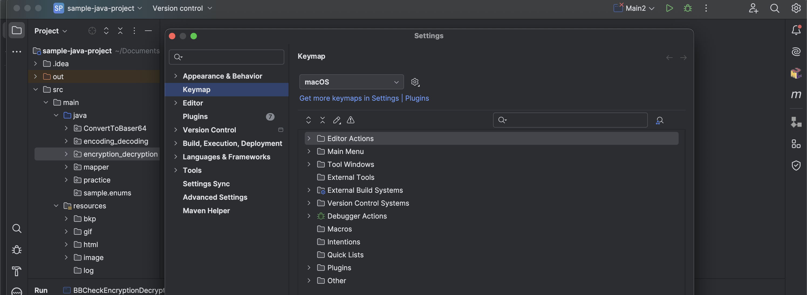
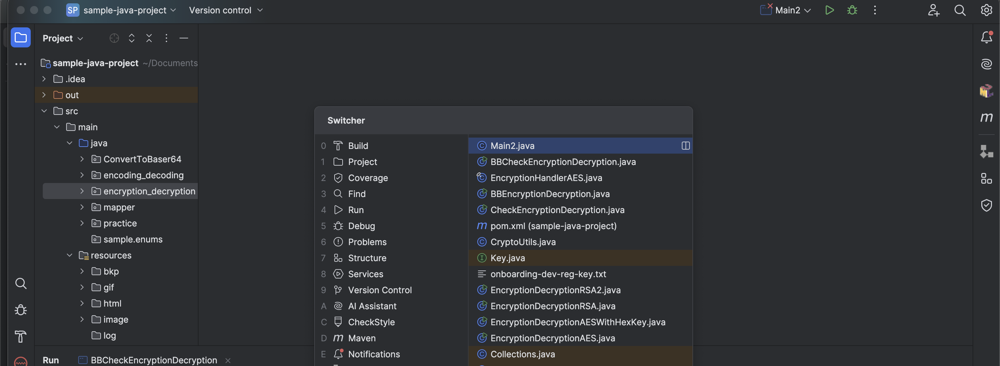

# Shortcuts for MAC

## 1. **General Shortcuts**

### **1.1 Search Everywhere**: `Shift` + `Shift`

Opens the universal search bar to find classes, files, actions, or symbols across the project.

<figure><figcaption></figcaption></figure>


**Classes:** A **class** in Java (or other languages supported by IntelliJ IDEA) is a blueprint for creating objects. It defines the properties and behaviors of objects through fields (variables) and methods.

**Examples in Java**: Customer, OrderService, ProductController

**Files:** Files include all the resources in your project, such as:

* Java files (`.java`)
* HTML files (`.html`)
* CSS files (`.css`)
* XML/JSON configuration files
* Any other type of file in your project directory.

**Examples**: `application.yml` (Spring configuration file),`index.html` (Frontend file), `pom.xml` (Maven configuration file)

**Actions:** Actions are operations or commands you can perform in IntelliJ IDEA. These include shortcuts to open windows, execute commands, refactor code, format code, etc.

**Examples of actions**: Reformat Code, Run Debug Configuration, Show Recent Files, Commit Changes

**Symbols:** Symbols include named elements within your code, such as:

* Methods
* Variables
* Constants
* Fields

**Examples in Java**: Methods: `calculateTotal()`, `fetchData()`,Variables: `int counter`, `String name` , Constants: `static final String APP_NAME`, Fields: `private double price;`


### **1.2 Open Settings/Preferences**: `Command` + `,`

Quickly opens the IntelliJ IDEA settings/preferences.

<figure><figcaption></figcaption></figure>

### **1.3 Switch Between Tabs**: `Control` + `Tab`

Shows the switcher to navigate between open files and tool windows.

<figure><figcaption></figcaption></figure>

### **1.4 Quick Documentation**: `F1`

Displays the documentation popup for the symbol at the caret.

<figure><figcaption></figcaption></figure>

### **1.5 Show Context Menu**: `Control` + `Space`

Opens the context menu at the caret.

<figure><figcaption></figcaption></figure>
