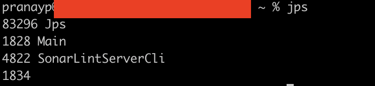
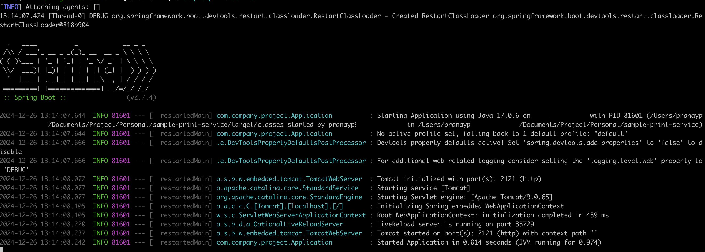
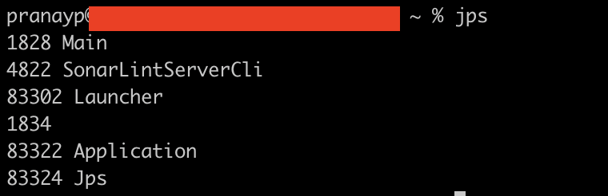
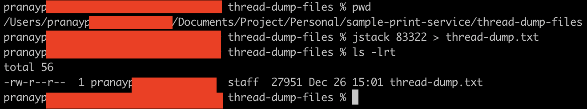

# jstack

## About

`jstack` is a JDK utility used to generate thread dumps of a Java process. A thread dump contains a snapshot of all the threads running in the Java Virtual Machine (JVM) at a given time. It is useful for diagnosing issues like deadlocks, high CPU usage, thread contention, or long-running threads.

## **Key Use Cases**

* Identifying thread contention and deadlocks.
* Debugging threads stuck in infinite loops or blocking states.
* Understanding CPU-bound threads or hung processes.

## **Steps to Use jstack on Mac**

### **1. Find the Process ID (PID):**

* Open the terminal and use the `jps` command to list all Java processes:

```bash
jps
```

Output example:

<figure><figcaption></figcaption></figure>

Start the Java Application (here it is sample-print-service maven springboot application)

<figure><figcaption></figcaption></figure>

`jps` command output is below

<figure><figcaption></figcaption></figure>

Here, `83322` is the PID of our Springboot app.

### **2. Generate a Thread Dump:**

* Run the `jstack` command with the PID to generate a thread dump:

```bash
jstack 83322 > thread-dump.txt
```

This saves the thread dump to a file named `thread-dump.txt` in the current directory.

<figure><figcaption></figcaption></figure>



### **3. Analyze the Thread Dump:**

* Open the `thread-dump.txt` file and look for:
  * `BLOCKED` or `WAITING` states indicating thread contention.
  * Deadlock information, which is explicitly mentioned if detected.
  * Long-running threads consuming resources.
