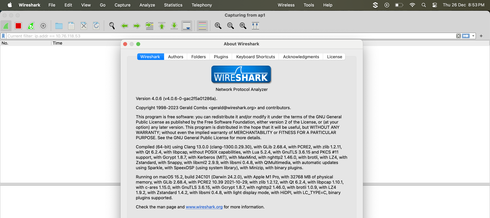

# Wireshark

## About

Wireshark is an open-source, cross-platform network protocol analyzer that captures and inspects data packets in real time. It allows users to see what is happening on their network at a granular level, making it an essential tool for network troubleshooting and analysis.

* **Developer**: Originally created by Gerald Combs in 1998, it is now maintained by the Wireshark team and community.
* **License**: GNU General Public License (GPL).
* **Platforms**: Available for Windows, macOS, Linux, and Unix-like systems.

<figure><figcaption></figcaption></figure>

## Installation

Refer to the official documentation for more details - [https://www.wireshark.org/docs/wsug\_html\_chunked/ChBuildInstallOSXInstall.html](https://www.wireshark.org/docs/wsug_html_chunked/ChBuildInstallOSXInstall.html)

## **Features**

Wireshark provides a wide array of features to aid in network analysis:

### **a) Packet Capture**

* Captures packets on wired or wireless networks in real time.
* Can capture data from various network interfaces (Ethernet, Wi-Fi, etc.).

### **b) Protocol Analysis**

* Supports hundreds of protocols (HTTP, HTTPS, TCP, UDP, FTP, DNS, etc.).
* Decodes protocols and displays them in human-readable formats.
* Updated frequently to include newer protocols.

### **c) Deep Packet Inspection**

* Displays packet details at multiple levels, including:
  * Physical layer (e.g., Ethernet frames).
  * Network layer (e.g., IP addresses).
  * Application layer (e.g., HTTP requests).

### **d) Filtering and Searching**

* **Display Filters**: Focus on specific packets (e.g., HTTP requests, traffic to/from specific IPs).
* **Capture Filters**: Control what data is captured (e.g., only packets on port 443).
* Powerful search functionality to locate packets quickly.

### **e) Packet Reassembly**

* Reassembles fragmented packets (e.g., TCP streams).
* Enables viewing of complete conversations, such as HTTP requests and responses.

### **f) Visualization**

* Graphical tools for visualizing data, such as:
  * Throughput graphs.
  * Round-trip time analysis.
  * IO graphs (Input/Output rates).

### **g) Exporting Data**

* Export captured packets in formats like pcap/pcapng for use in other tools.
* Supports exporting specific packet details as text, CSV, or XML.

### **h) Extensibility**

* Lua scripting support for custom dissectors and automated analysis.
* Integration with other tools (e.g., TShark, tcpdump).

## **Use Cases of Wireshark**

Wireshark is used in various scenarios, including:

### **a) Network Troubleshooting**

* Diagnose network performance issues (e.g., latency, dropped packets, bandwidth bottlenecks).
* Identify misconfigured devices or protocols.

### **b) Security Analysis**

* Detect malicious traffic (e.g., malware communication, DDoS attacks, ARP spoofing).
* Analyze vulnerabilities in encrypted traffic (e.g., SSL/TLS issues).

### **c) Protocol Debugging**

* Debug proprietary protocols.
* Test new implementations of standard protocols.

### **d) Network Education**

* Learn how networks and protocols function by analyzing packet-level communication.

### **e) Application Performance Monitoring**

* Track how applications interact with the network.
* Troubleshoot slow or failed connections.

## **How Wireshark Works ?**

Wireshark captures packets traveling over a network and dissects their headers and payloads for analysis.

### **a) Packet Capture Process**

1. **Traffic Interception**: Wireshark uses a packet capture library (e.g., WinPcap, Npcap) to intercept packets.
2. **Data Parsing**: Parses packet data and organizes it into protocol layers.
3. **Packet Storage**: Stores captured packets in memory or files for offline analysis.

### **b) Network Interfaces**

* Wireshark operates in **promiscuous mode**, capturing all packets passing through a network interface (not just those addressed to the device).

### **c) Packet Dissection**

* Breaks down packets into their protocol layers:
  * Physical layer (Ethernet headers, Wi-Fi signals).
  * Network layer (IP, ARP).
  * Transport layer (TCP, UDP).
  * Application layer (HTTP, DNS).
