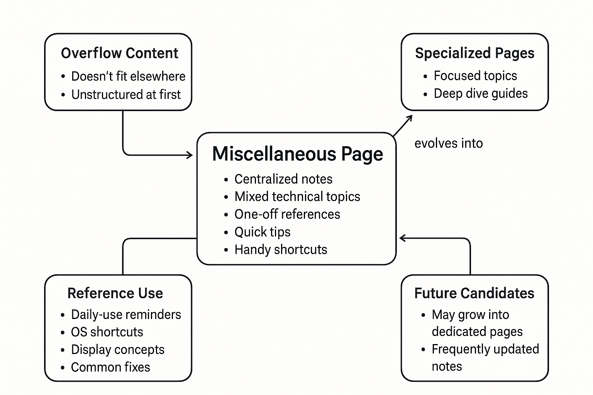

# Miscellaneous

## **About**

This page serves as a centralized hub for assorted topics and technical references that don't fit into a single focused category. It contains helpful notes, quick tips, conceptual explanations, and shortcuts that are frequently useful but not always easy to categorize under a specific domain.

Whether we are trying to recall a system shortcut, understand screen resolution terminology, or review technical quirks, this page is meant to be our all-in-one reference board.

<figure><figcaption></figcaption></figure>
