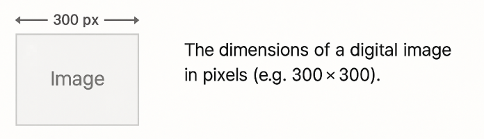

# Image

## About

A quick reference for common image-related concepts such as screen resolution, DPI vs PPI, viewport behavior, image formats, and best practices for responsive design and web optimization.

## **Image Size**

Image size refers to the actual **dimensions of an image** in terms of pixels—its width and height.

* A `1200×800` image has 1200 pixels in width and 800 in height.
* This size determines how much space it can occupy on a screen or within a container (like a div).
* It affects **file size**, **layout**, and **scaling behavior**.
* On screens, an image is rendered according to its pixel dimensions unless overridden by CSS.

**Real-World Examples:**

* A thumbnail may be `150×150` pixels.
* A blog header image could be `1600×600`.
* Facebook profile picture uses around `400×400` pixels.


People often equate **image size** with **file size**, but file size also depends on format and compression (e.g., PNG vs. JPEG).


<figure><figcaption></figcaption></figure>

## **Image Resolution**

Image resolution describes the **density of pixels per inch** (PPI or DPI), which is critical for printing and matters less for standard screens.

* **300 PPI** is ideal for high-quality print output.
* **72 PPI** is the de facto standard for digital use.
* Changing resolution affects **how large the image appears in physical units** when printed.

**Real-World Examples:**

* A `1200×800` image at 300 PPI prints at 4" × 2.67".
* The same image at 72 PPI prints at 16.7" × 11.1", but appears blurry.

**On Screens:**

High-DPI displays (like Retina) pack more pixels into the same physical space. So an image designed for a normal display may appear **blurry** on high-resolution screens unless scaled appropriately.

## **Viewport Size**

Viewport refers to the **visible area of a web page** inside the browser window, measured in CSS pixels. It defines the space available for rendering HTML, including images.

* Viewport size **changes with device and browser size**.
* Unlike screen resolution, which is physical and device-specific, viewport is **logical and layout-specific**.
* Critical for **responsive design** and **media queries**.

**Real-World Examples:**

* An iPhone with a native resolution of `1170×2532` may have a CSS viewport of `390×844`.
* A desktop browser resized to half the screen might have a viewport around `720×900`.
* Responsive layouts and image scaling (e.g., `width: 100%`) are based on viewport dimensions.


Viewport is not equal to screen resolution. A high-res screen can have a small logical viewport due to scaling.


<figure><figcaption></figcaption></figure>
