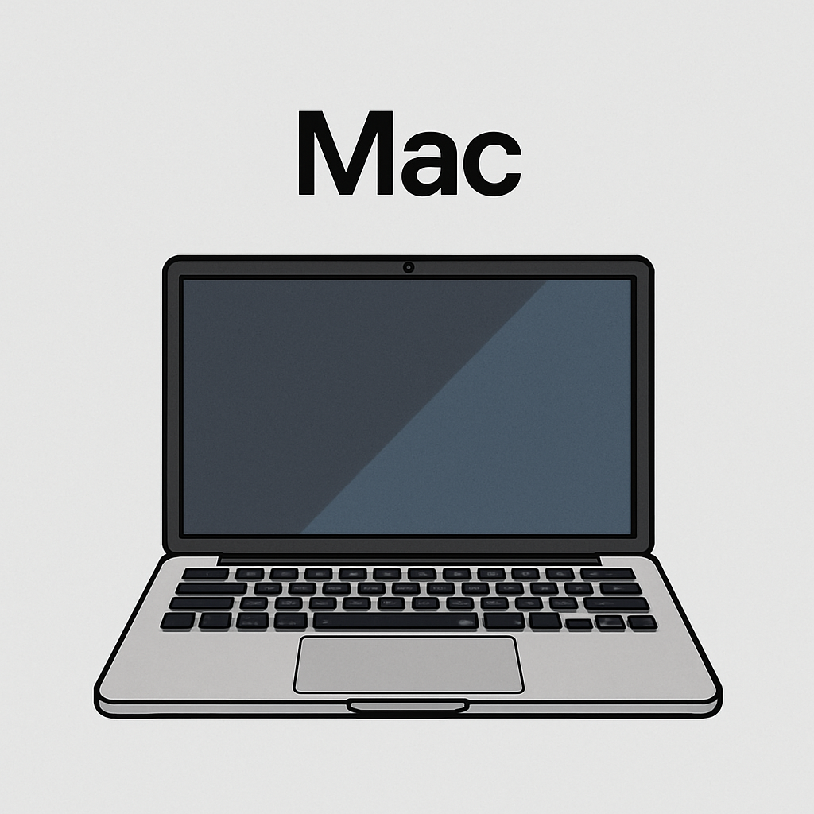

# Mac

## About

Subpages are dedicated space for capturing practical knowledge, shortcuts, and technical tips related to using and working efficiently with macOS.

Whether we are a developer, power user, or new to the Mac ecosystem, this section aims to provide concise, easy-to-follow notes that improve day-to-day productivity and solve common technical challenges.

<figure><figcaption></figcaption></figure>

## **MacOS Versions and Architectures**

<table data-full-width="true"><thead><tr><th width="175.7603759765625">macOS Version</th><th width="149.58331298828125">Version Number</th><th width="135.439208984375">Release Year</th><th width="214.6041259765625">Supported Architectures</th><th>Notes</th></tr></thead><tbody><tr><td><strong>macOS Sonoma</strong></td><td>14.x</td><td>2023</td><td>Apple Silicon (ARM), Intel</td><td>Latest as of 2025</td></tr><tr><td><strong>macOS Ventura</strong></td><td>13.x</td><td>2022</td><td>Apple Silicon, Intel</td><td>Improved Continuity features</td></tr><tr><td><strong>macOS Monterey</strong></td><td>12.x</td><td>2021</td><td>Apple Silicon, Intel</td><td>First full Apple Silicon support</td></tr><tr><td><strong>macOS Big Sur</strong></td><td>11.x</td><td>2020</td><td>Apple Silicon, Intel</td><td>Major redesign; Apple Silicon debut</td></tr><tr><td><strong>macOS Catalina</strong></td><td>10.15</td><td>2019</td><td>Intel only</td><td>Dropped support for 32-bit apps</td></tr><tr><td><strong>macOS Mojave</strong></td><td>10.14</td><td>2018</td><td>Intel only</td><td>Last to support 32-bit apps</td></tr><tr><td><strong>macOS High Sierra</strong></td><td>10.13</td><td>2017</td><td>Intel only</td><td>Metal 2 and APFS improvements</td></tr><tr><td><strong>macOS Sierra</strong></td><td>10.12</td><td>2016</td><td>Intel only</td><td>Introduced Siri on Mac</td></tr><tr><td><strong>OS X El Capitan</strong></td><td>10.11</td><td>2015</td><td>Intel only</td><td>Focused on stability</td></tr><tr><td><strong>OS X Yosemite</strong></td><td>10.10</td><td>2014</td><td>Intel only</td><td>Continuity features introduced</td></tr><tr><td><strong>OS X Mavericks</strong></td><td>10.9</td><td>2013</td><td>Intel only</td><td>First free macOS upgrade</td></tr><tr><td><strong>OS X Mountain Lion</strong></td><td>10.8</td><td>2012</td><td>Intel only</td><td>Gatekeeper introduced</td></tr><tr><td><strong>OS X Lion</strong></td><td>10.7</td><td>2011</td><td>Intel only</td><td>Mac App Store introduced</td></tr><tr><td><strong>OS X Snow Leopard</strong></td><td>10.6</td><td>2009</td><td>Intel (some PPC support early)</td><td>Transition from PowerPC to Intel</td></tr><tr><td><strong>OS X Leopard</strong></td><td>10.5</td><td>2007</td><td>PowerPC &#x26; Intel</td><td>Last to support PowerPC fully</td></tr><tr><td><strong>OS X Tiger</strong></td><td>10.4</td><td>2005</td><td>PowerPC (Intel support started late)</td><td>Spotlight introduced</td></tr></tbody></table>

## **Architectural Timeline Summary**

* **PowerPC (PPC)**: Used up to early Intel transition (Tiger/Leopard era).
* **Intel (x86-64)**: Main architecture from 2006 to 2020.
* **Apple Silicon (ARM64)**: Introduced in 2020 with macOS Big Sur; now the primary architecture for all new Macs.
