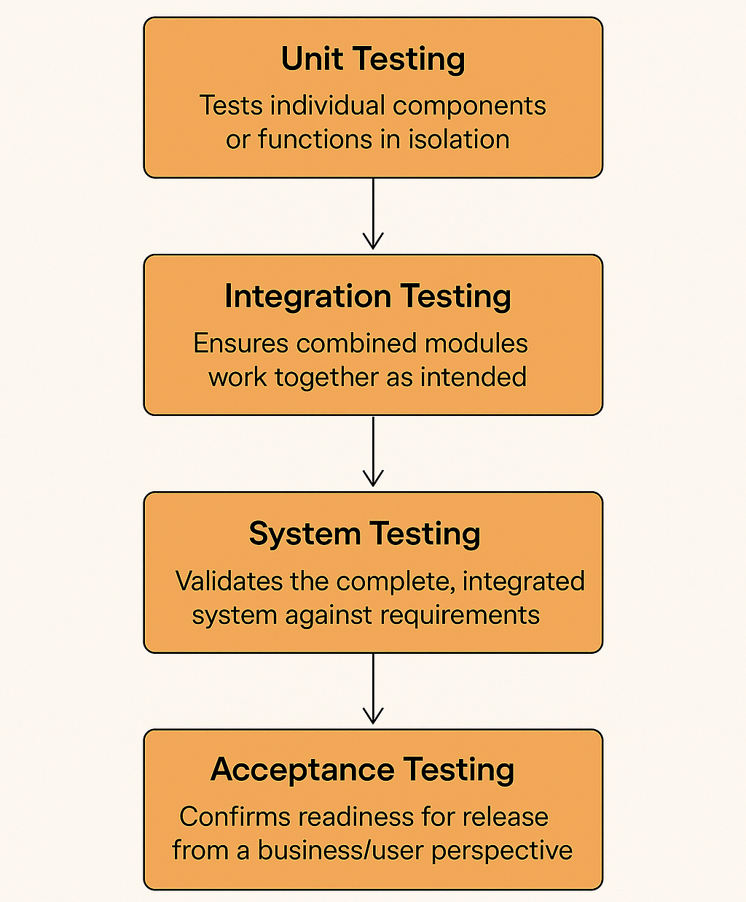

# Levels of Testing

## About

**Levels of Testing** define the structured stages at which software is verified for quality, starting from the smallest code units to the complete, ready-to-release product.

Each level focuses on a specific scope:

* At the **lowest level**, tests verify isolated units of code.
* In the **middle levels**, tests check how components interact and ensure the system behaves as expected end-to-end.
* At the **highest level**, tests validate that the system meets user and business requirements before release.

By progressing through these levels in sequence, defects can be caught early, isolated quickly, and fixed cost-effectively. This approach also ensures that testing efforts are layered, reducing the chance of major issues reaching production.

<figure><figcaption></figcaption></figure>

1. **Provides a Systematic Approach**\
   Organizing testing into levels ensures no part of the application is left unchecked, from individual functions to the user experience.
2. **Improves Defect Isolation**\
   Detecting issues at the earliest level possible helps pinpoint the root cause and minimizes debugging complexity.
3. **Reduces Cost of Fixing Bugs**\
   Issues caught during unit testing are far cheaper to fix than those found during acceptance or after release.
4. **Supports Incremental Quality Validation**\
   Each level builds confidence before moving to the next, ensuring stability before expanding the test scope.
5. **Aligns with Development and Release Cycles**\
   Testing levels map naturally to modern development workflows, from developer-written tests to stakeholder validation.
6. **Facilitates Communication**\
   Using clear level definitions allows teams, managers, and stakeholders to discuss testing coverage without confusion.

## The Four Core Levels

Although testing strategies can vary, most software projects follow four universally recognized levels. Each level expands the scope of verification, moving from small, isolated pieces of code to full business validation.

1. **Unit Testing**\
   Focuses on the smallest testable parts of an application, such as individual methods or classes.
   * Typically written and executed by developers.
   * Uses mocks or stubs to isolate dependencies.
   * Detects defects early, before integration.
2. **Integration Testing**\
   Verifies that individual components work together as intended.
   * Can be **component integration** (testing a small set of modules) or **system integration** (testing across subsystems).
   * Detects issues in data flow, API contracts, and inter-module communication.
3. **System Testing**\
   Validates the complete and integrated application against functional and non-functional requirements.
   * Runs in a production-like environment.
   * Covers end-to-end scenarios without bypassing any layers.
   * Ensures readiness for business validation.
4. **Acceptance Testing**\
   Confirms the system meets business needs and is ready for deployment.
   * **User Acceptance Testing (UAT)**: Conducted by business stakeholders or end users.
   * **Operational Acceptance Testing (OAT)**: Checks operational readiness such as backup/restore and failover.
   * May also include compliance or contractual acceptance.

## Relation to STLC

The **Software Testing Life Cycle (STLC)** defines the phases of planning, designing, executing, and closing tests. **Levels of Testing** map to STLC execution phases, ensuring quality is validated at the right time.

* **Planning Phase**\
  Testing levels are identified, their objectives defined, and entry/exit criteria established. For example, planning which features are covered in unit tests vs system tests.
* **Test Case Design Phase**\
  Test cases are prepared according to each level’s scope and objectives. Unit-level test cases are precise and isolated, while acceptance-level cases cover real-world workflows.
* **Execution Phase**\
  Testing proceeds in the logical order of levels: unit tests first, followed by integration, then system, and finally acceptance. This progression ensures that foundational issues are resolved before higher-level verification.
* **Closure Phase**\
  Reports summarize the results at each level, highlighting coverage, defects found, and overall quality status. This helps stakeholders make informed release decisions.

By aligning levels of testing with the STLC, teams ensure that quality checks are methodical, repeatable, and integrated into the overall development and release process.
