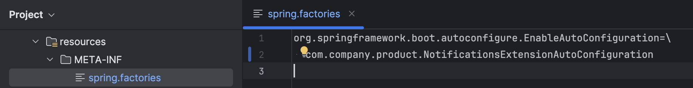

# spring.factories

## About

In **Spring Boot 2**, `spring.factories` is a special file located under `META-INF/` in a jar (or our project’s resources). It’s used to **register various Spring Boot infrastructure components**, especially for **auto-configuration**, **application context initializers**, **event listeners**, and more.

It is part of the **SpringFactoriesLoader** mechanism, which loads class names by reading this file.

## Where Is It Located?

We must place it under:

```
src/main/resources/META-INF/spring.factories
```

This file is included in our built JAR and used by Spring Boot during startup.

## Format of the File

It is a **key-value** pair format using fully qualified class names.

```properties
# Format:
<interface or annotation>=<implementation class 1>,<implementation class 2>,...

# Example for auto-configuration:
org.springframework.boot.autoconfigure.EnableAutoConfiguration=\
com.example.config.MyAutoConfiguration
```

Each key is a known **interface or annotation**, and the values are **implementations** of that key.'

<figure><figcaption></figcaption></figure>


* Spring Boot scans all `META-INF/spring.factories` from every dependency in the classpath.
* We **must not use comments (`#`) inside value lines**, only at the start of a line.
* We **must separate multiple classes with commas**, not line breaks (unless using backslashes `\` to continue a line).
* Spring Boot **merges** all `spring.factories` found across all jars — they are not overridden.


## Common Keys Used in `spring.factories`

<table data-full-width="true"><thead><tr><th width="566.0390625">Key</th><th>Purpose</th></tr></thead><tbody><tr><td><code>org.springframework.boot.autoconfigure.EnableAutoConfiguration</code></td><td>Registers auto-configuration classes</td></tr><tr><td><code>org.springframework.context.ApplicationListener</code></td><td>Registers application event listeners</td></tr><tr><td><code>org.springframework.context.ApplicationContextInitializer</code></td><td>Registers context initializers</td></tr><tr><td><code>org.springframework.boot.env.EnvironmentPostProcessor</code></td><td>Modifies the environment before context is created</td></tr><tr><td><code>org.springframework.boot.SpringApplicationRunListener</code></td><td>Hooks into the run lifecycle of SpringApplication</td></tr></tbody></table>

## When to Use `spring.factories`

Use it when:

* We're creating a reusable Spring Boot library/module
* We want to plug into Spring Boot's lifecycle without requiring users to manually configure anything
* We need to provide beans automatically based on conditions (classpath, properties, etc.)

## Examples with Spring Boot 2

### 1. `org.springframework.boot.autoconfigure.EnableAutoConfiguration`

#### Use Case

We are building a reusable library that should provide a bean automatically when certain conditions are met (e.g., class exists or a property is set).

#### Code Example

```java
// File: com.example.autoconfig.MyServiceAutoConfig.java
@Configuration
@ConditionalOnClass(MyService.class) // Only configures if MyService is on the classpath
public class MyServiceAutoConfig {

    @Bean
    public MyService myService() {
        return new MyService("Configured from AutoConfig!");
    }
}
```

```properties
# File: META-INF/spring.factories
org.springframework.boot.autoconfigure.EnableAutoConfiguration=\
com.example.autoconfig.MyServiceAutoConfig
```

* This auto-configuration will automatically register `MyService` **if** `MyService` is present.
* No need to annotate it with `@ComponentScan` or `@Import` manually.
* Widely used in Spring Boot starters.

### 2. `org.springframework.context.ApplicationListener`

#### Use Case

We want to run some code when specific Spring lifecycle events happen (like app context started, ready, closed, etc.).

#### Code Example

```java
// File: com.example.listeners.AppReadyLogger.java
public class AppReadyLogger implements ApplicationListener<ApplicationReadyEvent> {
    @Override
    public void onApplicationEvent(ApplicationReadyEvent event) {
        System.out.println("Application is fully started and ready!");
    }
}
```

```properties
org.springframework.context.ApplicationListener=\
com.example.listeners.AppReadyLogger
```

* This runs **after the application is fully initialized**.
* No need to register this bean manually—Spring picks it up automatically.

### 3. `org.springframework.context.ApplicationContextInitializer`

#### Use Case

We want to customize or register beans **before the Spring context is refreshed**.

#### Code Example

```java
// File: com.example.initializer.MyContextInitializer.java
public class MyContextInitializer implements ApplicationContextInitializer<ConfigurableApplicationContext> {
    @Override
    public void initialize(ConfigurableApplicationContext context) {
        System.out.println("Context is being initialized...");
        // We could register a bean or manipulate the context here
    }
}
```

```properties
org.springframework.context.ApplicationContextInitializer=\
com.example.initializer.MyContextInitializer
```

* This runs very early, before any beans are created.
* Useful to customize context or add profiles or property sources dynamically.

### 4. `org.springframework.boot.env.EnvironmentPostProcessor`

#### Use Case

We want to programmatically **add environment variables** or property sources **before anything loads**.

#### Code Example

```java
// File: com.example.env.AppNameSetter.java
public class AppNameSetter implements EnvironmentPostProcessor {
    @Override
    public void postProcessEnvironment(ConfigurableEnvironment environment, SpringApplication application) {
        environment.getSystemProperties().putIfAbsent("app.name", "CustomSpringBootApp");
    }
}
```

```properties
org.springframework.boot.env.EnvironmentPostProcessor=\
com.example.env.AppNameSetter
```

* Runs **before the context is created**.
* Use it to dynamically inject properties (from DB, vault, or logic).

### 5. `org.springframework.boot.SpringApplicationRunListener`

#### Use Case

We want to hook into the **entire Spring Boot lifecycle** — from starting to stopping.

#### Code Example

```java
// File: com.example.lifecycle.MyRunListener.java
public class MyRunListener implements SpringApplicationRunListener {

    // Mandatory constructor
    public MyRunListener(SpringApplication application, String[] args) {}

    @Override
    public void starting() {
        System.out.println("Spring Boot is starting...");
    }

    @Override
    public void started(ConfigurableApplicationContext context) {
        System.out.println("Context started.");
    }
}
```

```properties
org.springframework.boot.SpringApplicationRunListener=\
com.example.lifecycle.MyRunListener
```

* Requires a constructor with `(SpringApplication, String[])`
* Advanced hook—use sparingly for lifecycle-related logging or metrics

### Comparison

<table data-full-width="true"><thead><tr><th width="285.00390625">Key</th><th width="201.52734375">When It Runs</th><th width="180.14453125">Purpose</th><th>Common Use</th></tr></thead><tbody><tr><td><code>EnableAutoConfiguration</code></td><td>At startup</td><td>Auto-register beans</td><td>Used in starter libraries</td></tr><tr><td><code>ApplicationListener</code></td><td>On events</td><td>React to events</td><td>Notify, log, retry logic</td></tr><tr><td><code>ApplicationContextInitializer</code></td><td>Before context refresh</td><td>Customize context</td><td>Add profiles, log context info</td></tr><tr><td><code>EnvironmentPostProcessor</code></td><td>Before context creation</td><td>Inject properties</td><td>Read from vault, set defaults</td></tr><tr><td><code>SpringApplicationRunListener</code></td><td>Entire lifecycle</td><td>Monitor startup</td><td>Telemetry, custom logs</td></tr></tbody></table>

## Why and When to use `spring.factories` instead of `@Component` or `@Configuration`  ?

### When to Use `@Component` / `@Configuration`

These are ideal for **application code**, where:

* We **control the application startup**
* We are writing code **inside a Spring Boot project**
* We want Spring to discover the bean via **component scanning**

#### Example:

```java
@Component
public class MyService {}
```

Spring will pick it up if the class is in a package covered by `@SpringBootApplication`.

### When to Use `spring.factories`

Use it when we're building a **library**, **framework extension**, or **plugin** that needs to **auto-register beans or behaviors** **without the application developer doing anything**.

It allows:

* **Automatic registration** of beans/configurations across modules or JARs
* Avoiding the need for `@ComponentScan` in external modules
* Providing **conditional** configuration via `@ConditionalOn...` annotations
* Integrating **deeply into Spring Boot lifecycle** (e.g. env post-processors, listeners)

### Example

Imagine we're building a reusable **Starter** module like `my-logging-starter`.

#### If we use `@Component`

Spring **won’t scan it** unless the application explicitly scans your package.

#### If we use `spring.factories`

It just works when the library is on the classpath. No additional configuration required.

```properties
# META-INF/spring.factories
org.springframework.boot.autoconfigure.EnableAutoConfiguration=\
com.example.logging.LoggingAutoConfiguration
```

Now `LoggingAutoConfiguration` runs automatically.
