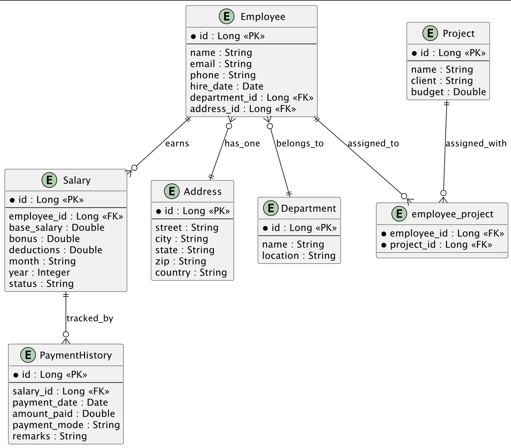

# Employee Portal

## About

A comprehensive, real-world Spring Boot application that simulates an enterprise-grade **Employee Management Portal**. This portal provides complete CRUD functionality and advanced data handling features such as:

* **Dynamic Filtering & Search**: Query employees based on multiple optional fields like name, department, role, salary range, and joining date.
* **Pagination & Sorting**: Efficient navigation through large datasets using Spring Data JPA’s built-in pagination and sorting capabilities.
* **Advanced Querying**: Incorporates JPQL, Criteria API, Native SQL, and Specifications to support dynamic and complex queries.
* **Projections**: Optimizes performance with interface-based, DTO-based, and nested projections.
* **Entity Relationships**: Demonstrates one-to-one, one-to-many, and many-to-many mappings with real-world relevance (e.g., Employee–Department, Employee–Projects).
* **Validation & Error Handling**: Ensures data integrity and returns meaningful status codes and error responses.
* **Transactional Operations**: Covers updates and bulk operations with transaction boundaries and concurrency control.
* **Performance Tuning**: Showcases best practices including fetch strategies, indexing hints, and caching options.

This example is designed to simulate real business requirements and demonstrate how to build scalable and maintainable persistence layers using **Spring Boot + Spring Data JPA + Hibernate**.

## Tools, Libraries & Technologies

* **Language**: Java 17+
* **Framework**: Spring Boot 3.x
* **Persistence**: Spring Data JPA with Hibernate (as JPA Provider)
* **Database**: Oracle Database 19c+
* **Build Tool**: Maven
* **REST**: Spring Web
* **Validation**: Jakarta Validation (Hibernate Validator)
* **Testing**: JUnit 5, Mockito, Testcontainers (for Oracle or H2)
* **IDE**: IntelliJ IDEA / Eclipse
* **Others**: Lombok (for reducing boilerplate)

## ER Diagram

<figure><figcaption></figcaption></figure>

<details>

<summary>Plant UML File</summary>

```
@startuml

' Entity: Employee
entity Employee {
  * id : Long <<PK>>
  --
  name : String
  email : String
  phone : String
  hire_date : Date
  department_id : Long <<FK>>
  address_id : Long <<FK>>
}

' Entity: Department
entity Department {
  * id : Long <<PK>>
  --
  name : String
  location : String
}

' Entity: Address
entity Address {
  * id : Long <<PK>>
  --
  street : String
  city : String
  state : String
  zip : String
  country : String
}

' Entity: Project
entity Project {
  * id : Long <<PK>>
  --
  name : String
  client : String
  budget : Double
}

' Join Table: employee_project (Many-to-Many)
entity employee_project {
  * employee_id : Long <<FK>>
  * project_id : Long <<FK>>
}

' Entity: Salary
entity Salary {
  * id : Long <<PK>>
  --
  employee_id : Long <<FK>>
  base_salary : Double
  bonus : Double
  deductions : Double
  month : String
  year : Integer
  status : String
}

' Entity: PaymentHistory
entity PaymentHistory {
  * id : Long <<PK>>
  --
  salary_id : Long <<FK>>
  payment_date : Date
  amount_paid : Double
  payment_mode : String
  remarks : String
}

' Relationships
Employee }o--|| Department : belongs_to
Employee }o--|| Address : has_one
Employee ||--o{ employee_project : assigned_to
Project ||--o{ employee_project : assigned_with
Employee ||--o{ Salary : earns
Salary ||--o{ PaymentHistory : tracked_by

@enduml
```

</details>

## Folder Structure

```apacheconf
com.company.employeeportal
│
├── config                  # Spring and application configuration (DataSource, Swagger, CORS, etc.)
│
├── constants               # Application-wide constants and enums
│
├── controller              # REST controllers for handling HTTP requests
│
├── dto                     # Data Transfer Objects for request/response bodies
│
├── entity                  # JPA entity classes (Employee, Department, Salary, etc.)
│
├── exception               # Custom exceptions and global exception handling
│
├── mapper                  # MapStruct or manual mappers (Entity <-> DTO)
│
├── repository              # Spring Data JPA repositories
│
├── service
│   ├── impl                # Implementations of service interfaces
│   └── spec                # JPA Specification classes for dynamic querying
│
├── util                    # Utility/helper classes (DateUtils, PaginationUtils, etc.)
│
├── validation              # Custom validators and annotation-based rules
│
└── payload                 # Generic API response structures (ApiResponse, PageResponse, etc.)
```


* We may optionally add a `security` package if the portal includes authentication/authorization.
* If internationalization is needed, add a `i18n` or `messages` package.
* If salary logic grows complex, you could even modularize it further with `salary`, `payroll`, or `finance` sub-packages under `service`, `controller`, `entity`, etc.


## Prerequisites

### Pom File

pom.xml

<pre class="language-xml"><code class="lang-xml"><strong>&#x3C;project xmlns="http://maven.apache.org/POM/4.0.0"
</strong>         xmlns:xsi="http://www.w3.org/2001/XMLSchema-instance"
         xsi:schemaLocation="http://maven.apache.org/POM/4.0.0 
                             http://maven.apache.org/xsd/maven-4.0.0.xsd">
    &#x3C;modelVersion>4.0.0&#x3C;/modelVersion>
    
    &#x3C;parent>
        &#x3C;groupId>org.springframework.boot&#x3C;/groupId>
        &#x3C;artifactId>spring-boot-starter-parent&#x3C;/artifactId>
        &#x3C;version>${spring.boot.version}&#x3C;/version>
        &#x3C;relativePath/>
    &#x3C;/parent>
    
    &#x3C;groupId>com.company&#x3C;/groupId>
    &#x3C;artifactId>employee-portal&#x3C;/artifactId>
    &#x3C;version>1.0.0&#x3C;/version>
    &#x3C;packaging>jar&#x3C;/packaging>

    &#x3C;properties>
        &#x3C;java.version>17&#x3C;/java.version>
        &#x3C;spring.boot.version>3.1.2&#x3C;/spring.boot.version>
    &#x3C;/properties>

    &#x3C;dependencies>
        &#x3C;!-- Spring Boot Starters -->
        &#x3C;dependency>
            &#x3C;groupId>org.springframework.boot&#x3C;/groupId>
            &#x3C;artifactId>spring-boot-starter-web&#x3C;/artifactId>
        &#x3C;/dependency>
        
        &#x3C;dependency>
            &#x3C;groupId>org.springframework.boot&#x3C;/groupId>
            &#x3C;artifactId>spring-boot-starter-data-jpa&#x3C;/artifactId>
        &#x3C;/dependency>

        &#x3C;!-- Oracle JDBC -->
        &#x3C;dependency>
            &#x3C;groupId>com.oracle.database.jdbc&#x3C;/groupId>
            &#x3C;artifactId>ojdbc8&#x3C;/artifactId>
            &#x3C;version>19.3.0.0&#x3C;/version>
        &#x3C;/dependency>

        &#x3C;!-- Lombok -->
        &#x3C;dependency>
            &#x3C;groupId>org.projectlombok&#x3C;/groupId>
            &#x3C;artifactId>lombok&#x3C;/artifactId>
            &#x3C;optional>true&#x3C;/optional>
        &#x3C;/dependency>

        &#x3C;!-- Bean Validation -->
        &#x3C;dependency>
            &#x3C;groupId>jakarta.validation&#x3C;/groupId>
            &#x3C;artifactId>jakarta.validation-api&#x3C;/artifactId>
        &#x3C;/dependency>

        &#x3C;!-- MapStruct -->
        &#x3C;dependency>
            &#x3C;groupId>org.mapstruct&#x3C;/groupId>
            &#x3C;artifactId>mapstruct&#x3C;/artifactId>
            &#x3C;version>1.5.5.Final&#x3C;/version>
        &#x3C;/dependency>

        &#x3C;!-- Swagger/OpenAPI -->
        &#x3C;dependency>
            &#x3C;groupId>org.springdoc&#x3C;/groupId>
            &#x3C;artifactId>springdoc-openapi-starter-webmvc-ui&#x3C;/artifactId>
            &#x3C;version>2.1.0&#x3C;/version>
        &#x3C;/dependency>

        &#x3C;!-- Test -->
        &#x3C;dependency>
            &#x3C;groupId>org.springframework.boot&#x3C;/groupId>
            &#x3C;artifactId>spring-boot-starter-test&#x3C;/artifactId>
            &#x3C;scope>test&#x3C;/scope>
        &#x3C;/dependency>
    &#x3C;/dependencies>
&#x3C;/project>
</code></pre>

### Application Properties File

application.properties

```properties
spring.datasource.url=jdbc:oracle:thin:@localhost:1521:xe
spring.datasource.username=your_oracle_user
spring.datasource.password=your_password
spring.datasource.driver-class-name=oracle.jdbc.OracleDriver

spring.jpa.hibernate.ddl-auto=none
spring.jpa.show-sql=true
spring.jpa.database-platform=org.hibernate.dialect.Oracle12cDialect

server.port=8080
```

### Main Class File

EmployeePortalApplication.java&#x20;

```java
package com.company.employeeportal;

import org.springframework.boot.SpringApplication;
import org.springframework.boot.autoconfigure.SpringBootApplication;

@SpringBootApplication
public class EmployeePortalApplication {
    public static void main(String[] args) {
        SpringApplication.run(EmployeePortalApplication.class, args);
    }
}
```

### Entity Class Files

#### Employee.java

```java
@Entity
@Table(name = "employees")
@Data
@NoArgsConstructor
@AllArgsConstructor
public class Employee {

    @Id
    @GeneratedValue(strategy = GenerationType.IDENTITY)
    private Long id;

    private String name;
    private String email;
    private String phone;

    @Temporal(TemporalType.DATE)
    private Date hireDate;

    @ManyToOne
    @JoinColumn(name = "department_id", nullable = false)
    private Department department;

    @OneToOne(cascade = CascadeType.ALL)
    @JoinColumn(name = "address_id", referencedColumnName = "id")
    private Address address;

    @ManyToMany
    @JoinTable(
        name = "employee_project",
        joinColumns = @JoinColumn(name = "employee_id"),
        inverseJoinColumns = @JoinColumn(name = "project_id")
    )
    private Set<Project> projects = new HashSet<>();

    @OneToMany(mappedBy = "employee", cascade = CascadeType.ALL, orphanRemoval = true)
    private List<Salary> salaries = new ArrayList<>();
}
```

#### Department.java

```java
javaCopyEdit@Entity
@Table(name = "departments")
@Data
@NoArgsConstructor
@AllArgsConstructor
public class Department {

    @Id
    @GeneratedValue(strategy = GenerationType.IDENTITY)
    private Long id;

    private String name;
    private String location;

    @OneToMany(mappedBy = "department")
    private List<Employee> employees = new ArrayList<>();
}
```

#### Address.java

```java
@Entity
@Table(name = "addresses")
@Data
@NoArgsConstructor
@AllArgsConstructor
public class Address {

    @Id
    @GeneratedValue(strategy = GenerationType.IDENTITY)
    private Long id;

    private String street;
    private String city;
    private String state;
    private String zip;
    private String country;

    @OneToOne(mappedBy = "address")
    private Employee employee;
}
```

#### Project.java

```java
@Entity
@Table(name = "projects")
@Data
@NoArgsConstructor
@AllArgsConstructor
public class Project {

    @Id
    @GeneratedValue(strategy = GenerationType.IDENTITY)
    private Long id;

    private String name;
    private String client;
    private Double budget;

    @ManyToMany(mappedBy = "projects")
    private Set<Employee> employees = new HashSet<>();
}
```

#### Salary.java

```java
@Entity
@Table(name = "salaries")
@Data
@NoArgsConstructor
@AllArgsConstructor
public class Salary {

    @Id
    @GeneratedValue(strategy = GenerationType.IDENTITY)
    private Long id;

    @ManyToOne
    @JoinColumn(name = "employee_id", nullable = false)
    private Employee employee;

    private Double baseSalary;
    private Double bonus;
    private Double deductions;
    private String month;
    private Integer year;
    private String status;

    @OneToMany(mappedBy = "salary", cascade = CascadeType.ALL, orphanRemoval = true)
    private List<PaymentHistory> paymentHistories = new ArrayList<>();
}
```

#### PaymentHistory.java

```java
@Entity
@Table(name = "payment_history")
@Data
@NoArgsConstructor
@AllArgsConstructor
public class PaymentHistory {

    @Id
    @GeneratedValue(strategy = GenerationType.IDENTITY)
    private Long id;

    @ManyToOne
    @JoinColumn(name = "salary_id", nullable = false)
    private Salary salary;

    @Temporal(TemporalType.DATE)
    private Date paymentDate;

    private Double amountPaid;
    private String paymentMode;
    private String remarks;
}
```


The `employee_project` table is a **join table** handled implicitly by the `@ManyToMany` mappings in both `Employee` and `Project`, so no separate entity is required unless we want to add extra fields (like assignment date).


