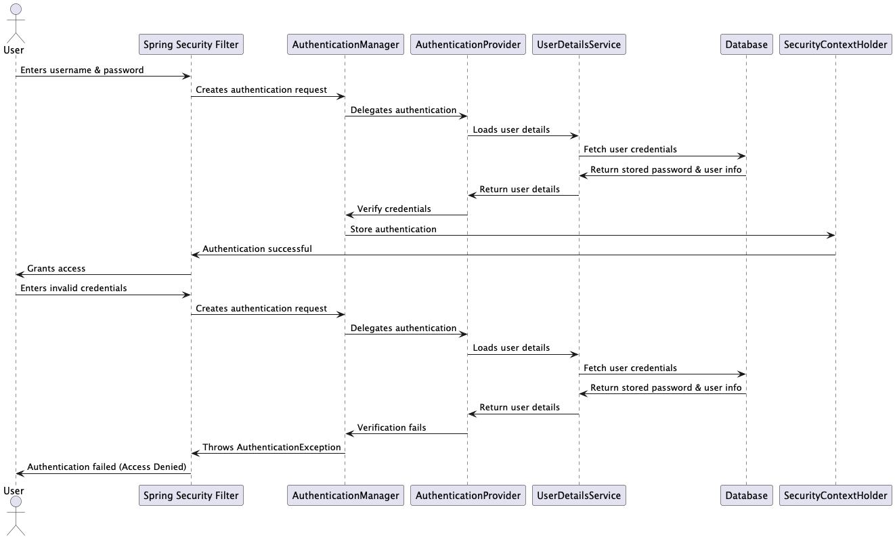

# Authentication

## About

Authentication is the **process of verifying the identity** of a user or system before granting access. It ensures that the user is who they claim to be by checking credentials such as:

* **Username & password** (most common method)
* **Token-based authentication** (e.g., JWT, OAuth2)
* **Multi-factor authentication (MFA)** (e.g., OTP, fingerprint, etc.)

**Example**

* If we log in to a website using our email and password, authentication verifies whether our credentials are correct.
* If correct → We are authenticated and granted access.
* If incorrect → Access is denied.

## **How Authentication Flow Works**

Let’s break down how authentication works in simple terms -

1. User provides credentials (e.g., username/password in a login form).
2. Spring Security intercepts the request and checks for authentication.
3. AuthenticationManager verifies credentials using an Authentication Provider (e.g., DAOAuthenticationProvider).
4. UserDetailsService loads user details from a database (if required).
5. PasswordEncoder checks if the password matches (e.g., BCrypt).
6. If successful, a Security Context is created, and the user is marked as authenticated.
7. User gains access to the requested resource.
8. If authentication fails, Spring Security denies access.

<figure><figcaption></figcaption></figure>

## **Authentication & Authorization**

<table><thead><tr><th width="143">Feature</th><th width="245">Authentication</th><th>Authorization</th></tr></thead><tbody><tr><td><strong>What it does</strong></td><td>Confirms who you are</td><td>Confirms what you can do</td></tr><tr><td><strong>Purpose</strong></td><td>Identity verification</td><td>Access control</td></tr><tr><td><strong>Example</strong></td><td>Logging into a website</td><td>Checking if you can access an admin panel</td></tr><tr><td><strong>Data used</strong></td><td>Username, password, tokens</td><td>Roles, permissions</td></tr><tr><td><strong>Enforced by</strong></td><td>AuthenticationManager</td><td>Access Control mechanisms (like roles &#x26; permissions)</td></tr></tbody></table>


**Authentication**: You log in with a password to your bank’s website.

**Authorization**: After logging in, you can only view your own bank account, not someone else’s.


## **How Spring Security Handles Authentication**

Spring Security provides a built-in authentication system that works as follows -

1. Intercepts authentication requests using filters.
2. Delegates authentication to an AuthenticationManager.
3. Validates credentials via Authentication Providers.
4. Stores authentication details in SecurityContextHolder.
5. Manages user sessions & permissions.

Spring Security supports multiple authentication methods, including -

* Form-based login
* HTTP Basic Authentication
* JWT-based authentication
* OAuth2 & OpenID Connect
* Multi-factor authentication

## **Custom Authentication Providers in Spring Security**

By default, Spring Security uses `DaoAuthenticationProvider` to authenticate users against a database.

However, we can create a **custom authentication provider** when -

* Authenticating users via an **external system** (e.g., LDAP, OAuth, API).
* Using a **custom password verification logic**.
* Handling **multi-factor authentication (MFA)**.
