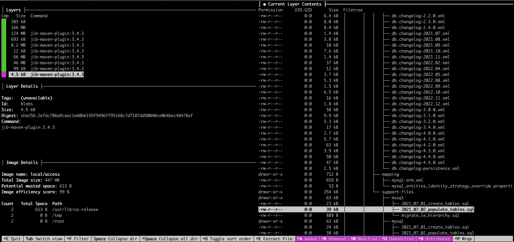
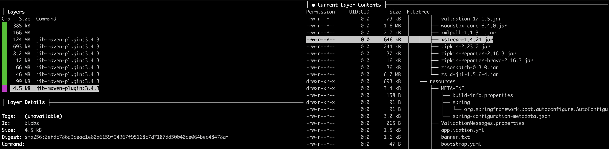

# Inspecting Docker Images

## About

When building Spring Boot applications for containerized deployment, it's common to package them as Docker images. But the way these images are built and what they contain can greatly impact performance, security, and maintainability.

**Inspecting Docker images** involves analyzing the image’s internal structure: its layers, file system, configuration metadata, embedded application artifacts (like JARs), and runtime setup. Tools like `dive`, `docker history`, and `docker inspect` allow developers to gain visibility into how Spring Boot applications are built and shipped in container form.

## Why It Matters ?

* **Understand What Goes Inside**: A Spring Boot image often includes our application JAR, dependencies, configs, and even a base OS. Inspection helps verify what’s actually packaged.
* **Optimize Image Layers**: Avoid unnecessary bloat caused by repetitive or misplaced build steps (e.g., `COPY` commands, Maven caches).
* **Troubleshooting & Debugging**: Pinpoint missing files, misconfigured entrypoints, or wrong permissions inside the image.
* **Security Auditing**: Check for unexpected tools, leftover secrets, or outdated libraries.
* **CI/CD Confidence**: Verifies whether final production images match expectations set in Dockerfiles or Jib builds.

## What to Look For During Inspection of a Spring Boot Docker Image ?

<table data-header-hidden data-full-width="true"><thead><tr><th width="169.33245849609375"></th><th></th><th></th></tr></thead><tbody><tr><td><strong>Aspect</strong></td><td><strong>What to Look For</strong></td><td><strong>Why It Matters / Use Case</strong></td></tr><tr><td><strong>Application JAR</strong></td><td>Is the JAR file (e.g., <code>hello-springboot.jar</code>) present in the expected path like <code>/app</code> or <code>/target</code>?</td><td>Validates that the build and copy steps succeeded. Missing JAR means the app won’t run at all.</td></tr><tr><td><strong>Configuration Files</strong></td><td>Are <code>application.properties</code> or <code>application.yml</code> files included? Are they in the right directory?</td><td>If these files are missing, environment-specific configs (DB URL, ports, etc.) won't be picked up.</td></tr><tr><td><strong>Liquibase / Flyway Migrations</strong></td><td>Check if migration scripts (e.g., <code>db/changelog.xml</code>) are copied into the image.</td><td>Without these, Liquibase or Flyway will fail silently or at runtime due to missing migration files.</td></tr><tr><td><strong>Secrets or Credentials</strong></td><td>Are there any <code>.env</code>, <code>.pem</code>, or credentials accidentally copied?</td><td>Avoid leaking secrets into images. They should be injected via environment variables at runtime instead.</td></tr><tr><td><strong>Layer Size</strong></td><td>Which layer adds the most size? Are there any large, unnecessary files?</td><td>Identifies optimization opportunities. For example, Maven cache might get added if <code>.dockerignore</code> is misconfigured.</td></tr><tr><td><strong>Base Image</strong></td><td>What is the base image used (e.g., <code>openjdk</code>, <code>eclipse-temurin</code>, <code>distroless</code>)?</td><td>Affects image size, startup time, and security posture. Distroless or slim images are better for production.</td></tr><tr><td><strong>Permissions</strong></td><td>Are file permissions and ownership correct (e.g., non-root user)?</td><td>Running apps as root is a security risk. Inspect <code>/home/nonroot</code> or UID/GID mappings.</td></tr><tr><td><strong>Entrypoint / CMD</strong></td><td>Is <code>ENTRYPOINT ["java", "-jar", "app.jar"]</code> correctly defined?</td><td>Ensures that the app starts automatically when the container is run.</td></tr><tr><td><strong>Unwanted Files</strong></td><td>Are <code>.git</code>, <code>test/</code>, <code>target/</code>, <code>.idea</code>, or <code>node_modules</code> present in final image?</td><td>These should be excluded using <code>.dockerignore</code>. Including them increases size and leaks internal structure.</td></tr><tr><td><strong>Healthcheck or Labels</strong></td><td>Are labels like <code>maintainer</code>, <code>version</code>, or healthcheck metadata added?</td><td>Helps in managing images during deployment and monitoring.</td></tr><tr><td><strong>Build Artifacts</strong></td><td>Is Maven or Gradle cache included?</td><td>May unnecessarily inflate image size; should be kept in builder stage only.</td></tr></tbody></table>

## Using Dive to Explore Spring Boot Docker Images

To deeply inspect the internals of our Spring Boot Docker image such as layer-by-layer file changes, image composition, and efficiency the tool **Dive** is highly recommended.

Dive provides a terminal-based interface to:

* View each image layer and what it adds or removes
* Analyze the image’s file system at any layer
* Identify redundant or bloated layers (e.g., Maven caches, test files)
* Detect config file locations, application JAR placement, and more
* Measure image efficiency, especially in multi-stage builds

This is especially useful when we want to:

* Ensure our `application.properties`, Liquibase scripts, and compiled JAR are properly placed
* Confirm that unwanted artifacts (e.g., `.git`, `.class` files, temp logs) are excluded
* Debug runtime issues caused by misconfigured or missing files

Refer to the Page for more details - [use-case.md](../../containers-and-orchestration/container-runtimes-and-tools/docker/tools-and-utilities/dive/use-case.md "mention")

<figure><figcaption></figcaption></figure>

<figure><figcaption></figcaption></figure>


After inspecting the image, proper classpath updates can be done to locate the appropriate configuration files

\['-cp','/app/WEB-INF/classes:/app/WEB-INF/lib/_:/app/classes:/app/libs/_:/app/resources/','-Dlogging.level.liquibase=DEBUG']

