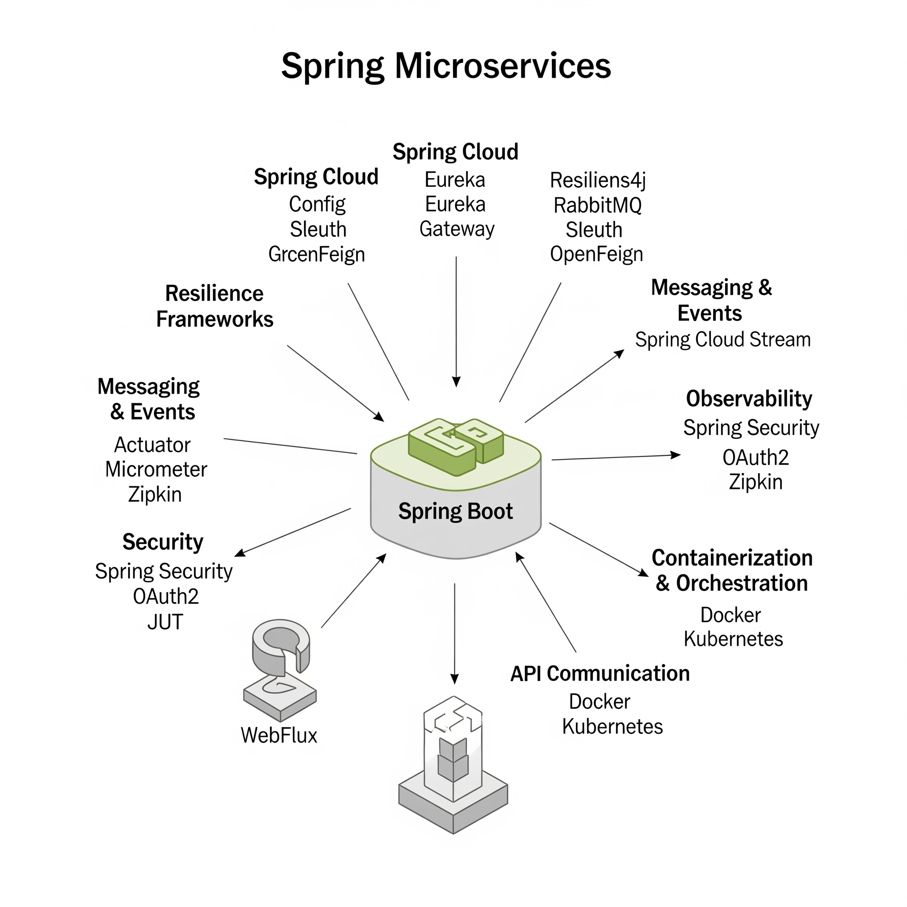

# Microservices

## About Spring Microservices

Spring Microservices refers to building and managing small, independent, and loosely coupled services using the Spring ecosystem. Leveraging frameworks like **Spring Boot** and **Spring Cloud**, developers can design modular applications that can be developed, deployed, and scaled independently.

Unlike traditional monolithic applications, Spring Microservices promote agility, allowing teams to iterate faster and adapt to changing business requirements. The Spring framework provides a comprehensive set of tools and integrations that simplify common microservice challenges such as service discovery, configuration management, fault tolerance, and distributed tracing.

This approach is especially popular in cloud-native application development, where services often run in containerized environments and need to communicate seamlessly and reliably.

## Spring vs Traditional Monolithic Development

In monolithic applications, all components (UI, business logic, data access) are packaged into a single deployment unit. While this is simpler to start with, it becomes harder to maintain, scale, and deploy as complexity grows.

Spring microservices solve these issues by:

* Breaking the application into smaller services that evolve independently.
* Reducing deployment risk since changes affect only one service at a time.
* Allowing teams to work in parallel without stepping on each other’s code.

## Why Spring for Microservices ?

Spring is particularly well-suited for microservices because:

* **Spring Boot** streamlines service creation, auto-configures dependencies, and embeds servers (Tomcat, Jetty, Netty).
* **Spring Cloud** provides production-ready tools for distributed systems - service discovery (Eureka), configuration management (Spring Cloud Config), API gateway (Spring Cloud Gateway), and resilience patterns (Hystrix, Resilience4j).
* **Integration with cloud platforms** like Kubernetes, AWS, Azure, and GCP is seamless.
* **Active community and ecosystem** ensure constant updates, security patches, and evolving best practices.

## Core Components & Frameworks

A successful **Spring-based microservices architecture** is built upon a combination of **core Spring modules** and supporting frameworks. Each component addresses a specific challenge in designing, building, and running distributed services.

Spring’s modular approach means we can **adopt only what we need**, while still benefiting from seamless integration between components.

<figure><figcaption></figcaption></figure>

#### **1. Spring Boot – Service Foundation**

Simplifies microservice creation by providing defaults, embedded servers, and auto-configuration.

* **Key Features**
  * **Auto Configuration** – Reduces boilerplate configuration for data sources, web servers, and security.
  * **Embedded Servers** – Bundles Tomcat, Jetty, or Netty directly in the service JAR/WAR for easy deployment.
  * **Production Ready** – Metrics, health checks, and application info endpoints via Spring Boot Actuator.
* **Why It’s Important in Microservices**
  * Fast startup time for independent services.
  * Self-contained deployments without external server dependencies.
  * Compatible with containerized environments like Docker and Kubernetes.

#### **2. Spring Cloud – Distributed System Toolkit**

* **Purpose:** Provides tools for **service coordination**, **configuration**, **resilience**, and **communication**.
* **Key Modules**
  * **Spring Cloud Config** – Centralized configuration management.
  * **Spring Cloud Netflix (Eureka)** – Service discovery and registration.
  * **Spring Cloud Gateway** – API gateway for routing, aggregation, and filtering requests.
  * **Spring Cloud LoadBalancer** – Client-side load balancing.
  * **Spring Cloud Sleuth** – Distributed tracing.
  * **Spring Cloud OpenFeign** – Declarative REST clients.
* **Why It’s Important**
  * Reduces the complexity of implementing common microservice patterns.
  * Ensures services can discover and communicate with each other reliably.
  * Helps maintain observability across distributed components.

#### **3. Resilience Frameworks**

* **Resilience4j** (modern) and **Hystrix** (legacy Netflix OSS):
  * Circuit breakers to prevent cascading failures.
  * Retry and fallback mechanisms.
  * Rate limiting and bulkhead isolation.
* **Importance**
  * Keeps the system stable under partial failures.
  * Improves fault tolerance and recovery times.

#### **4. Messaging & Event-Driven Tools**

* **Spring Kafka / RabbitMQ Integration:**
  * Enables asynchronous communication between services.
  * Useful for decoupling and scaling event-driven workflows.
* **Spring Cloud Stream**
  * Abstracts messaging middleware behind a unified programming model.
* **Importance**
  * Improves scalability.
  * Allows services to communicate without tight request-response dependencies.

#### **5. Observability Tools**

* **Spring Boot Actuator**
  * Exposes health checks, metrics, and monitoring endpoints.
* **Spring Cloud Sleuth + Zipkin / OpenTelemetry**
  * Enables distributed tracing for cross-service request tracking.
* **Micrometer**
  * Metrics instrumentation compatible with Prometheus, Grafana, and others.
* **Importance**
  * Makes debugging distributed systems possible.
  * Provides performance insights to guide scaling decisions.

#### **6. Security Modules**

* **Spring Security**
  * Authentication and authorization for microservices.
  * Supports OAuth2, JWT, and custom authentication mechanisms.
* **Spring Cloud Security**
  * Integration for securing service-to-service communication.
* **Importance**
  * Protects APIs and data.
  * Ensures compliance with security regulations.

#### **7. API Communication Tools**

* **Spring Web (REST)**
  * Build RESTful services quickly.
* **Spring WebFlux**
  * Reactive programming support for high-concurrency scenarios.
* **Spring Cloud OpenFeign**
  * Simplifies HTTP client creation with annotations.
* **Importance**
  * Offers flexibility between synchronous and asynchronous communication patterns.

#### **8. Containerization & Orchestration Support**

* **Spring Boot with Docker**
  * Simple Dockerfile creation for services.
* **Kubernetes + Spring Cloud Kubernetes**
  * Auto-configuration for config maps, service discovery, and load balancing in K8s environments.
* **Importance**
  * Enables deployment at scale with cloud-native infrastructure.

A **Spring Microservices project** typically combines these frameworks to form a **complete ecosystem** where each service:

* Runs independently.
* Can scale based on demand.
* Is observable, secure, and resilient.

## Benefits

Using Spring Microservices offers several advantages that make it a popular choice for building modern applications:

* **Scalability:** Individual microservices can be scaled independently based on demand, optimizing resource usage.
* **Flexibility:** Developers can choose different technologies or databases for each microservice, as Spring supports polyglot architectures.
* **Faster Development:** Spring Boot’s auto-configuration and Spring Cloud’s ready-made solutions speed up the development lifecycle.
* **Resilience:** Built-in support for circuit breakers and fault tolerance improves overall system stability.
* **Ease of Deployment:** Spring microservices can be packaged as lightweight containers, simplifying cloud and container platform deployments.
* **Improved Maintainability:** Smaller, modular codebases are easier to manage, test, and update without impacting the entire system.
* **Rich Ecosystem:** The vast Spring ecosystem provides integrations and tools to handle security, monitoring, messaging, and more.

These benefits collectively empower teams to deliver robust, agile, and scalable applications aligned with modern software delivery practices.

## Challenges

While Spring Microservices offer many advantages, they also come with their own set of challenges that teams must be prepared to address:

* **Increased Complexity:** Managing multiple independent services requires careful design, orchestration, and monitoring.
* **Distributed System Issues:** Handling network latency, fault tolerance, and data consistency across services adds complexity.
* **Deployment Overhead:** Coordinating deployment, versioning, and rollback across many microservices can be challenging.
* **Testing Difficulties:** Integration and end-to-end testing become more complicated due to service dependencies.
* **Security Risks:** Securing communication between services and managing distributed authentication needs thorough attention.
* **Operational Demands:** Monitoring, logging, and tracing distributed services require additional tooling and expertise.
* **Learning Curve:** Mastering the Spring ecosystem and microservice concepts demands investment in time and training.

Recognizing and addressing these challenges early helps teams design better solutions and leverage Spring Microservices effectively.

## Importance of Learning

In the modern software landscape, the ability to design, build, and maintain **microservice-based systems** is no longer an optional skill - it’s a **core competency** for backend developers, solution architects, and DevOps engineers. With Spring being one of the most widely adopted Java frameworks in the world, mastering **Spring Microservices** has both immediate and long-term career and project benefits.

#### **1. Industry Adoption and Demand**

Microservices have moved beyond being a trend - they are now the **standard architecture** for large-scale enterprise applications.

* **Tech giants** like Netflix, Amazon, and Uber use microservices to handle massive user bases and dynamic workloads.
* **Financial institutions** adopt microservices to modernize legacy systems while meeting strict compliance requirements.
* **Startups** rely on microservices for faster time-to-market and the ability to pivot quickly.

The job market reflects this adoption - Spring Boot and Spring Cloud are among the **most requested skills** in backend developer job descriptions.

#### **2. Career Growth**

* **Competitive Edge** – Proficiency in Spring Microservices differentiates developers in interviews and promotions.
* **Versatility** – Skills transfer easily across industries such as finance, healthcare, logistics, e-commerce, and streaming.
* **Leadership Potential** – Understanding distributed systems enables us to design architectures rather than only implementing modules.

#### **3. Scalability and Performance in Projects**

Modern applications must handle **millions of requests per day** and still maintain low latency. Microservices allow:

* Horizontal scaling of individual services without over-provisioning the whole system.
* Fine-tuned performance optimizations at the service level.
* Reduced downtime risk, since failures are contained to specific services.

#### **4. Rapid Development and Deployment**

* **Independent Deployability** – Teams can release updates without coordinating massive deployment cycles.
* **Parallel Development** – Different teams can work on different services simultaneously without code conflicts.
* **Continuous Delivery** – Automated CI/CD pipelines are easier to manage at the microservice level.

#### **5. Future-Proofing our Skillset**

Technology landscapes change rapidly, but microservices, cloud-native design, and containerization (Docker, Kubernetes) are converging into a **long-term standard**.\
Learning Spring Microservices equips us to:

* Integrate with modern cloud platforms.
* Adopt emerging practices like event-driven architecture and serverless functions.
* Transition smoothly to hybrid architectures combining microservices, edge computing, and AI-driven components.

#### **6. Real-World Impact**

Knowing Spring Microservices means we can:

* Refactor a monolith into modular services without disrupting business operations.
* Optimize resource usage in production environments.
* Deliver stable, scalable solutions that directly impact customer experience and business revenue.

