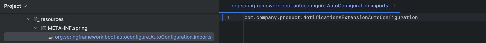

# Spring Boot 3: spring.factories

## About

In Spring Boot 3, the traditional `META-INF/spring.factories` mechanism was replaced by a **new metadata-based system** using:

* `META-INF/spring/org.springframework.boot.autoconfigure.AutoConfiguration.imports` (for auto-configuration)
* `META-INF/spring/org.springframework.boot` folder with structured metadata files for other use cases

<figure><figcaption></figcaption></figure>

## Why the Change ?

* **Modularity:** Split metadata per feature rather than one bulky file
* **Better performance:** Optimized classpath scanning
* **Clarity:** Easier to understand and manage for different framework extension points
* **Native image compatibility:** Improves behavior in GraalVM and AOT (Ahead-of-Time) contexts

## Replacing `EnableAutoConfiguration`

### Old Way (Spring Boot 2):

```properties
propertiesCopyEdit# spring.factories
org.springframework.boot.autoconfigure.EnableAutoConfiguration=\
com.example.autoconfig.MyAutoConfiguration
```

### New Way (Spring Boot 3):

Create the file:

```
META-INF/spring/org.springframework.boot.autoconfigure.AutoConfiguration.imports
```

Add your class:

```
com.example.autoconfig.MyAutoConfiguration
```

Java Class:

```java
@Configuration
@ConditionalOnClass(name = "com.example.MyService")
public class MyAutoConfiguration {

    @Bean
    public MyService myService() {
        return new MyService();
    }
}
```


This is now the standard way to register auto-configuration classes in Spring Boot 3.


## ApplicationContextInitializer, EnvironmentPostProcessor, RunListener

These are **not** moved to a new system. They **still use `spring.factories`**, even in Spring Boot 3.

So, for the following types, **we still use `META-INF/spring.factories`**:

#### Still supported in Spring Boot 3 via `spring.factories`:

| Interface/Class                 | Description                               |
| ------------------------------- | ----------------------------------------- |
| `ApplicationContextInitializer` | Modify application context before refresh |
| `EnvironmentPostProcessor`      | Add/override environment properties       |
| `ApplicationListener`           | Hook into Spring event lifecycle          |
| `SpringApplicationRunListener`  | Listen to Spring Boot startup phases      |

### Example:

```properties
# META-INF/spring.factories
org.springframework.boot.env.EnvironmentPostProcessor=\
com.example.env.MyEnvPostProcessor
```

```java
public class MyEnvPostProcessor implements EnvironmentPostProcessor {
    public void postProcessEnvironment(ConfigurableEnvironment env, SpringApplication app) {
        env.getSystemProperties().put("env.source", "custom");
    }
}
```

## Comparison

<table data-full-width="true"><thead><tr><th width="185.3515625">Feature</th><th width="461.55078125">Spring Boot 2 (Old)</th><th>Spring Boot 3 (New)</th></tr></thead><tbody><tr><td>Auto Configuration</td><td><code>spring.factories</code> with <code>EnableAutoConfiguration</code> key</td><td><code>AutoConfiguration.imports</code> file</td></tr><tr><td>Initializers</td><td><code>spring.factories</code></td><td>still <code>spring.factories</code></td></tr><tr><td>Listeners</td><td><code>spring.factories</code></td><td>still <code>spring.factories</code></td></tr><tr><td>Env Post Processor</td><td><code>spring.factories</code></td><td>still <code>spring.factories</code></td></tr><tr><td>Lifecycle Hooks</td><td><code>spring.factories</code></td><td>still <code>spring.factories</code></td></tr></tbody></table>
