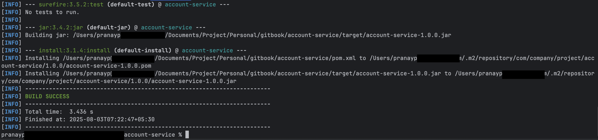
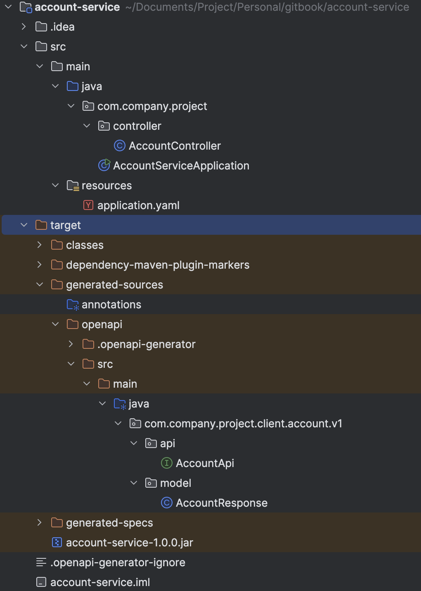
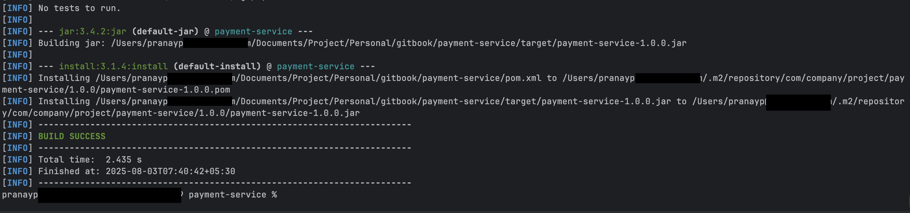
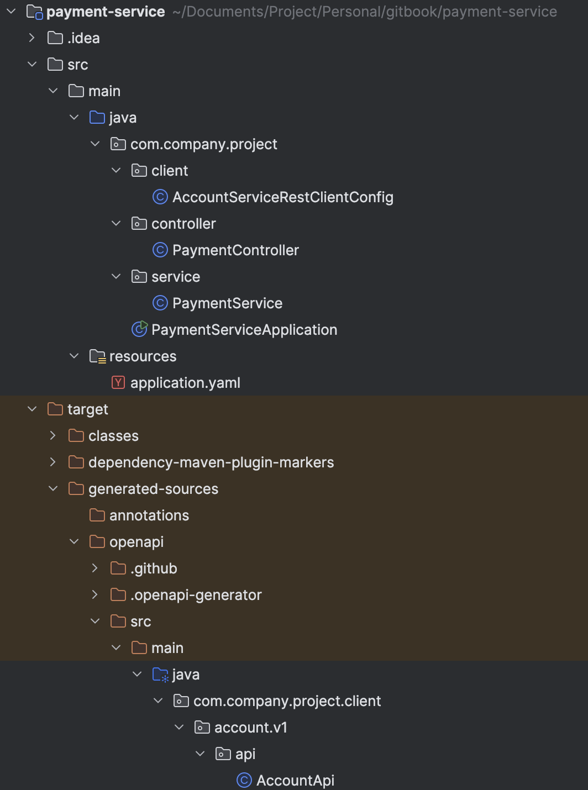
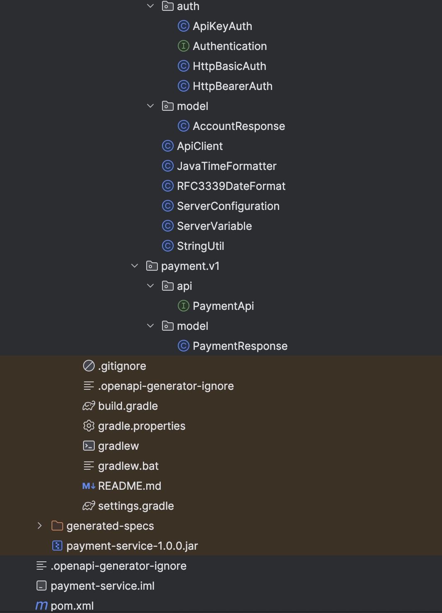
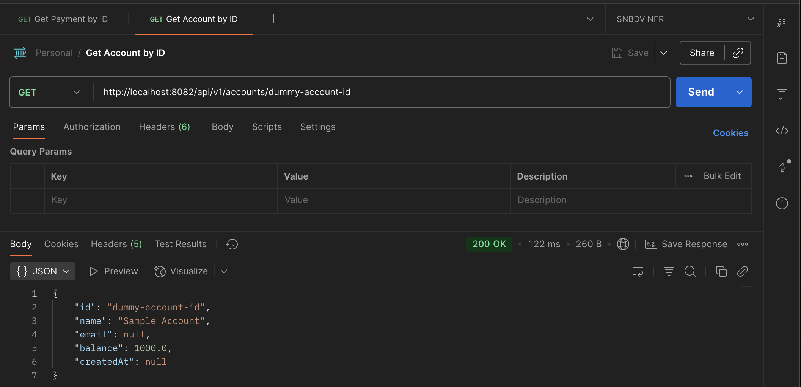
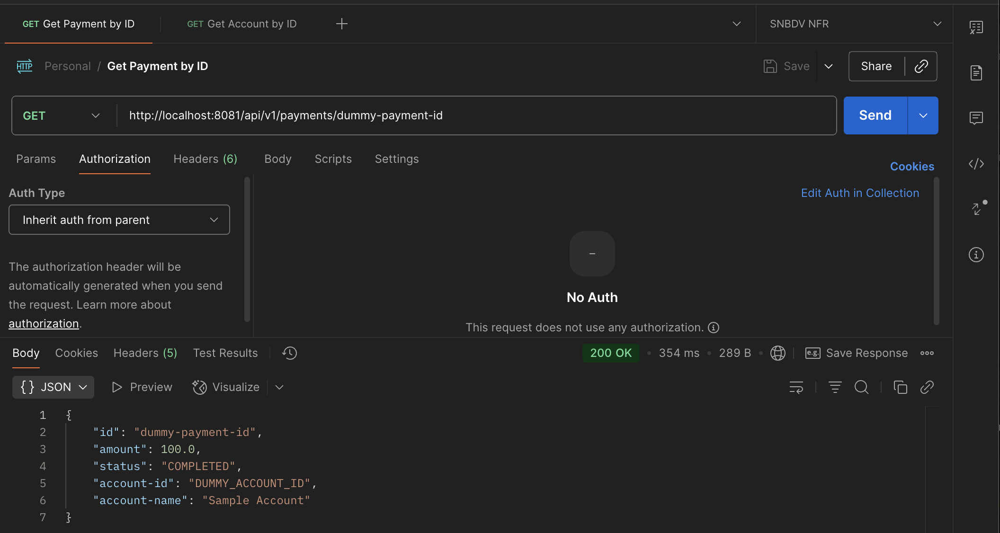

# Use Case: Internal API Calls with OpenAPI Clients

## About

In enterprise microservices, one service often calls another to fetch or process data. Using **OpenFeign** with OpenAPI-generated interfaces provides:

* Type-safe HTTP client code
* Automatic implementation generation
* Integration with Spring Boot for dependency injection and configuration
* Cleaner code compared to manually building RestTemplate or WebClient requests

This example demonstrates:

* `account-service`: Implements an OpenAPI-defined endpoint for retrieving account details.
* `payment-service`: Uses an OpenAPI-generated Feign client to call `account-service`.

The Feign interface is generated from the OpenAPI spec (`account.yaml`) and automatically wired into the Spring Boot context.

## **Project Structure** <a href="#project-structure" id="project-structure"></a>

#### **Specs** <a href="#specs" id="specs"></a>

* **account-api-spec** Contains the OpenAPI definition (`account.yaml`) for retrieving account details.
* **payment-api-spec** Contains `payment.yaml` defining how to retrieve payment details.

#### **Service** <a href="#service" id="service"></a>

* **account-service** Implements the account API (as per spec) using Spring Boot.
* **payment-service** Depends on both API specs and uses OpenAPI-generated clients to call `account-service`.

## **1. account-api-spec** <a href="#id-1.-account-api-spec" id="id-1.-account-api-spec"></a>

**Structure**

```
account-api-spec/
├── assembly/api.xml
├── pom.xml
└── src/main/resources/openapi/account.yaml
```

**api.xml**

```xml
<assembly xmlns="http://maven.apache.org/plugins/maven-assembly-plugin/assembly/1.1.3"
    xmlns:xsi="http://www.w3.org/2001/XMLSchema-instance"
    xsi:schemaLocation="http://maven.apache.org/plugins/maven-assembly-plugin/assembly/1.1.3
          https://maven.apache.org/xsd/assembly-1.1.3.xsd">
    <id>api</id>
    <formats>
        <format>zip</format>
    </formats>
    <includeBaseDirectory>false</includeBaseDirectory>
    <fileSets>
        <fileSet>
            <directory>src/main/resources/openapi</directory>
            <includes>
                <include>account.yaml</include>
            </includes>
            <outputDirectory>/</outputDirectory>
        </fileSet>
    </fileSets>
</assembly>
```

**account.yaml**

```yaml
openapi: 3.0.3

info:
  title: Account API
  description: Account API Specification
  version: 1.0.0

servers:
  - description: local test
    url: http://localhost:8080/api/v1

paths:
  /api/v1/accounts/{id}:
    summary: Get account details by ID
    description: Get account details by ID
    get:
      operationId: getAccountById
      parameters:
        - name: id
          in: path
          required: true
          schema:
            type: string
      responses:
        '200':
          description: Account found
          content:
            application/json:
              schema:
                $ref: '#/components/schemas/AccountResponse'
      tags:
        - Account

components:
  schemas:
    AccountResponse:
      type: object
      properties:
        id:
          type: string
        name:
          type: string
        email:
          type: string
        balance:
          type: number
          format: double
        createdAt:
          type: string
          format: date-time
```

**pom.xml**

```xml
<?xml version="1.0" encoding="UTF-8"?>
<project xmlns="http://maven.apache.org/POM/4.0.0" xmlns:xsi="http://www.w3.org/2001/XMLSchema-instance"
    xsi:schemaLocation="http://maven.apache.org/POM/4.0.0 http://maven.apache.org/xsd/maven-4.0.0.xsd">
    <modelVersion>4.0.0</modelVersion>

    <groupId>com.company.project</groupId>
    <artifactId>account-api-spec</artifactId>
    <version>1.0.0</version>
    <packaging>jar</packaging>

    <build>
        <plugins>
            <plugin>
                <groupId>org.apache.maven.plugins</groupId>
                <artifactId>maven-assembly-plugin</artifactId>
                <version>3.7.1</version>
                <executions>
                    <execution>
                        <id>assemble-api-zip</id>
                        <goals>
                            <goal>single</goal>
                        </goals>
                        <phase>package</phase>
                        <configuration>
                            <descriptors>
                                <descriptor>assembly/api.xml</descriptor>
                            </descriptors>
                        </configuration>
                    </execution>
                </executions>
            </plugin>
        </plugins>
    </build>
</project>
```

**Build the package**

```
mvn clean install
```

<figure><figcaption></figcaption></figure>

## **2. payment-api-spec** <a href="#id-2.-payment-api-spec" id="id-2.-payment-api-spec"></a>

**Structure**

```
payment-api-spec/
├── assembly/api.xml
├── pom.xml
└── src/main/resources/openapi/payment.yaml
```

**api.xml**

```xml
<assembly xmlns="http://maven.apache.org/plugins/maven-assembly-plugin/assembly/1.1.3"
    xmlns:xsi="http://www.w3.org/2001/XMLSchema-instance"
    xsi:schemaLocation="http://maven.apache.org/plugins/maven-assembly-plugin/assembly/1.1.3
          https://maven.apache.org/xsd/assembly-1.1.3.xsd">
    <id>api</id>
    <formats>
        <format>zip</format>
    </formats>
    <includeBaseDirectory>false</includeBaseDirectory>
    <fileSets>
        <fileSet>
            <directory>src/main/resources/openapi</directory>
            <includes>
                <include>payment.yaml</include>
            </includes>
            <outputDirectory>/</outputDirectory>
        </fileSet>
    </fileSets>
</assembly>
```

**payment.yaml**

```yaml
openapi: 3.0.3

info:
  title: Payment API
  description: Payment API Specification
  version: 1.0.0

servers:
  - description: local test
    url: http://localhost:8080/api/v1

paths:
  /api/v1/payments/{id}:
    summary: Get payment details by ID
    description: Get payment details by ID
    get:
      operationId: getPaymentById
      parameters:
        - name: id
          in: path
          required: true
          schema:
            type: string
      responses:
        '200':
          description: Payment found
          content:
            application/json:
              schema:
                $ref: '#/components/schemas/PaymentResponse'
      tags:
        - Payment

components:
  schemas:
    PaymentResponse:
      type: object
      properties:
        id:
          type: string
        amount:
          type: number
        status:
          type: string
        account-id:
          type: string
        account-name:
          type: string
```

**pom.xml**

```xml
<?xml version="1.0" encoding="UTF-8"?>
<project xmlns="http://maven.apache.org/POM/4.0.0" xmlns:xsi="http://www.w3.org/2001/XMLSchema-instance"
    xsi:schemaLocation="http://maven.apache.org/POM/4.0.0 http://maven.apache.org/xsd/maven-4.0.0.xsd">
    <modelVersion>4.0.0</modelVersion>

    <groupId>com.company.project</groupId>
    <artifactId>payment-api-spec</artifactId>
    <version>1.0.0</version>
    <packaging>jar</packaging>

    <build>
        <plugins>
            <plugin>
                <groupId>org.apache.maven.plugins</groupId>
                <artifactId>maven-assembly-plugin</artifactId>
                <version>3.7.1</version>
                <executions>
                    <execution>
                        <id>assemble-api-zip</id>
                        <goals>
                            <goal>single</goal>
                        </goals>
                        <phase>package</phase>
                        <configuration>
                            <descriptors>
                                <descriptor>assembly/api.xml</descriptor>
                            </descriptors>
                        </configuration>
                    </execution>
                </executions>
            </plugin>
        </plugins>
    </build>
</project>
```

**Build the package**

```
mvn clean install
```

<figure><figcaption></figcaption></figure>

## **3. account-service** <a href="#id-3.-account-service" id="id-3.-account-service"></a>

**Structure**

```
account-service/
├── .openapi-generator-ignore
├── pom.xml
├── src/main/java/com/company/project/controller/AccountController.java
├── src/main/java/com/company/project/AccountServiceApplication.java
└── src/main/resources/application.yaml
```

**.openapi-generator-ignore**

```
# OpenAPI Generator Ignore
# Generated by openapi-generator https://github.com/openapitools/openapi-generator

# Use this file to prevent files from being overwritten by the generator.
# The patterns follow closely to .gitignore or .dockerignore.

# Exclude unwanted files and directories
**/src/main/AndroidManifest.xml
**/build.sbt
**/pom.xml
**/gradle/
**/git_push.sh
**/.travis.yml
**/api/openapi.yaml
```

**pom.xml**

```xml
<?xml version="1.0" encoding="UTF-8"?>
<project xmlns="http://maven.apache.org/POM/4.0.0" xmlns:xsi="http://www.w3.org/2001/XMLSchema-instance"
    xsi:schemaLocation="http://maven.apache.org/POM/4.0.0 http://maven.apache.org/xsd/maven-4.0.0.xsd">
    <modelVersion>4.0.0</modelVersion>

    <parent>
        <groupId>org.springframework.boot</groupId>
        <artifactId>spring-boot-starter-parent</artifactId>
        <version>3.4.4</version>
        <relativePath />
    </parent>

    <groupId>com.company.project</groupId>
    <artifactId>account-service</artifactId>
    <version>1.0.0</version>
    <packaging>jar</packaging>

    <properties>
        <java.version>21</java.version>
    </properties>

    <dependencies>
        <dependency>
            <groupId>org.springframework.boot</groupId>
            <artifactId>spring-boot-starter-web</artifactId>
        </dependency>
        <dependency>
            <groupId>org.projectlombok</groupId>
            <artifactId>lombok</artifactId>
            <version>1.18.36</version>
        </dependency>
        <dependency>
            <groupId>org.openapitools</groupId>
            <artifactId>jackson-databind-nullable</artifactId>
            <version>0.2.6</version>
        </dependency>
        <dependency>
            <groupId>io.swagger.core.v3</groupId>
            <artifactId>swagger-annotations</artifactId>
            <version>2.2.29</version>
        </dependency>
        <dependency>
            <groupId>jakarta.validation</groupId>
            <artifactId>jakarta.validation-api</artifactId>
            <version>3.1.1</version>
        </dependency>
        <dependency>
            <groupId>org.springframework.boot</groupId>
            <artifactId>spring-boot-starter-test</artifactId>
            <scope>test</scope>
        </dependency>
    </dependencies>

    <build>
        <plugins>
            <plugin>
                <groupId>org.apache.maven.plugins</groupId>
                <artifactId>maven-dependency-plugin</artifactId>
                <version>3.8.1</version>
                <executions>
                    <execution>
                        <id>unpack-openapi-spec</id>
                        <phase>generate-sources</phase>
                        <goals>
                            <goal>unpack</goal>
                        </goals>
                        <configuration>
                            <artifactItems>
                                <artifactItem>
                                    <groupId>com.company.project</groupId>
                                    <artifactId>account-api-spec</artifactId>
                                    <version>1.0.0</version>
                                    <classifier>api</classifier>
                                    <type>zip</type>
                                    <overWrite>true</overWrite>
                                    <outputDirectory>${project.build.directory}/generated-specs/account-api-spec</outputDirectory>
                                </artifactItem>
                            </artifactItems>
                            <includes>**/*.yaml, **/*.json</includes>
                        </configuration>
                    </execution>
                </executions>
            </plugin>
            <plugin>
                <groupId>org.openapitools</groupId>
                <artifactId>openapi-generator-maven-plugin</artifactId>
                <version>6.6.0</version>
                <executions>
                    <execution>
                        <id>generate-spring-boot-server-code</id>
                        <goals>
                            <goal>generate</goal>
                        </goals>
                        <configuration>
                            <generateSupportingFiles>false</generateSupportingFiles>
                            <generatorName>spring</generatorName>
                            <strictSpec>true</strictSpec>
                            <generateApiTests>false</generateApiTests>
                            <generateModelTests>false</generateModelTests>
                            <output>${project.build.directory}/generated-sources/openapi</output>
                            <inputSpec>${project.build.directory}/generated-specs/account-api-spec/account.yaml</inputSpec>
                            <apiPackage>com.company.project.client.account.v1.api</apiPackage>
                            <modelPackage>com.company.project.client.account.v1.model</modelPackage>
                            <configOptions>
                                <library>spring-boot</library>
                                <interfaceOnly>true</interfaceOnly>
                                <skipDefaultInterface>true</skipDefaultInterface>
                                <useTags>true</useTags>
                                <useBeanValidation>true</useBeanValidation>
                                <useClassLevelBeanValidation>false</useClassLevelBeanValidation>
                                <useOptional>false</useOptional>
                                <useJakartaEe>true</useJakartaEe>
                                <useSpringBoot3>true</useSpringBoot3>
                                <containerDefaultToNull>false</containerDefaultToNull>
                            </configOptions>
                            <ignoreFileOverride>.openapi-generator-ignore</ignoreFileOverride>
                        </configuration>
                    </execution>
                </executions>
            </plugin>
        </plugins>
    </build>
</project>
```

**AccountController.java**

```java
package com.company.project.controller;

import com.company.project.client.account.v1.api.AccountApi;
import com.company.project.client.account.v1.model.AccountResponse;
import lombok.extern.slf4j.Slf4j;
import org.springframework.http.ResponseEntity;
import org.springframework.web.bind.annotation.RestController;

@Slf4j
@RestController
public class AccountController implements AccountApi {

    /**
     * GET /api/v1/accounts/{id}
     *
     * @param id (required)
     * @return Account found (status code 200)
     */
    @Override
    public ResponseEntity<AccountResponse> getAccountById(String id) {
        var accountResponse = new AccountResponse()
            .id(id)
            .name("Sample Account")
            .balance(1000.00);

        return ResponseEntity.ok(accountResponse);
    }
}
```

**AccountServiceApplication.java**

```java
package com.company.project;

import org.springframework.boot.SpringApplication;
import org.springframework.boot.autoconfigure.SpringBootApplication;

@SpringBootApplication
public class AccountServiceApplication {
    public static void main(String[] args) {
        SpringApplication.run(AccountServiceApplication.class, args);
    }
}
```

**application.yaml**

```yaml
logging:
  level:
    root: DEBUG

server:
  port: 8082
  servlet:
    context-path: /
```

**Build the package**

```
mvn clean install
```

<figure><figcaption></figcaption></figure>

<figure><figcaption></figcaption></figure>

## **4. payment-service** <a href="#id-4.-payment-service" id="id-4.-payment-service"></a>

**Structure**

```
payment-service/
├── .openapi-generator-ignore
├── pom.xml
├── src/main/java/com/company/project/client/AccountServiceRestClientConfig.java
├── src/main/java/com/company/project/controller/PaymentController.java
├── src/main/java/com/company/project/service/PaymentService.java
├── src/main/java/com/company/project/PaymentServiceApplication.java
└── src/main/resources/application.yaml
```

**.openapi-generator-ignore**

```
# OpenAPI Generator Ignore
# Generated by openapi-generator https://github.com/openapitools/openapi-generator

# Use this file to prevent files from being overwritten by the generator.
# The patterns follow closely to .gitignore or .dockerignore.

# Exclude unwanted files and directories
**/src/main/AndroidManifest.xml
**/build.sbt
**/pom.xml
**/gradle/
**/git_push.sh
**/.travis.yml
**/api/openapi.yaml
```

**pom.xml**

```xml
<?xml version="1.0" encoding="UTF-8"?>
<project xmlns="http://maven.apache.org/POM/4.0.0" xmlns:xsi="http://www.w3.org/2001/XMLSchema-instance"
    xsi:schemaLocation="http://maven.apache.org/POM/4.0.0 http://maven.apache.org/xsd/maven-4.0.0.xsd">
    <modelVersion>4.0.0</modelVersion>

    <parent>
        <groupId>org.springframework.boot</groupId>
        <artifactId>spring-boot-starter-parent</artifactId>
        <version>3.4.4</version>
        <relativePath />
    </parent>

    <groupId>com.company.project</groupId>
    <artifactId>payment-service</artifactId>
    <version>1.0.0</version>
    <packaging>jar</packaging>

    <properties>
        <java.version>21</java.version>
    </properties>

    <dependencyManagement>
        <dependencies>
            <!-- Spring Cloud Version -->
            <dependency>
                <groupId>org.springframework.cloud</groupId>
                <artifactId>spring-cloud-dependencies</artifactId>
                <version>2024.0.1</version>
                <type>pom</type>
                <scope>import</scope>
            </dependency>
        </dependencies>
    </dependencyManagement>

    <dependencies>
        <dependency>
            <groupId>org.springframework.boot</groupId>
            <artifactId>spring-boot-starter-web</artifactId>
        </dependency>
        <dependency>
            <groupId>org.springframework.cloud</groupId>
            <artifactId>spring-cloud-starter-openfeign</artifactId>
        </dependency>
        <!-- Feign Core -->
        <dependency>
            <groupId>io.github.openfeign</groupId>
            <artifactId>feign-core</artifactId>
            <version>12.5</version>
        </dependency>

        <!-- Feign OkHttp Client -->
        <dependency>
            <groupId>io.github.openfeign</groupId>
            <artifactId>feign-okhttp</artifactId>
            <version>12.5</version>
        </dependency>

        <!-- Feign Jackson Support -->
        <dependency>
            <groupId>io.github.openfeign</groupId>
            <artifactId>feign-jackson</artifactId>
            <version>12.5</version>
        </dependency>
        <dependency>
            <groupId>org.projectlombok</groupId>
            <artifactId>lombok</artifactId>
            <version>1.18.36</version>
        </dependency>
        <dependency>
            <groupId>org.openapitools</groupId>
            <artifactId>jackson-databind-nullable</artifactId>
            <version>0.2.6</version>
        </dependency>
        <dependency>
            <groupId>io.swagger.core.v3</groupId>
            <artifactId>swagger-annotations</artifactId>
            <version>2.2.29</version>
        </dependency>
        <dependency>
            <groupId>jakarta.validation</groupId>
            <artifactId>jakarta.validation-api</artifactId>
            <version>3.1.1</version>
        </dependency>
        <dependency>
            <groupId>org.springframework.boot</groupId>
            <artifactId>spring-boot-starter-test</artifactId>
            <scope>test</scope>
        </dependency>
    </dependencies>

    <build>
        <plugins>
            <plugin>
                <groupId>org.apache.maven.plugins</groupId>
                <artifactId>maven-dependency-plugin</artifactId>
                <version>3.8.1</version>
                <executions>
                    <execution>
                        <id>unpack-openapi-spec</id>
                        <phase>generate-sources</phase>
                        <goals>
                            <goal>unpack</goal>
                        </goals>
                        <configuration>
                            <artifactItems>
                                <artifactItem>
                                    <groupId>com.company.project</groupId>
                                    <artifactId>account-api-spec</artifactId>
                                    <version>1.0.0</version>
                                    <classifier>api</classifier>
                                    <type>zip</type>
                                    <overWrite>true</overWrite>
                                    <outputDirectory>${project.build.directory}/generated-specs/account-api-spec</outputDirectory>
                                </artifactItem>
                                <artifactItem>
                                    <groupId>com.company.project</groupId>
                                    <artifactId>payment-api-spec</artifactId>
                                    <version>1.0.0</version>
                                    <classifier>api</classifier>
                                    <type>zip</type>
                                    <overWrite>true</overWrite>
                                    <outputDirectory>${project.build.directory}/generated-specs/payment-api-spec</outputDirectory>
                                </artifactItem>
                            </artifactItems>
                            <includes>**/*.yaml, **/*.json</includes>
                        </configuration>
                    </execution>
                </executions>
            </plugin>
            <plugin>
                <groupId>org.openapitools</groupId>
                <artifactId>openapi-generator-maven-plugin</artifactId>
                <version>6.6.0</version>
                <executions>
                    <execution>
                        <id>generate-spring-boot-server-code</id>
                        <goals>
                            <goal>generate</goal>
                        </goals>
                        <configuration>
                            <generateSupportingFiles>false</generateSupportingFiles>
                            <generatorName>spring</generatorName>
                            <strictSpec>true</strictSpec>
                            <generateApiTests>false</generateApiTests>
                            <generateModelTests>false</generateModelTests>
                            <output>${project.build.directory}/generated-sources/openapi</output>
                            <inputSpec>${project.build.directory}/generated-specs/payment-api-spec/payment.yaml</inputSpec>
                            <apiPackage>com.company.project.client.payment.v1.api</apiPackage>
                            <modelPackage>com.company.project.client.payment.v1.model</modelPackage>
                            <configOptions>
                                <library>spring-boot</library>
                                <interfaceOnly>true</interfaceOnly>
                                <skipDefaultInterface>true</skipDefaultInterface>
                                <useTags>true</useTags>
                                <useBeanValidation>true</useBeanValidation>
                                <useClassLevelBeanValidation>false</useClassLevelBeanValidation>
                                <useOptional>false</useOptional>
                                <useJakartaEe>true</useJakartaEe>
                                <useSpringBoot3>true</useSpringBoot3>
                                <containerDefaultToNull>false</containerDefaultToNull>
                            </configOptions>
                            <ignoreFileOverride>.openapi-generator-ignore</ignoreFileOverride>
                        </configuration>
                    </execution>
                    <execution>
                        <id>generate-spring-boot-client-code</id>
                        <goals>
                            <goal>generate</goal>
                        </goals>
                        <configuration>
                            <generateSupportingFiles>true</generateSupportingFiles>
                            <generatorName>java</generatorName>
                            <strictSpec>true</strictSpec>
                            <generateApiTests>false</generateApiTests>
                            <generateApiDocumentation>false</generateApiDocumentation>
                            <generateModelTests>false</generateModelTests>
                            <generateModelDocumentation>false</generateModelDocumentation>
                            <output>${project.build.directory}/generated-sources/openapi</output>
                            <inputSpec>${project.build.directory}/generated-specs/account-api-spec/account.yaml</inputSpec>
                            <apiPackage>com.company.project.client.account.v1.api</apiPackage>
                            <modelPackage>com.company.project.client.account.v1.model</modelPackage>
                            <configOptions>
                                <library>feign</library>
                                <dateLibrary>java8</dateLibrary>
                                <interfaceOnly>true</interfaceOnly>
                                <skipDefaultInterface>true</skipDefaultInterface>
                                <useTags>true</useTags>
                                <useBeanValidation>true</useBeanValidation>
                                <useClassLevelBeanValidation>false</useClassLevelBeanValidation>
                                <useOptional>false</useOptional>
                                <useJakartaEe>true</useJakartaEe>
                            </configOptions>
                            <ignoreFileOverride>.openapi-generator-ignore</ignoreFileOverride>
                        </configuration>
                    </execution>
                </executions>
            </plugin>
        </plugins>
    </build>
</project>
```

**AccountServiceRestClientConfig.java**

```java
package com.company.project.client;

import com.company.project.client.account.v1.ApiClient;
import com.company.project.client.account.v1.api.AccountApi;
import org.springframework.beans.factory.annotation.Value;
import org.springframework.context.annotation.Bean;
import org.springframework.context.annotation.Configuration;

@Configuration
public class AccountServiceRestClientConfig extends ApiClient {

    @Value("${services.account-service.base-path}")
    private String basePath;

    @Bean
    public AccountApi accountApi() {
        return createApiClient().buildClient(AccountApi.class);
    }

    private ApiClient createApiClient() {
        return new ApiClient()
            .setBasePath(basePath);
    }

}
```

**PaymentController.java**

```java
package com.company.project.controller;

import com.company.project.client.payment.v1.api.PaymentApi;
import com.company.project.client.payment.v1.model.PaymentResponse;
import com.company.project.service.PaymentService;
import lombok.RequiredArgsConstructor;
import lombok.extern.slf4j.Slf4j;
import org.springframework.http.ResponseEntity;
import org.springframework.web.bind.annotation.*;

@Slf4j
@RequiredArgsConstructor
@RestController
public class PaymentController implements PaymentApi {

    private final PaymentService paymentService;

    /**
     * GET /api/v1/payments/{id}
     *
     * @param id (required)
     * @return Payment found (status code 200)
     */
    @Override
    public ResponseEntity<PaymentResponse> getPaymentById(String id) {
        log.info("Request to get payment details for id: {}", id);
        return ResponseEntity.ok(paymentService.fetchPaymentDetails(id));
    }
}
```

**PaymentService.java**

```java
package com.company.project.service;

import com.company.project.client.AccountServiceRestClientConfig;
import com.company.project.client.payment.v1.model.PaymentResponse;
import lombok.RequiredArgsConstructor;
import org.springframework.stereotype.Service;

@RequiredArgsConstructor
@Service
public class PaymentService {

    private final AccountServiceRestClientConfig accountServiceRestClientConfig;

    public PaymentResponse fetchPaymentDetails(String id) {
        var accountDetails = accountServiceRestClientConfig.accountApi()
            .getAccountById("DUMMY_ACCOUNT_ID");

        // Return dummy details for the sake of this example
        return new PaymentResponse()
                .id(id)
                .amount(new java.math.BigDecimal("100.0"))
                .status("COMPLETED")
                .accountId(accountDetails.getId())
                .accountName(accountDetails.getName());
    }
}
```

**PaymentServiceApplication.java**

```java
package com.company.project;

import org.springframework.boot.SpringApplication;
import org.springframework.boot.autoconfigure.SpringBootApplication;
import org.springframework.cloud.openfeign.EnableFeignClients;

@EnableFeignClients
@SpringBootApplication
public class PaymentServiceApplication {
    public static void main(String[] args) {
        SpringApplication.run(PaymentServiceApplication.class, args);
    }
}
```

**application.yaml**

```yaml
logging:
  level:
    com.example: DEBUG
    root: DEBUG

server:
  port: 8081
  servlet:
    context-path: /

services:
  account-service:
    base-path: "http://localhost:8082/"
```

**Build the package**

```
mvn clean install
```

<figure><figcaption></figcaption></figure>

<figure><figcaption></figcaption></figure>

<figure><figcaption></figcaption></figure>

## Verification <a href="#verification" id="verification"></a>

Start both the services using `mvn spring-boot:run`

**Test the API with Postman**

<figure><figcaption></figcaption></figure>

<figure><figcaption></figcaption></figure>

## Reference <a href="#reference" id="reference"></a>


