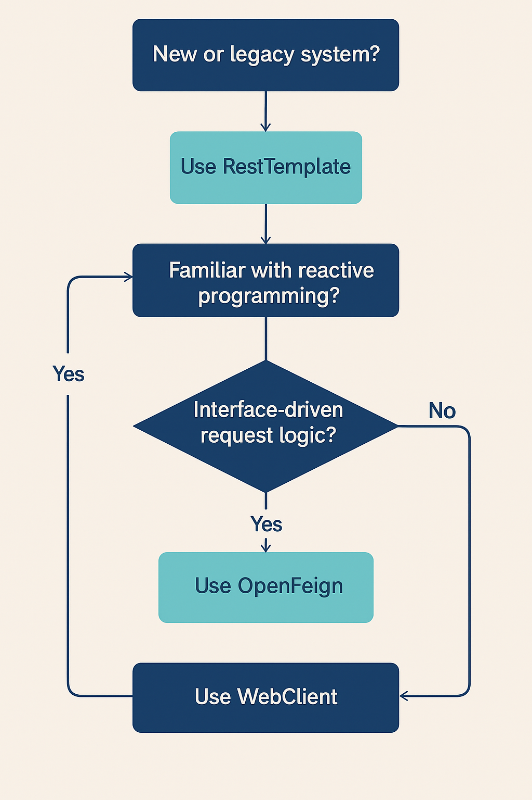

# When to Use Which ?

## About

In modern Spring Boot applications, there are multiple options for making HTTP calls to other services: **RestTemplate**, **WebClient**, and **OpenFeign**.\
Each has its own strengths, limitations, and ideal use cases. Choosing the right one is important for achieving the desired performance, maintainability, and developer productivity.

<figure><figcaption></figcaption></figure>

## Comparison

<table data-header-hidden data-full-width="true"><thead><tr><th width="127.32421875" valign="top"></th><th valign="top"></th><th valign="top"></th><th width="235.03125" valign="top"></th></tr></thead><tbody><tr><td valign="top"><strong>Aspect</strong></td><td valign="top"><strong>RestTemplate</strong></td><td valign="top"><strong>WebClient</strong></td><td valign="top"><strong>OpenFeign</strong></td></tr><tr><td valign="top"><strong>Nature</strong></td><td valign="top">Synchronous, blocking client for REST calls</td><td valign="top">Reactive, non-blocking HTTP client supporting sync &#x26; async</td><td valign="top">Declarative, interface-based HTTP client</td></tr><tr><td valign="top"><strong>Best For</strong></td><td valign="top">Simple, blocking service calls in synchronous applications</td><td valign="top">Reactive systems, high concurrency, streaming data, when non-blocking IO is required</td><td valign="top">Microservices communication where you want to call REST APIs using annotated interfaces</td></tr><tr><td valign="top"><strong>When to Use</strong></td><td valign="top">- Legacy applications still using blocking I/O - Quick prototypes or small services where async is not needed - When you already have existing codebase with RestTemplate</td><td valign="top">- Applications built on Project Reactor (Spring WebFlux) - When you need async calls without blocking threads - High-performance, high-throughput API clients - Streaming data handling</td><td valign="top">- When you want minimal boilerplate for calling internal/external REST APIs - You have OpenAPI specs and can generate interfaces - Clear contract-driven development between services</td></tr><tr><td valign="top"><strong>When Not to Use</strong></td><td valign="top">- New reactive systems - When handling thousands of concurrent requests efficiently is critical</td><td valign="top">- Fully synchronous codebases where reactive stack would add complexity without benefit</td><td valign="top">- Low-level control of requests/responses is required - For highly dynamic API calls where compile-time interface definitions are not feasible</td></tr><tr><td valign="top"><strong>Ease of Use</strong></td><td valign="top">Medium — requires manual request creation, error handling, object mapping</td><td valign="top">Medium — fluent API but requires understanding of reactive concepts (<code>Mono</code>, <code>Flux</code>)</td><td valign="top">High — just define an interface with annotations and call methods</td></tr><tr><td valign="top"><strong>Performance Profile</strong></td><td valign="top">Blocking — each request ties up a thread until response arrives</td><td valign="top">Non-blocking — event-loop model allows scaling with fewer threads</td><td valign="top">Blocking or non-blocking depending on underlying client (e.g., OkHttp, WebClient)</td></tr><tr><td valign="top"><strong>Integration with OpenAPI</strong></td><td valign="top">Requires manual configuration or wrapper code</td><td valign="top">Possible with codegen but less common</td><td valign="top">Excellent — generated clients map directly to service interfaces</td></tr><tr><td valign="top"><strong>Typical Use Case Example</strong></td><td valign="top">A Spring Boot monolith making synchronous HTTP calls to a single third-party API</td><td valign="top">A reactive microservice calling multiple APIs in parallel to aggregate results</td><td valign="top">An internal payment service calling account service via a generated API client</td></tr><tr><td valign="top"><strong>Future Outlook</strong></td><td valign="top">Deprecated in favor of WebClient for new development</td><td valign="top">Preferred choice for modern Spring HTTP clients</td><td valign="top">Preferred for declarative, contract-based inter-service communication</td></tr></tbody></table>
