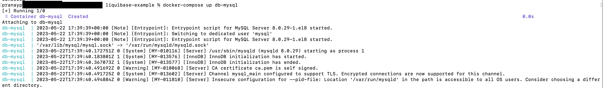

# Liquibase with Spring Boot

## About

Liquibase is a powerful tool that provides a declarative way to manage database schema changes. With Liquibase, schema changes can be defined in a change log file, which can be versioned and tracked just like the application code. This makes it easy to manage database schema changes across different environments, such as development, staging, and production.

Spring Boot has **built-in support** for Liquibase, which means Liquibase can easily integrate into the Spring Boot application by adding the liquibase-core dependency to the project's Maven or Gradle build file, and configuring it with the necessary properties, such as the JDBC URL, username, and password.

To use Liquibase in a Spring Boot application, create a **Liquibase change log file**, which defines the changes to be applied to the database schema. It can be in YAML or XML or any other format which is supported, and can include a series of change sets that define the individual changes to be made to the schema.

Overall, using Liquibase as part of a Spring Boot project can help us manage database schema changes more effectively and maintain the consistency of our database schema across different environments.

## Init Container vs Main Container wrt liquibase

### Init Container

An init container is a separate container that runs and completes before the main application container starts. It is primarily used for performing initialization tasks or pre-requisites required by the main container. In the context of Liquibase, an init container can be used to apply database schema changes or migrations before the main application container starts. This ensures that the database is properly prepared before the application attempts to connect to it. Liquibase can be executed as part of the init container, allowing us to manage database changes as a separate initialization step. In case of any issues with init container, main container won't be starting.

### Main Container

The main container refers to the primary application container that runs the actual application logic. In the case of a Spring Boot application, the main container would be responsible for running the Spring Boot application itself including the liquibase changes.


The separation of Liquibase execution into an init container allows for better control over the database initialization process and ensures that the database schema changes are applied before the application starts. This approach helps to maintain consistency and reduces the risk of the application encountering issues due to incompatible database schema versions.


## Example

_**Firstly, we will need mysql instance up and running. We will use docker-compose method to bring mysql.**_

docker-compose.yaml

```yaml
version: "3.9"
# https://docs.docker.com/compose/compose-file/

services:
  db-mysql:
    container_name: db-mysql
    image: mysql:8.0.29
    ports:- "3306:3306"
    environment:MYSQL_ROOT_PASSWORD: root
    volumes:- mysql-data:/var/lib/mysql

volumes:
  mysql-data:
    driver: local

networks:default:
    name: company_default
```

```
docker-compose up db-mysql
```

<figure><figcaption></figcaption></figure>

_**We will create liquibase-example-service spring boot project.**_

Add the following dependencies to the pom.xml file

<pre class="language-xml"><code class="lang-xml">    &#x3C;dependencies>
        &#x3C;dependency>
            &#x3C;groupId>org.springframework.boot&#x3C;/groupId>
<strong>            &#x3C;artifactId>spring-boot-starter-web&#x3C;/artifactId>
</strong>        &#x3C;/dependency>
        &#x3C;dependency>
            &#x3C;groupId>org.springframework.boot&#x3C;/groupId>
<strong>            &#x3C;artifactId>spring-boot-starter-data-jpa&#x3C;/artifactId>
</strong>        &#x3C;/dependency>
        &#x3C;dependency>
            &#x3C;groupId>org.liquibase&#x3C;/groupId>
<strong>            &#x3C;artifactId>liquibase-core&#x3C;/artifactId>
</strong>        &#x3C;/dependency>
        &#x3C;dependency>
            &#x3C;groupId>mysql&#x3C;/groupId>
<strong>            &#x3C;artifactId>mysql-connector-java&#x3C;/artifactId>
</strong>        &#x3C;/dependency>
        &#x3C;dependency>
            &#x3C;groupId>org.springframework.boot&#x3C;/groupId>
            &#x3C;artifactId>spring-boot-devtools&#x3C;/artifactId>
            &#x3C;scope>runtime&#x3C;/scope>
            &#x3C;optional>true&#x3C;/optional>
        &#x3C;/dependency>
    &#x3C;/dependencies>
</code></pre>

Create the main application.java class

```java
package com.company.project;

import org.springframework.boot.autoconfigure.SpringBootApplication;
import org.springframework.boot.SpringApplication;

@SpringBootApplication
public class Application {
    public static void main(final String[] args) {
        SpringApplication.run(Application.class, args);
    }
}
```

Add the required properties in application.yaml file

```yaml
server:
  port: 4040
  
spring:
  datasource:
    url: jdbc:mysql://localhost:3306/liquibase-example-schema/liquibase-example-schema?createDatabaseIfNotExist=true
    username: root
    password: root
    driver-class-name: com.mysql.cj.jdbc.Driver
  liquibase:
    enabled: true
    change-log: db/changeLog-master.yaml
    
logging:
  level:
    liquibase: DEBUG
```

Now, let's create changelog files. We will create master changelog file and it will have reference to separate changelog files.

<figure><figcaption></figcaption></figure>

changeLog-master.yaml

```yaml
databaseChangeLog:
- includeAll:
    path: tables-setup-0_1
    relativeToChangelogFile: true
```

add-table-books-04052023.yaml

```yaml
databaseChangeLog:
  - changeSet:
      id: 2
      author: pranay.pourkar@test.com
      labels: books
      context: books
      comment: This is the table to hold books data
      changes:
        - createTable:
            tableName: books
            columns:
              - column:
                  name: id
                  type: int
                  autoIncrement: true
                  constraints:
                    primaryKey: true
                    nullable: false
              - column:
                  name: name
                  type: varchar(50)
                  constraints:
                    nullable: false

# Add a version attribute here
version: 1.0.0
```

add-table-users-03052023.yaml

```yaml
databaseChangeLog:
  - changeSet:
      id:  1
      author: pranay.pourkar@test.com
      labels: users
      context: users
      comment: This is the table to hold users data
      changes:
        - createTable:
            tableName:  users
            columns:
              - column:
                  name:  id
                  type:  int
                  autoIncrement:  true
                  constraints:
                    primaryKey:  true
                    nullable:  false
              - column:
                  name:  name
                  type:  varchar(50)
                  constraints:
                    nullable:  false
              - column:
                  name:  age
                  type:  int
                  constraints:
                    nullable:  false
              - column:
                  name:  contact
                  type:  int
                  constraints:
                    nullable:  false
              - column:
                  name:  address
                  type:  varchar(100)
                  constraints:
                    nullable:  false

# Add a version attribute here
version: 1.0.0
```

update-table-users-05052023.yaml

```yaml
databaseChangeLog:
  - changeSet:
      id: 3
      author: pranay.pourkar@test.com
      labels: books
      context: books
      comment: Adding author column to the books table
      changes:
        - addColumn:
            tableName: books
            columns:
              - column:
                  name: author
                  type: varchar(50)
```

Overall, the folder structure will look like below

<figure><figcaption></figcaption></figure>

_**Build the project with below maven command and run the application**_

```
mvn clean install
```

<figure><figcaption></figcaption></figure>

```
mvn spring-boot:run
```

<figure><figcaption></figcaption></figure>

<figure><figcaption></figcaption></figure>

_**From the above logs, we can see that liquibase has applied the database changes and let's verify from the MySQl Workbench as well.**_

<figure><figcaption></figcaption></figure>

Files are attached for the reference below.


