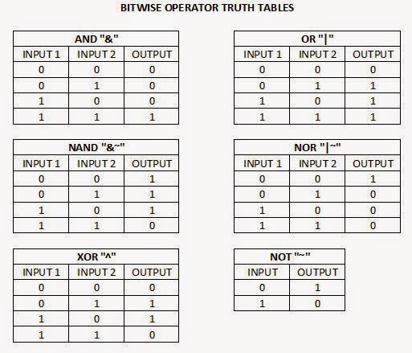

# Order of Execution of the query

The order of execution of a SQL query can vary depending on the specific database management system (DBMS) being used and the query optimizer's implementation.


## SELECT statement execution order

The order of execution for a SQL query in Oracle, specifically a SELECT statement, follows a well-defined sequence:

### **1 - FROM Clause:**&#x20;

The database engine first identifies the tables involved in the query based on the `FROM` clause. This includes resolving table names, aliases, and joins (if present).

### **2 - WHERE Clause (Filtering):**&#x20;

Once the tables are identified, the WHERE clause comes into play. Rows that do not meet the specified conditions in the WHERE clause are filtered out. This filtering happens before any aggregations or ordering.

### **3 - JOINs:**&#x20;

If the query involves joins between tables, the join operation is performed after WHERE clause filtering. The join operation combines rows from multiple tables based on the join condition.

### **4 - GROUP BY (Grouping):**&#x20;

After filtering and joining (if applicable), the GROUP BY clause, if present, groups the remaining rows based on the specified columns. This creates groups of rows with identical values in the group by columns.

### **5 - HAVING Clause (Group Filtering):**&#x20;

The HAVING clause, if present, is applied after grouping. It filters the groups created by the GROUP BY clause based on a condition applied to aggregate functions (e.g., only groups with a total order count greater than 5).

### **6 - SELECT Clause (Projection):**&#x20;

The SELECT clause determines which columns or expressions are retrieved for each row.

### **7 - ORDER BY (Sorting):**&#x20;

Finally, the ORDER BY clause, if present, sorts the result set based on the specified columns in ascending (ASC) or descending (DESC) order. This is the last step before the results are returned.


## Example of Select Statement:

```
SELECT LAST_NAME, FIRST_NAME FROM EMPLOYEE WHERE DEPARTMENT = 'IT';
```

<figure><figcaption></figcaption></figure>

```
SELECT LAST_NAME, FIRST_NAME
    FROM EMPLOYEE
   WHERE DEPARTMENT = 'IT'
ORDER BY FIRST_NAME;
```

<figure><figcaption></figcaption></figure>

```
SELECT DEPARTMENT, COUNT(*)
    FROM EMPLOYEES
   WHERE SALARY > 80000
GROUP BY DEPARTMENT
ORDER BY COUNT(*) DESC;
```

<figure><figcaption></figcaption></figure>

```
SELECT DEPARTMENT
    FROM EMPLOYEES
   WHERE DEPARTMENT <> 'SALES'
GROUP BY DEPARTMENT
  HAVING AVG(SALARY) > 80000;
```

<figure><figcaption></figcaption></figure>

```
SELECT EMPLOYEE_ID, LAST_NAME
  FROM EMPLOYEES
  JOIN DEPARTMENT
    ON DEPARTMENT = DEPT_NAME
 WHERE BUDGET > 275000;
```

<figure><figcaption></figcaption></figure>

## Rownum execution order
