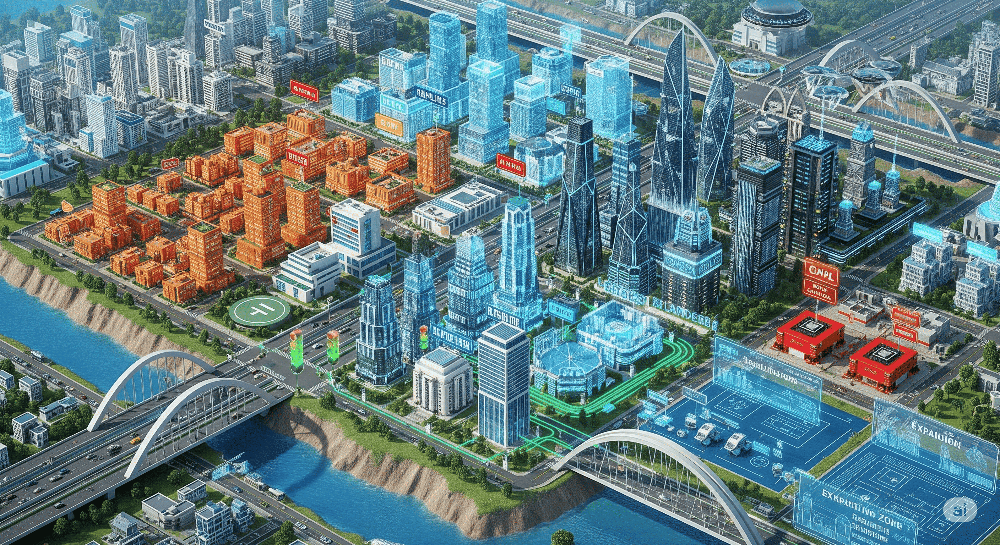

# System Design

## About

**System Design** is the discipline of **planning and structuring a software system’s components, their relationships, and the principles that guide their interaction** so the system meets its functional and non-functional requirements - **reliably, efficiently, and at scale**.

It’s more than just drawing boxes and arrows. It’s about making **architectural decisions** that influence:

* **Scalability** – Can the system grow without breaking?
* **Performance** – Can it handle the required throughput and latency?
* **Resilience** – Can it recover gracefully from failures?
* **Maintainability** – Can it be updated without excessive cost or risk?
* **Security** – Can it safeguard data and withstand threats?

A good system design anticipates **future change**—it balances what is needed today with what will be needed tomorrow.

## System Design as a City 

Designing a large-scale software system is like **planning and building a modern city**.

When city planners begin, they’re not just thinking about the buildings, they’re thinking about **how the entire ecosystem will function** for decades to come. A software architect does the same when designing a system.

<figure><figcaption></figcaption></figure>

**1. Zoning and Layout**\
In a city, there are residential, commercial, and industrial zones. Each has a clear purpose and boundaries.\
In a system, we do the same—breaking it into services, modules, and databases with well-defined responsibilities. Clear zoning prevents congestion, confusion, and conflicts.

**2. Infrastructure and Utilities**\
A city depends on roads, bridges, power lines, and water pipes to connect and support everything.\
In system design, these are your networks, APIs, message queues, and data pipelines—they keep information moving between components.

**3. Traffic Flow and Management**\
Cities use traffic lights, highways, and bypass roads to keep vehicles flowing smoothly.\
Systems use load balancers, caching, and queuing systems to manage request flow and avoid bottlenecks.

**4. Public Services and Safety Nets**\
Cities have fire stations, hospitals, and police for emergencies.\
Systems have monitoring, alerting, auto-recovery, and failover strategies to handle outages and unexpected events.

**5. Scalability and Growth Planning**\
A growing city needs new districts, upgraded roads, and expanded utilities.\
A growing system needs horizontal scaling, additional servers, and new services—planned in a way that doesn’t break what’s already there.

**6. Disaster Preparedness**\
Cities in earthquake zones have earthquake-resistant buildings and evacuation routes.\
Systems have redundancy, backups, disaster recovery, and fault tolerance built into their architecture.

**7. Balance and Sustainability**\
Cities aim for a balance between development, quality of life, and sustainability.\
Systems aim for performance, maintainability, and cost-effectiveness over the long term.

## Why Learn System Design ?

System Design is not just for senior architects, it’s a skill that impacts **every stage of your engineering career**. Whether you’re building a small feature or architecting a global platform, design decisions shape **performance, scalability, reliability, and cost**.


Learning System Design is like learning how to build the foundation of a skyscraper it’s invisible to most, but everything else depends on it.


#### **1. It Shapes How Software Works at Scale**

Small applications can get away with quick fixes. But when systems grow - more users, more data, more traffic - poor design shows its cracks:

* Slow response times
* Frequent downtime
* Costly rework to handle growth

Learning System Design equips you to anticipate these challenges early so your solutions can scale naturally.

#### **2. It’s Core to Technical Interviews**

In mid-to-senior developer interviews, system design questions often carry as much weight as coding problems.

* FAANG and top tech companies use system design rounds to evaluate problem-solving, trade-off analysis, and architectural thinking.
* Being able to design a scalable URL shortener, chat system, or recommendation engine shows employers you can handle complex, real-world problems.

#### **3. It Improves Cross-Team Communication**

A clear design:

* Creates a shared language between developers, testers, DevOps, and business stakeholders.
* Makes onboarding faster—new team members can understand the system’s structure without diving into every line of code.

#### **4. It Reduces Long-Term Cost and Risk**

The majority of software costs come after launch—maintenance, scaling, security fixes, feature changes.\
Good design:

* Minimizes technical debt
* Avoids expensive rewrites
* Prevents unnecessary complexity

#### **5. It Builds Future-Proof Systems**

Tech stacks change. Traffic patterns evolve. Business needs shift.\
Learning System Design teaches you to:

* Build modular systems that adapt easily
* Use standard patterns for flexibility
* Plan for both current and future requirements

#### **6. It Makes You a Better Problem-Solver**

System Design is about trade-offs, balancing speed vs. cost, consistency vs. availability, simplicity vs. flexibility.\
These are the same decisions you’ll make in every real-world project.

## For Whom Is This Guide?


If you work with software systems—whether you build them, operate them, or plan them—this guide will help you **think like a system architect**.


This guide is designed for **anyone who wants to understand how modern software systems are planned, built, and scaled,** from the first design sketch to a production-ready, high-traffic application.

#### **1. Aspiring & Junior Developers**

* Want to go beyond just writing code and understand how all the pieces of a system fit together.
* Learn to speak the language of senior engineers in code reviews and architecture discussions.

#### **2. Mid-Level Engineers**

* Ready to step up from feature development to system-level thinking.
* Preparing for system design interviews at top tech companies.
* Need to make informed trade-offs when building new features.

#### **3. Senior Developers & Tech Leads**

* Responsible for architectural decisions, scalability, and reliability.
* Want a structured framework for teaching system design to their teams.
* Need reference material for design discussions and documentation.

#### **4. DevOps & Site Reliability Engineers (SREs)**

* Want to understand design choices that impact deployment, observability, and operations.
* Collaborating with developers to build resilient, maintainable systems.

#### **5. Product Managers & Technical Architects**

* Need to translate business requirements into system capabilities.
* Want to understand trade-offs in architecture to make better roadmap decisions.
