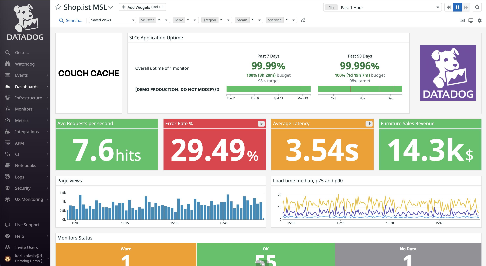
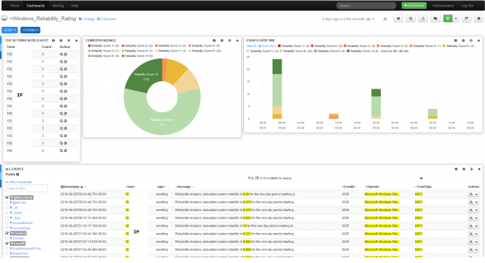
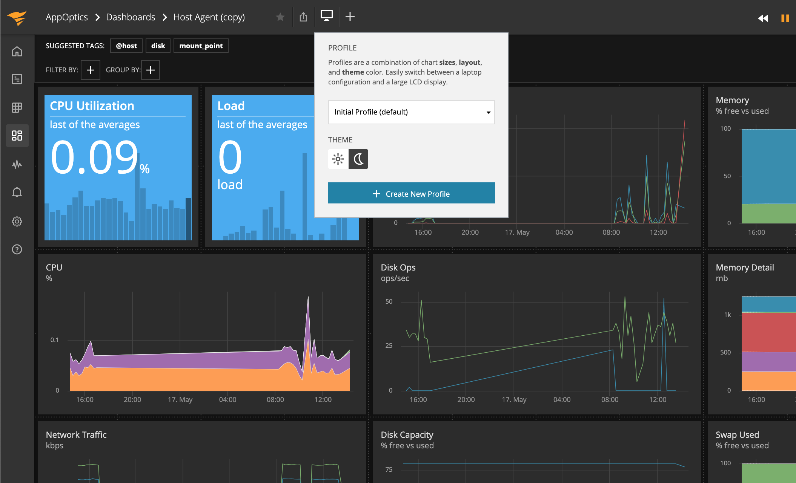
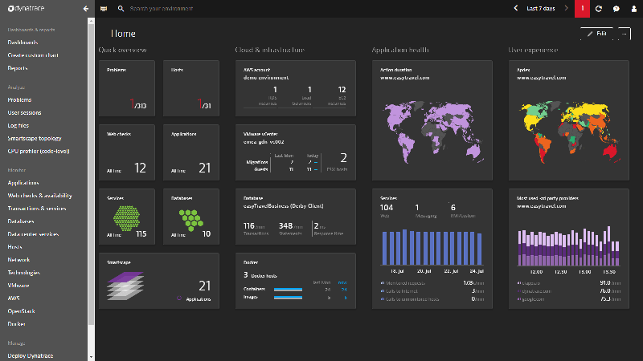
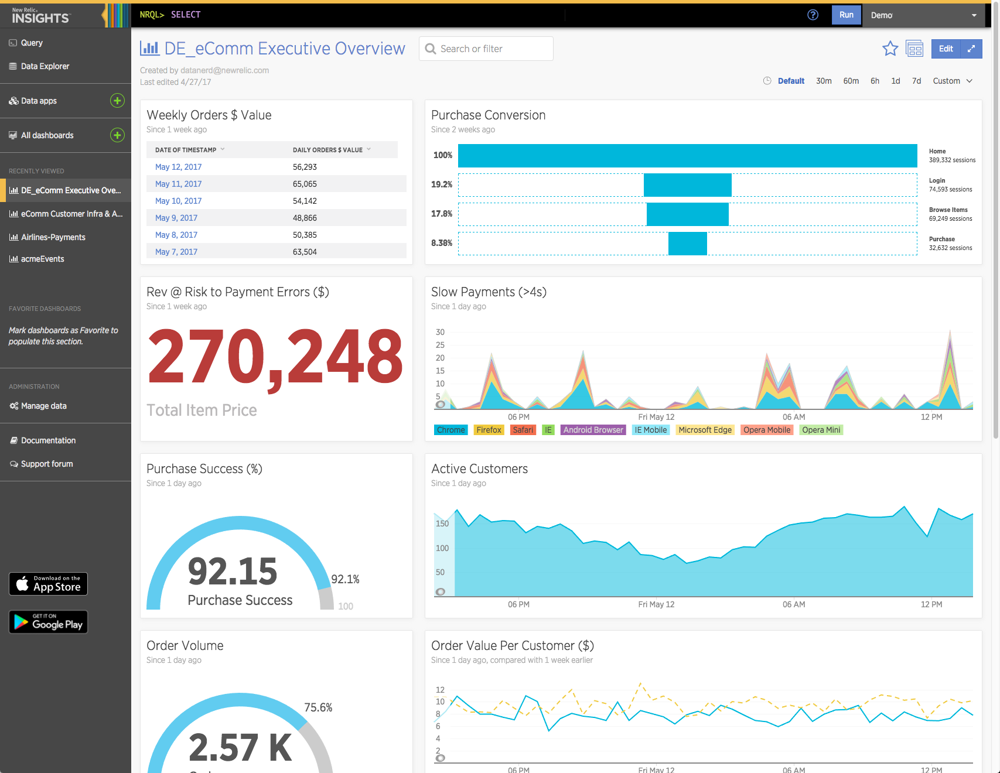
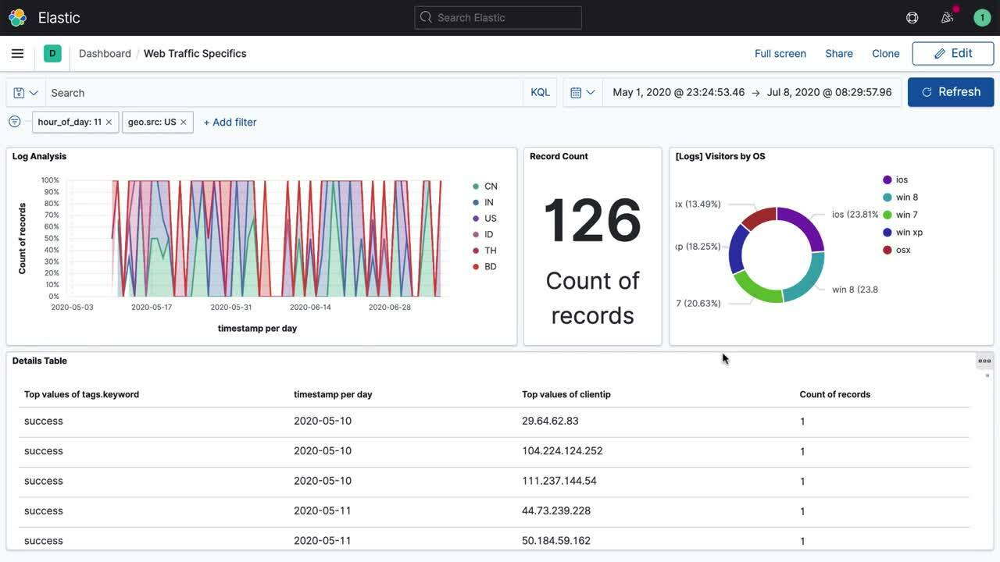
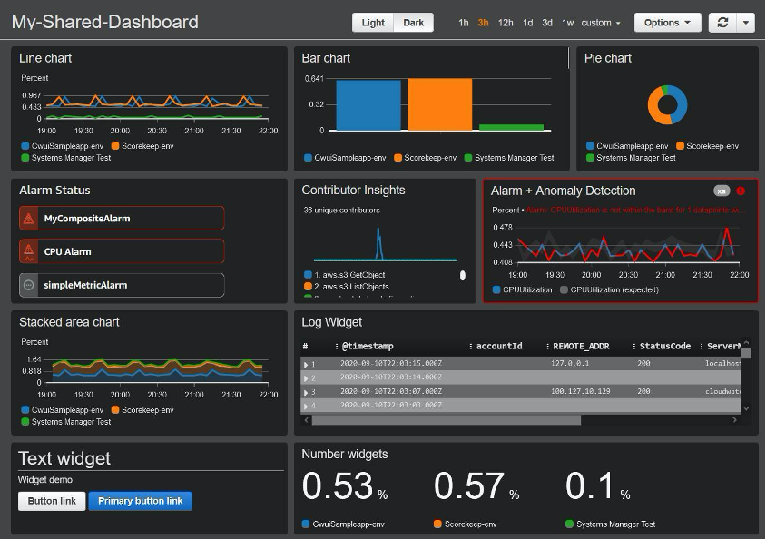

# Load Balancer Monitoring Tool

## About

Load balancer monitoring tools help ensure that traffic distribution and system performance are optimized, reducing downtime and improving overall system health. Monitoring key metrics like request rates, latency, error rates, and system resource utilization ensures that load balancers function efficiently. Below are some popular load balancer monitoring tools and platforms:

## **1. Prometheus with Grafana**

Prometheus is an open-source monitoring and alerting toolkit. When combined with Grafana for visualization, it becomes a powerful load balancer monitoring solution.

<figure><figcaption></figcaption></figure>

* **Key Features**:
  * Metrics collection via exporters (e.g., for HAProxy, NGINX).
  * Time-series database.
  * Real-time monitoring with highly customizable dashboards.
  * Alerting based on query conditions.
* **Usage**: Best for DevOps teams looking for customizable, open-source solutions.

## **2. Datadog**

Datadog is a cloud-based monitoring platform that offers comprehensive insights into load balancer health and performance.

<figure><figcaption></figcaption></figure>

* **Key Features**:
  * Integrated with AWS Elastic Load Balancer (ELB), NGINX, HAProxy, and other popular balancers.
  * Customizable dashboards with live metrics.
  * AI-based anomaly detection.
  * Logs monitoring, tracing, and correlation with network metrics.
* **Usage**: Suitable for organizations seeking an all-in-one cloud-based observability solution.

## **3. Nagios**

A widely-used open-source tool for network monitoring, Nagios can track the status of load balancers and provide notifications on failures or performance issues.

<figure><figcaption></figcaption></figure>

* **Key Features**:
  * Monitors availability and response times of load balancers.
  * SNMP integration for load balancer health checks.
  * Plugin architecture with load balancer-specific plugins (e.g., for F5, NGINX, HAProxy).
  * Alerts for slow responses or resource bottlenecks.
* **Usage**: Good for teams needing a flexible, plugin-driven monitoring tool.

## **4. SolarWinds Server & Application Monitor (SAM)**

SolarWinds SAM provides detailed monitoring for both application and network layers, including load balancers.

<figure><figcaption></figcaption></figure>

* **Key Features**:
  * Pre-configured templates for monitoring load balancers (F5, Citrix ADC, etc.).
  * Real-time monitoring of load balancer traffic, performance, and health.
  * Integrated alerting and performance reporting.
  * Monitoring of both virtual and physical load balancers.
* **Usage**: Ideal for enterprises looking for a comprehensive, out-of-the-box monitoring solution.

## **5. Dynatrace**

Dynatrace provides AI-driven monitoring and observability, capable of automatically detecting load balancer issues.

<figure><figcaption></figcaption></figure>

* **Key Features**:
  * Auto-discovery and monitoring of load balancer resources (e.g., AWS ELB).
  * Real-time network and application flow analysis.
  * AI-powered anomaly detection and root-cause analysis.
  * Centralized observability for complex environments.
* **Usage**: Best for organizations leveraging complex multi-cloud and distributed systems.

## **6. New Relic**

New Relic offers a full-stack observability platform, with specific support for monitoring load balancers.

<figure><figcaption></figcaption></figure>

* **Key Features**:
  * Integrates with load balancers like AWS ELB, NGINX, and HAProxy.
  * Real-time dashboards for traffic and performance metrics.
  * Customizable alerts and insights based on response times and error rates.
  * End-to-end tracing of network requests through the load balancer.
* **Usage**: Best for enterprises that need a unified monitoring solution across application and infrastructure layers.

## **7. Elastic Stack (ELK Stack)**

Elastic Stack (Elasticsearch, Logstash, Kibana) is a popular open-source toolset for log management, metrics collection, and visualization.

<figure><figcaption></figcaption></figure>

* **Key Features**:
  * Centralized logging from load balancers (e.g., NGINX, HAProxy).
  * Real-time data analysis and visualization via Kibana.
  * Custom dashboards for monitoring load balancer performance.
  * Integration with Beats or Logstash for data collection.
* **Usage**: Ideal for teams with strong DevOps skills who need powerful log aggregation and analytics.

## **8. AWS CloudWatch (for Elastic Load Balancers)**

AWS CloudWatch offers native monitoring for AWS services, including Elastic Load Balancer (ELB).

<figure><figcaption></figcaption></figure>

* **Key Features**:
  * Real-time monitoring of ELB performance metrics such as request counts, latency, and healthy/unhealthy instances.
  * CloudWatch Alarms for automatic alerting.
  * Integrated with other AWS services for a complete observability solution.
* **Usage**: Best for organizations using AWS for load balancing.
