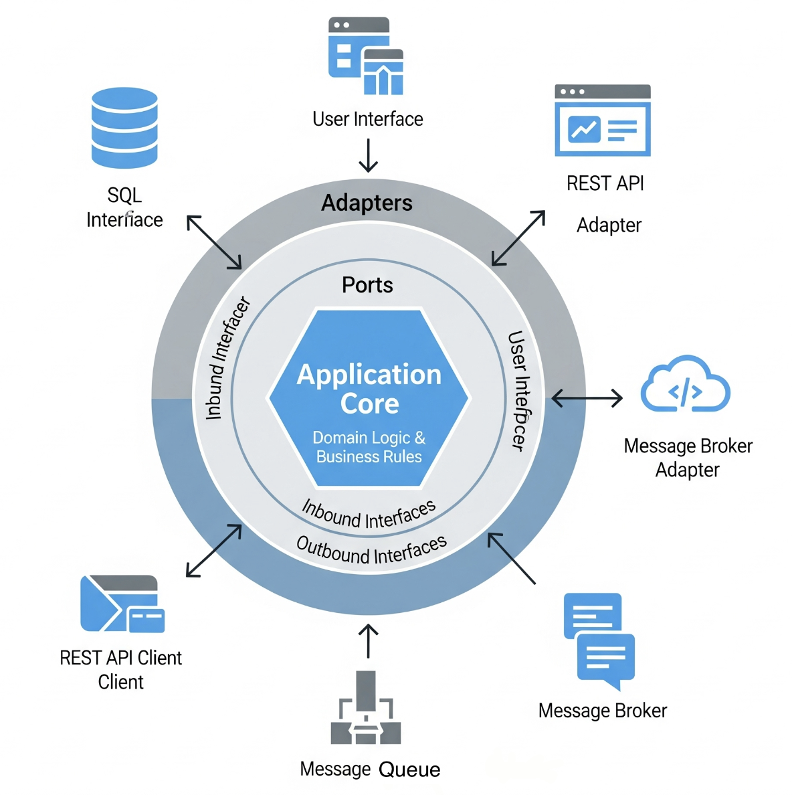

# Hexagonal Architecture

## About

**Hexagonal Architecture**, also known as the **Ports and Adapters** pattern, is a **software design approach** that aims to make applications **highly maintainable, testable, and adaptable** to change by clearly separating the **core business logic** from **external systems**.

The name “hexagonal” comes from the diagrammatic representation, where the application core is shown as a hexagon surrounded by various **ports (interfaces)** and **adapters (implementations)**. The shape itself isn’t technically important - it simply helps visualize multiple entry and exit points symmetrically.


The application is designed so the **business logic (core)** is completely **independent** of external frameworks, databases, UI, or messaging systems.

Communication with the outside world happens via **abstract ports** (interfaces), which are implemented by **adapters** that connect to actual external systems.


#### **Why It Exists ?**

* Traditional layered architectures often create **tight coupling** between layers, making it hard to replace or upgrade infrastructure (e.g., switching databases, changing UI frameworks).
* Hexagonal Architecture solves this by isolating the business rules from infrastructure concerns, enabling flexibility, scalability, and easier automated testing.


## Core Principles

The Hexagonal Architecture pattern is built around **abstraction, separation of concerns, and adaptability**. These principles guide its structure and explain why it’s often favored for long-lived systems.

#### **1) Ports (Interfaces for Communication)**

* **Definition:**
  * Ports are **abstract entry/exit points** that define how the application interacts with the outside world.
  * They are **interfaces** or contracts - not tied to a specific technology.
* **Types of Ports:**
  * **Inbound Ports:** Define how the application receives input (e.g., REST API commands, CLI commands, messages).
  * **Outbound Ports:** Define how the application sends output to external systems (e.g., database queries, sending messages).
*   **Example:**

    ```java
    public interface CustomerRepository {
        Customer findById(UUID id);
        void save(Customer customer);
    }
    ```

    This interface is a **port** - the business logic uses it without knowing what database or storage system is behind it.

#### **2) Adapters (Implementations of Ports)**

* **Definition:**
  * Adapters are **technology-specific implementations** that connect the application core to the external world.
* **Types of Adapters:**
  * **Inbound Adapters:** Implement how external input reaches the core (e.g., Spring MVC controller, CLI parser, message listener).
  * **Outbound Adapters:** Implement how the core interacts with infrastructure (e.g., MySQL repository, Kafka producer).
*   **Example:**

    ```java
    @Repository
    public class MySQLCustomerRepository implements CustomerRepository {
        // JDBC or JPA logic here
    }
    ```

#### **3) Dependency Inversion Principle (DIP)**

* **Why It’s Important:**
  * Business logic depends **only** on abstractions (ports), not on concrete infrastructure implementations.
* **Impact:**
  * The core module can be tested and evolved without worrying about breaking the infrastructure code.
* **In Practice:**
  * Dependencies point **inward** toward the core, never outward.
  * The infrastructure layer “plugs into” the application core via adapters.

#### **4) Isolation of Concerns**

* **Goal:**
  * Keep business rules separate from delivery mechanisms and infrastructure details.
* **Benefit:**
  * We can replace **UI frameworks, databases, messaging systems, or even cloud providers** without touching the core.
* **Example:**
  * Switching from REST to gRPC, or from MySQL to MongoDB, should only require updating adapters, not the core logic.

#### **5) Testability & Maintainability**

* **Why It Excels in Testing:**
  * Since the core talks only through ports, we can provide **mock adapters** for testing.
  * No need to spin up real databases, queues, or API gateways for most unit tests.
* **Maintainability:**
  * Changes in one adapter (e.g., migrating from Kafka to RabbitMQ) do not ripple through the rest of the system.


## Architecture Diagram

The **Hexagonal Architecture** is best understood as **three conceptual zones**:

1. **Application Core** (center)
2. **Ports Layer** (interfaces)
3. **Adapters Layer** (implementations)

Each has **specific components** with a clear purpose.

<figure><figcaption></figcaption></figure>

#### **1) Application Core (Business Logic Zone)**

This is the **heart of the system** - pure business logic, with **no dependency** on frameworks or external technology.

**Key Components:**

<table data-full-width="true"><thead><tr><th width="196.84375">Component</th><th width="321.390625">Description</th><th>Example</th></tr></thead><tbody><tr><td><strong>Domain Entities</strong></td><td>Core business objects that encapsulate data and business rules.</td><td><code>Order</code>, <code>Customer</code>, <code>Invoice</code></td></tr><tr><td><strong>Value Objects</strong></td><td>Immutable, identity-less objects that hold domain-specific data.</td><td><code>Money</code>, <code>Address</code>, <code>DateRange</code></td></tr><tr><td><strong>Aggregates &#x26; Aggregate Roots</strong></td><td>Cluster of related entities treated as a single unit for data changes.</td><td><code>Order</code> (root) managing <code>OrderItem</code>s</td></tr><tr><td><strong>Application Services (Use Cases)</strong></td><td>Orchestrate the flow of business rules; coordinate entities and ports.</td><td><code>CreateOrderService</code>, <code>CancelSubscriptionService</code></td></tr><tr><td><strong>Domain Services</strong></td><td>Encapsulate domain logic that doesn’t belong to a single entity.</td><td><code>PricingService</code>, <code>TaxCalculator</code></td></tr><tr><td><strong>Ports (Interfaces)</strong></td><td>Abstract definitions for interacting with external systems.</td><td><code>PaymentGatewayPort</code>, <code>CustomerRepositoryPort</code></td></tr></tbody></table>

#### **2) Ports Layer (Abstraction Zone)**

This **defines contracts** - the _how_ of interaction without the _what_ of implementation.

**Types of Ports:**

* **Inbound Ports:** Define application entry points (requests/events coming into the system).
  * Examples: `PlaceOrderUseCase`, `GetCustomerDetailsUseCase`.
* **Outbound Ports:** Define application exit points (how the system reaches out to the world).
  * Examples: `SendEmailPort`, `InventoryRepositoryPort`.

**Role in the Architecture:**

* Ensure the **core remains framework-agnostic**.
* Allow swapping implementations without touching the business rules.

#### **3) Adapters Layer (Implementation Zone)**

The **outermost layer** where infrastructure and frameworks live.

**Types of Adapters:**

<table data-full-width="true"><thead><tr><th width="176.015625">Adapter Type</th><th>Purpose</th><th>Example Implementation</th></tr></thead><tbody><tr><td><strong>Inbound Adapters</strong></td><td>Convert external input into a form the core understands.</td><td>Spring REST Controller, Kafka Listener, CLI Command Parser</td></tr><tr><td><strong>Outbound Adapters</strong></td><td>Implement outbound ports to connect to actual external systems.</td><td>JPA Repository, Kafka Producer, HTTP Client</td></tr><tr><td><strong>Test Adapters</strong></td><td>Mock implementations for testing purposes.</td><td>In-memory repository for unit tests</td></tr></tbody></table>

**Common External Systems Connected via Adapters:**

* Databases (PostgreSQL, MongoDB)
* Message Brokers (RabbitMQ, Kafka)
* REST or gRPC APIs
* File systems and cloud storage (AWS S3, GCP Storage)


## Execution Flow

The execution flow describes **how data and commands travel through the system** while keeping business logic isolated from infrastructure concerns.

#### **General Flow Pattern**

1. **External Trigger**
   * A request or event arrives from an **external actor** (user, external system, scheduled job).
   * Can be HTTP requests, message events, CLI commands, or even IoT signals.
2. **Inbound Adapter Activation**
   * An inbound adapter **receives the request** and transforms it into a form the core understands.
   * Example: A Spring REST Controller converting an HTTP POST JSON body into a `PlaceOrderCommand` object.
3. **Inbound Port Invocation**
   * The adapter calls an **inbound port interface**, which is implemented by the core's **application service** (use case).
   * This keeps the request **decoupled** from the framework.
4. **Application Core Processing**
   * The application service orchestrates **domain entities**, **domain services**, and **business rules**.
   * If external resources are needed (like fetching inventory), it uses **outbound ports**.
5. **Outbound Port Call**
   * The core calls an outbound port, unaware of its actual implementation.
   * Example: `PaymentGatewayPort.chargeCustomer()`.
6. **Outbound Adapter Execution**
   * The outbound adapter implements the outbound port and **performs the real operation** (e.g., sending an HTTP request to Stripe’s payment API).
7. **Result Handling**
   * The outbound adapter returns a result to the core, which applies business rules and forms the final response.
8. **Return via Inbound Adapter**
   * The result is passed back through the inbound adapter to **match the external system’s protocol** (e.g., HTTP response with JSON).

#### **Example: E-Commerce Order Placement**

**Step 1 – User Action**

* Customer clicks “Place Order” in a web app → sends HTTP POST `/orders` request with cart details.

**Step 2 – Inbound Adapter (REST Controller)**

* Controller maps JSON body to `PlaceOrderCommand` object.

**Step 3 – Call Inbound Port**

* Calls `PlaceOrderUseCase.placeOrder(PlaceOrderCommand)` interface.

**Step 4 – Application Service (Use Case)**

* Validates cart, checks customer profile, calculates total price using `PricingService`.
* Calls `InventoryRepositoryPort.reserveItems()` to ensure stock availability.

**Step 5 – Outbound Port Call**

* Calls `PaymentGatewayPort.chargeCustomer()` to process payment.

**Step 6 – Outbound Adapter Execution**

* Payment adapter sends HTTPS request to Stripe API.
* Returns payment confirmation to the core.

**Step 7 – Domain Model Update**

* Core creates `Order` entity, sets status to "Confirmed", and saves it via `OrderRepositoryPort`.

**Step 8 – Outbound Adapter (Database)**

* JPA-based repository adapter inserts the order into PostgreSQL.

**Step 9 – Response to User**

* Core returns order confirmation to the inbound adapter, which sends back HTTP 201 Created with order ID.


## Advantages

The Hexagonal (Ports & Adapters) model offers several long-term benefits that address **maintainability, scalability, and technology independence**.

#### **1) Strong Decoupling from Infrastructure**

* The core **business logic is not bound** to databases, frameworks, APIs, or UI layers.
* Changing the database from MySQL to MongoDB, or switching from REST to gRPC, requires only replacing an adapter - the core logic remains untouched.
* Prevents **framework lock-in** and allows future-proofing for evolving technologies.

**Example:**\
If a payment gateway changes from Stripe to PayPal, only the **PaymentGatewayAdapter** changes; no other layers are impacted.

#### **2) Clear Separation of Concerns**

* Business rules live in the **core**, infrastructure code lives in **adapters**.
* The separation ensures developers can focus on **domain logic** without getting distracted by low-level technical details.

**Impact:**

* Domain experts can work on business rules.
* Infrastructure specialists can focus on performance, security, and API integration.

#### **3) Technology Agnosticism**

* The architecture works with **any language, framework, or database** because the ports define **contracts**, not implementations.
* Adapters can be swapped out with minimal disruption.

**Example:**\
We could start with a relational DB adapter for PostgreSQL and later swap it with an event-sourced persistence adapter without rewriting business logic.

#### **4) Easier Testing and Higher Coverage**

* The application core can be tested **without real databases, APIs, or queues** by using **mock adapters**.
* This speeds up automated testing and enables reliable CI/CD pipelines.

**Benefit:**

* Unit tests run in milliseconds.
* Integration tests can focus on critical adapter interactions.

#### **5) Flexible Deployment & Integration**

* Supports gradual **migration strategies** when replacing legacy systems.
* Allows **multiple adapters** for the same port to support hybrid deployments.

**Example:**\
A single outbound port for notifications could have:

* Email adapter
* SMS adapter
* Push notification adapter

#### **6) Supports Event-Driven and API-Driven Models Equally**

* Inbound ports can be triggered by HTTP APIs, CLI commands, or Kafka events - without changing core logic.
* Outbound ports can emit events or call APIs based on configuration.

#### **7) Better Long-Term Maintainability**

* Reduces technical debt because infrastructure decisions do not creep into the business core.
* Makes refactoring **safer** and more predictable.


## Challenges / Limitations

While the **Ports & Adapters** model is powerful, it comes with trade-offs that teams must acknowledge before adopting it at scale.

#### **1) Higher Initial Complexity**

* Compared to simpler architectures (like layered MVC), hexagonal design introduces **extra interfaces, abstractions, and adapters**.
* Small projects might feel “over-engineered” if the benefits of decoupling aren’t immediately needed.

**Impact:**

* Slower onboarding for new developers.
* More boilerplate code before we see working features.

#### **2) Steeper Learning Curve**

* Requires developers to understand **dependency inversion, interface-based design, and clean architecture principles**.
* Misunderstanding ports/adapters can lead to accidental coupling between the core and infrastructure.

**Example:**\
If a developer directly injects a JPA repository into the core, it defeats the whole purpose of separation.

#### **3) Increased Code Volume**

* Every external interaction needs:
  * A **Port interface** in the core.
  * An **Adapter implementation** in infrastructure.
* This can **double the number of files** for simple features.

**Impact:**

* Slower prototyping for early-stage MVPs.

#### **4) Risk of Over-Abstraction**

* Teams might create **too many unnecessary ports** for trivial operations.
* This can result in “architecture astronautics” - building abstraction layers no one really uses.

**Best Practice:**

* Introduce ports only for **true external boundaries** (e.g., persistence, messaging, external APIs).

#### **5) Requires Strong Architectural Discipline**

* It’s easy for developers to bypass ports/adapters “just for now” when under deadline pressure.
* Without code reviews and enforcement, architecture purity will erode.

**Example:**\
Someone might directly call an HTTP client from the core because it’s “faster to implement” - creating long-term maintenance pain.

#### **6) Debugging Can Be More Complex**

* Tracing execution requires following **indirect calls** through ports and adapters.
* Without good logging and monitoring, root cause analysis can be slower.

#### **7) Not Always a Good Fit for Small or Short-Lived Projects**

* For small-scale prototypes or POCs, the overhead may outweigh the benefits.
* The architecture shines in **long-lived, evolving systems**, not throwaway code.


## Use Cases

Hexagonal Architecture is most beneficial in **large, evolving systems** where business rules must remain stable despite frequent changes in technology or integration partners.

#### **1) Enterprise Systems with Long Lifespan**

* Large-scale ERP, CRM, and core banking platforms often need **decades** of maintenance.
* Business rules must remain intact while UI, databases, and integration technologies change over time.

**Example:**\
A bank can modernize its core banking platform by replacing COBOL-based APIs with REST/gRPC adapters - without touching the domain logic.

#### **2) Systems Integrating with Multiple External Services**

* Applications that must **connect to multiple APIs or data sources** benefit from adapter flexibility.
* We can add or replace integrations without modifying the core.

**Example:**\
An e-commerce platform might connect to:

* Payment gateways (Stripe, PayPal, Razorpay)
* Logistics providers (DHL, FedEx, local couriers)
* Marketing APIs (Mailchimp, SendGrid)

#### **3) Applications with Multiple User Interfaces**

* The same business logic can serve **different front-ends**:
  * Web UI
  * Mobile app
  * CLI tool
  * External partner APIs

**Example:**\
A project management tool can have web, iOS, Android, and API-based clients - all calling the same inbound ports.

#### **4) Migration from Legacy Systems**

* Hexagonal Architecture enables **strangling** old monoliths by gradually replacing adapters with modern equivalents.

**Example:**\
An old Java EE monolith using Oracle DB could introduce a MongoDB adapter for new modules while still supporting the old database until full migration.

#### **5) Event-Driven Architectures**

* Works well when business logic can be triggered by **events** or **commands** from multiple sources.

**Example:**\
A supply chain system could have inbound ports listening to:

* Kafka events from IoT devices
* REST calls from partner systems
* CLI commands from operators

#### **6) SaaS Products Serving Multiple Clients with Different Needs**

* Each client may need different **integrations**, but core logic stays the same.
* Hexagonal architecture allows us to **swap adapters per client**.

**Example:**\
A SaaS invoicing system can connect to different tax APIs depending on the country of operation.

#### **7) Testing-Critical Environments**

* Industries like healthcare, aviation, and finance demand **full business logic testing** without real production systems.

**Example:**\
A medical records system can be tested entirely with fake adapters, avoiding accidental data leaks.


## Best Practices

A **Ports and Adapters** implementation can be elegant and maintainable if approached with discipline. The following guidelines help ensure our architecture stays clean, scalable, and adaptable over the long term.

#### **1) Clearly Define the Core Domain Model**

* Treat the **core domain** as the “heart” of the system - it contains business rules, policies, and state transitions.
* Avoid putting **framework code, annotations, or infrastructure details** in the core.

**Tip:**

* Our core should be able to compile and run **without** a database, HTTP server, or UI framework.

#### **2) Separate Ports for Different Concerns**

* **Inbound Ports** handle requests from the outside world (UI, API, CLI, events).
* **Outbound Ports** handle communication to the outside (databases, external APIs, message queues).
* Don’t mix inbound and outbound responsibilities in the same interface.

#### **3) Keep Ports Technology-Agnostic**

* Define ports in terms of **business capabilities**, not technical details.

**Bad Example:**

```java
interface PaymentPort {
    void payWithStripe(String cardToken);
}
```

**Good Example:**

```java
interface PaymentPort {
    PaymentReceipt processPayment(PaymentRequest request);
}
```

#### **4) Use Adapters to Encapsulate Infrastructure**

* All **framework and technology-specific code** belongs in adapters.
* Adapters should **translate** between the external system’s format and our domain model.

**Example:**\
A JPA adapter converts `OrderEntity` to `Order` domain object before passing it to the core.

#### **5) Apply Dependency Inversion Rigorously**

* Core should **depend only on ports (interfaces)**, never on concrete adapter classes.
* Use dependency injection to wire adapters at runtime.

#### **6) Test the Core in Isolation**

* Use **mock adapters** or in-memory implementations to test business rules without infrastructure dependencies.
* This ensures tests are fast, reliable, and independent of external failures.

#### **7) Avoid Over-Engineering**

* Introduce ports only where true **external boundaries** exist.
* Don’t create unnecessary abstraction layers for in-process logic.

#### **8) Version and Document Ports**

* Ports define contracts between the core and external systems - changes can break multiple adapters.
* Maintain **versioning** and **clear documentation** for all port interfaces.

#### **9) Keep Adapters Simple and Focused**

* Each adapter should serve **one external system** and have minimal business logic.
* Complex transformations belong in the core or a dedicated mapper layer.

#### **10) Automate Enforcement**

* Use **code review checklists** to ensure no infrastructure code leaks into the core.
* Add **static analysis rules** to detect forbidden dependencies.

