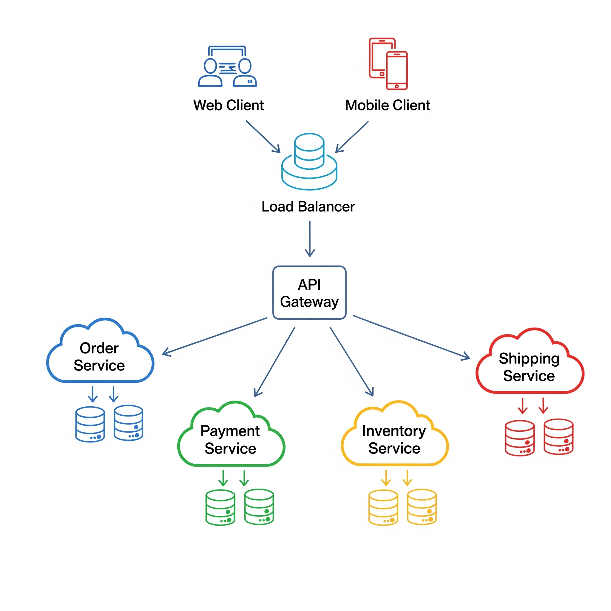

# Microservices

## About

**Microservices Architecture** is a software design pattern where an application is built as a collection of **small, autonomous services**, each responsible for a **single business capability**. Unlike monolithic systems where all modules share the same codebase and runtime, microservices operate as **independent deployable units** with their own code, database (or data storage), and lifecycle.

Each service in a microservices architecture is:

* **Loosely coupled** - changes in one service minimally affect others.
* **Highly cohesive** - each service focuses on one well-defined purpose.
* **Independently deployable** - teams can release services without redeploying the whole application.

This approach **mirrors real-world business domains** - often aligning services to **bounded contexts** from Domain-Driven Design (DDD). For example, in an e-commerce platform:

* Order Service → Handles order creation, updates, and tracking.
* Inventory Service → Manages product stock levels.
* Payment Service → Processes payments and refunds.

#### **Core Attributes**

1. **Service Autonomy**
   * Each service has its own source repository, build pipeline, and deployment schedule.
2. **Decentralized Data Management**
   * Services do not share a single database schema; they may even use different database technologies.
3. **API-First Communication**
   * Services communicate via lightweight protocols (HTTP/REST, gRPC, messaging).
4. **Independent Scaling**
   * Services can be scaled individually based on demand.

#### **Why It’s Popular ?**

* **Scalability**: We can scale only the services that need more resources.
* **Resilience**: A failure in one service doesn’t bring down the whole system (if designed with fault tolerance).
* **Team Autonomy**: Different teams can own different services, allowing parallel development.

## Core Principles

Microservices are more than “breaking an app into smaller pieces.” They are grounded in **specific architectural principles** that ensure these independent services actually work together as a coherent system.

#### **1. Single Responsibility Principle (SRP) - Service Autonomy**

* **Definition**: Each microservice should do **one thing well** - own a single, well-defined business capability.
* **Why It Matters**:
  * Keeps services simple, easier to maintain, and limits the blast radius of failures.
* **Example**:
  * A `PaymentService` processes transactions but doesn’t handle order inventory updates.

#### **2. Bounded Context (Domain-Driven Design)**

* **Definition**: Each service operates in a **bounded context**, meaning it owns its domain model, rules, and data.
* **Why It Matters**:
  * Prevents data model conflicts and enables independent evolution of business logic.
* **Example**:
  * In an e-commerce platform, the **Order** model in `OrderService` is not the same as the **OrderSummary** DTO in `ShippingService`.

#### **3. Decentralized Data Management**

* **Definition**: Each service controls its own database - avoiding a shared schema.
* **Why It Matters**:
  * Prevents coupling through the database, enabling each service to choose the best storage technology (SQL, NoSQL, etc.).
* **Example**:
  * `CatalogService` uses Elasticsearch for product search, while `OrderService` uses PostgreSQL.

#### **4. API-First Communication**

* **Definition**: Services interact through well-defined APIs using lightweight protocols like REST, gRPC, or messaging.
* **Why It Matters**:
  * Decouples internal implementations from consumers and supports language-agnostic interoperability.
* **Example**:
  * `InventoryService` exposes a `/check-stock` REST endpoint for other services to query.

#### **5. Independent Deployment & Scaling**

* **Definition**: Services can be deployed and scaled independently.
* **Why It Matters**:
  * Reduces release bottlenecks and optimizes resource utilization.
* **Example**:
  * During a holiday sale, only `CheckoutService` is scaled horizontally to handle spikes in orders.

#### **6. Resilience & Fault Isolation**

* **Definition**: A failure in one service should not cascade into system-wide downtime.
* **Why It Matters**:
  * Increases reliability, especially in distributed systems.
* **Techniques**:
  * Circuit breakers, retries, timeouts, fallback logic.
* **Example**:
  * If `RecommendationService` fails, the main product page still loads - just without personalized suggestions.

#### **7. Polyglot Persistence & Technology Freedom**

* **Definition**: Teams can choose the best-fit language, framework, and database for their service.
* **Why It Matters**:
  * Enables optimization for each domain’s performance and scalability needs.
* **Example**:
  * `AnalyticsService` might be in Python using a columnar database, while `UserService` is in Java with a relational DB.

#### **8. Decentralized Governance**

* **Definition**: Teams have autonomy to decide internal implementation details while aligning on **common contracts** for interoperability.
* **Why It Matters**:
  * Avoids central bottlenecks while maintaining necessary standards (logging, security, observability).

## Architecture Diagram

A microservices architecture can be visualized as a **collection of independently deployable services** communicating over lightweight protocols, typically coordinated through an **API Gateway** and supported by infrastructure services such as service discovery, configuration management, and monitoring.

<figure><figcaption></figcaption></figure>

#### **Some of the Key Components in the Diagram**

**1. Client Applications**

* **Role**: End-users interact through web, mobile, or desktop clients.
* **Function**: All requests go through the API Gateway, not directly to services.

**2. API Gateway**

* **Purpose**: A single entry point for all clients.
* **Responsibilities**:
  * Request routing to the correct microservice
  * Protocol translation (HTTP to gRPC, etc.)
  * Authentication & authorization
  * Aggregating responses from multiple services
* **Example**: Netflix Zuul, Spring Cloud Gateway, Kong.

**3. Microservices**

* **Definition**: Small, independent services aligned to business capabilities.
* **Characteristics**:
  * Own their code, data, and deployment
  * Communicate via synchronous (REST/gRPC) or asynchronous (message brokers) methods

**4. Service Registry & Discovery**

* **Purpose**: Keeps track of all service instances and their locations (dynamic IPs in cloud environments).
* **Example**: Eureka, Consul, etcd.

**5. Database per Service**

* **Principle**: No shared database schema.
* **Reason**: Avoids tight coupling and enables polyglot persistence.

**6. Message Broker (Optional)**

* **Purpose**: Enables asynchronous, event-driven communication between services.
* **Example**: RabbitMQ, Kafka, AWS SNS/SQS.

**7. Observability & Monitoring**

* **Purpose**: Tracks health, performance, and logs across distributed services.
* **Example**: ELK Stack, Prometheus, Grafana, Zipkin.

## Execution Flow

A microservices execution flow describes how a **request travels through the system**, how services interact, and how results are returned to the user. In a well-designed microservices system, this flow is **highly modular, fault-tolerant, and scalable**.

Below is the **step-by-step breakdown** for a **typical synchronous HTTP request** and an **asynchronous event-driven process**.

### **Synchronous Flow**

1. **Client Request Initiation**
   * A user action (e.g., placing an order via a mobile app) triggers an HTTP/HTTPS request.
   * The request is sent to the **public endpoint** of the system (domain or API URL).
2. **Load Balancer**
   * The request first reaches the **load balancer** (e.g., AWS ELB, NGINX, HAProxy).
   * **Responsibilities**:
     * Distribute traffic evenly across multiple instances of the API Gateway for high availability.
     * Detect unhealthy gateway instances and reroute traffic.
3. **API Gateway Processing**
   * The request is routed from the load balancer to the **API Gateway**.
   * The API Gateway performs:
     * **Authentication & Authorization** (JWT, OAuth2, API keys)
     * **Rate Limiting** (prevent overload from abusive clients)
     * **Request Routing** (deciding which microservice should handle the request)
     * **Protocol Translation** (HTTP ↔ gRPC, WebSocket, etc.)
     * **Response Aggregation** (if multiple services are involved)
4. **Service Discovery & Routing**
   * The API Gateway queries the **Service Registry** (e.g., Eureka, Consul) to find available instances of the target microservice.
   * This allows dynamic routing even in autoscaling environments where service IPs change frequently.
5. **Microservice Execution**
   * The target microservice processes the request.
   * If needed, it may:
     * Call other microservices via synchronous REST/gRPC calls.
     * Query its **own database**.
     * Publish events to the **message broker** for background processing.
6. **Inter-Service Communication**
   * For multi-service workflows (e.g., order creation triggers payment and inventory update), synchronous calls may be chained OR replaced with asynchronous events to improve responsiveness.
7. **Response Handling**
   * The microservice sends the response back to the API Gateway.
   * The gateway may aggregate results from multiple services if needed.
8. **Load Balancer → Client Response**
   * The API Gateway sends the final response to the load balancer, which forwards it to the client.

### **Asynchronous Flow (Event-Driven Execution)**

1. **Event Publication**
   * A microservice completes an action and publishes an event to the **message broker** (e.g., Kafka, RabbitMQ).
   * Example: `OrderService` publishes an `OrderCreated` event.
2. **Event Routing**
   * The message broker delivers the event to one or many **subscriber services**.
   * Example: `InventoryService` reduces stock; `NotificationService` sends confirmation emails.
3. **Independent Processing**
   * Each subscriber service processes the event at its own pace, without blocking the original request.
4. **No Direct Response**
   * Asynchronous flows usually don’t return an immediate response to the client.
   * Client may later query a service for status (polling) or receive push notifications/WebSocket updates.

## Advantages

#### 1) Independent Scaling (Cost & Performance Efficiency)

* **What:** Scale only the hot services instead of the whole application.
* **Why it matters:** Traffic is rarely uniform; checkout spikes don’t imply catalog spikes.
* **How it helps:** Right-size CPU/memory per service, choose instance types tuned to workload (CPU-bound vs I/O-bound), and autoscale independently.

#### 2) Faster, Safer Delivery (Team Autonomy)

* **What:** Teams own services end-to-end (code, pipeline, deployment).
* **Why it matters:** Eliminates org bottlenecks of synchronized releases; services ship on their own cadence.
* **How it helps:** Trunk-based development + per-service CI/CD reduces lead time and change failure rate. Small blast radius: one service rollback ≠ system rollback.

#### 3) Resilience & Fault Isolation

* **What:** A failing service should degrade a feature, not the entire system.
* **Why it matters:** Distributed systems fail in partial, messy ways; isolation prevents domino effects.
* **How it helps:** Bulkheads, circuit breakers, timeouts, retries, and fallbacks confine faults and enable graceful degradation.

#### 4) Clear Domain Boundaries (Better Modeling)

* **What:** Services map to bounded contexts; they own their models, rules, and data.
* **Why it matters:** Avoids the “one mega-entity to rule them all” anti-pattern and endless schema fights.
* **How it helps:** Independent evolution of domain logic; fewer cross-team conflicts; easier to reason about correctness.

#### 5) Polyglot Freedom (Right Tool for the Job)

* **What:** Per-service freedom to choose language, framework, and database engine.
* **Why it matters:** Workloads vary - search vs. transactions vs. analytics.
* **How it helps:** Use gRPC for low-latency RPC, Postgres for ACID, Kafka for streams, Redis for caching, column stores for analytics - without forcing one stack everywhere.

#### 6) Security Zoning & Least Privilege

* **What:** Service-level authZ/authN and network segmentation (Zero Trust style).
* **Why it matters:** Compromise surface area is reduced; secrets and permissions scoped per service.
* **How it helps:** Fine-grained policies (mTLS, JWT scopes), per-service secrets rotation, blast radius reduction.

#### 7) Operational Observability by Construction

* **What:** Standardized telemetry (metrics, logs, traces) across services.
* **Why it matters:** Distributed systems require end-to-end visibility to debug latency and errors.
* **How it helps:** Per-service SLOs/SLIs, golden signals (latency, traffic, errors, saturation), and trace IDs across hops accelerate MTTR.

#### 8) Evolvability & Replaceability

* **What:** Replace or rewrite a single service without a big-bang migration.
* **Why it matters:** Tech and requirements change; localized refactors reduce risk.
* **How it helps:** Strangler patterns at service boundaries; blue/green or canary per service; parallel runs for safe cutovers.

#### 9) Compliance & Data Residency Flexibility

* **What:** Isolate regulated data to dedicated services/regions.
* **Why it matters:** Different jurisdictions mandate different controls.
* **How it helps:** Per-service data stores enable geo-fencing, specialized audit trails, and targeted encryption/retention policies.

#### 10) Performance Specialization

* **What:** Tune performance per service independently.
* **Why it matters:** One-size-fits-all tuning in monoliths creates compromises.
* **How it helps:** Tailored caching, thread/connection pools, GC/heap configs, and IO models per service yield higher aggregate throughput.

## Challenges / Limitations

While microservices bring agility and scalability, they also introduce **new layers of complexity** that must be handled deliberately.

#### **1) Operational Complexity**

* **What happens:** We replace one monolith process with potentially hundreds of independent deployable units.
* **Impact:**
  * Service discovery, routing, scaling, logging, monitoring, and alerting must now work across a distributed fleet.
  * The infrastructure footprint grows - more VMs, containers, or serverless endpoints to manage.
* **Mitigation:**
  * Invest in a **service mesh** (Istio, Linkerd) for routing, mTLS, retries, and telemetry.
  * Standardize CI/CD pipelines and templates.
  * Treat infrastructure as code (Terraform, Pulumi).

#### **2) Distributed Data Management**

* **What happens:** Each service owns its own database (good for isolation) but transactions spanning multiple services are now hard.
* **Impact:**
  * ACID guarantees become difficult across service boundaries.
  * Eventual consistency can introduce business edge cases (e.g., stock showing available after it’s sold).
* **Mitigation:**
  * Use **Saga patterns** or **Orchestration/Choreography** for distributed transactions.
  * Apply **CQRS** and **event sourcing** for clear data lineage.
  * Accept and handle eventual consistency explicitly in requirements.

#### **3) Network Latency & Reliability**

* **What happens:** Function calls become network calls, adding latency and possible failures.
* **Impact:**
  * Slow services or network partitions can cascade failures.
  * “Chatty” microservices with too many inter-service calls amplify latency.
* **Mitigation:**
  * Co-locate services that communicate frequently.
  * Batch or aggregate calls where possible.
  * Apply **circuit breakers**, **timeouts**, and **retries with backoff**.

#### **4) Testing Complexity**

* **What happens:** Unit testing remains simple, but integration and end-to-end tests must account for multiple services, networks, and dependencies.
* **Impact:**
  * Difficult to reproduce production-like environments locally.
  * Flaky tests caused by async workflows or service startup order.
* **Mitigation:**
  * Use **contract testing** (e.g., Pact) to validate service interfaces.
  * Employ **test containers** or ephemeral test environments.
  * Leverage mocks and service virtualization for CI pipelines.

#### **5) Deployment & Versioning Overhead**

* **What happens:** Each service can evolve independently - but breaking changes in APIs or events can disrupt consumers.
* **Impact:**
  * Requires careful coordination between producer and consumer teams.
  * Rolling out features touching multiple services can still require orchestration.
* **Mitigation:**
  * Version APIs and event schemas.
  * Use feature flags and backward-compatible changes.
  * Stage rollouts (canary, blue-green) per service.

#### **6) Observability & Debugging Difficulty**

* **What happens:** A single user action can fan out into dozens of service calls.
* **Impact:**
  * Harder to trace root cause of failures or slowdowns without proper tooling.
* **Mitigation:**
  * Implement **distributed tracing** (OpenTelemetry, Jaeger, Zipkin).
  * Correlate logs with trace IDs.
  * Monitor the **four golden signals** (latency, traffic, errors, saturation).

#### **7) Organizational Overhead**

* **What happens:** Teams must be aligned with service boundaries, and inter-team communication becomes a factor in delivery speed.
* **Impact:**
  * Conway’s Law in effect - poor org structure leads to poor architecture.
* **Mitigation:**
  * Adopt **team topologies** (stream-aligned, enabling, platform, complicated-subsystem).
  * Define service ownership and support SLAs clearly.

#### **8) Cost Management Challenges**

* **What happens:** Many small services may have low CPU/memory usage individually but high aggregate idle cost.
* **Impact:**
  * Unused capacity spread across many instances inflates cloud bills.
* **Mitigation:**
  * Use **serverless** or aggressive **autoscaling** for low-traffic services.
  * Monitor cost per service and enforce budgets.

## Use Cases

Microservices shine in environments where **scale, agility, and resilience** outweigh the complexity overhead. Below are the scenarios where they are particularly effective, with reasoning for each.

#### **1) Large-Scale E-Commerce Platforms**

* **Why it fits:**
  * Domains like **catalog**, **search**, **cart**, **checkout**, **payments**, and **shipping** can be isolated.
  * Seasonal spikes (e.g., Black Friday) affect only certain services like checkout or search.
* **Benefits:**
  * Each team can release features independently (new payment methods, promotions, recommendation engines).
  * Fault isolation prevents a cart service outage from taking down the catalog.

#### **2) Global SaaS Platforms**

* **Why it fits:**
  * Multi-tenant SaaS often needs **custom features per customer** and **regional deployments**.
  * Regulatory needs like GDPR or data localization can be handled by isolating services and databases per region.
* **Benefits:**
  * Regional scaling for user-heavy geographies.
  * Per-tenant customization without impacting the core platform.

#### **3) Real-Time Streaming Services**

* **Why it fits:**
  * Services like Netflix or Spotify have **distinct workflows**: ingestion, encoding/transcoding, content catalog, recommendations, streaming delivery, analytics.
* **Benefits:**
  * Each service can scale differently: transcoding can use GPU-heavy nodes, recommendations can scale on compute-heavy instances, streaming delivery on edge nodes.
  * Failures in analytics or recommendations don’t break content delivery.

#### **4) High-Frequency FinTech Applications**

* **Why it fits:**
  * Microservices enable **isolation of high-security, high-availability payment services** from less critical services like marketing or reporting.
* **Benefits:**
  * Compliance (PCI DSS, PSD2) applied to only the payment services.
  * Faster delivery of non-core features without delaying security audits.

#### **5) Internet of Things (IoT) Backends**

* **Why it fits:**
  * IoT ecosystems require **device management**, **data ingestion**, **real-time processing**, **alerts**, and **dashboards**.
* **Benefits:**
  * High-ingestion services scale separately from processing or alerting services.
  * Updates to the analytics engine won’t disrupt data ingestion.

#### **6) Event-Driven Business Systems**

* **Why it fits:**
  * Complex workflows (e.g., travel booking) that span multiple independent steps (flight, hotel, payment) fit well into an **event-driven microservices** model.
* **Benefits:**
  * Loose coupling: each service reacts to events asynchronously.
  * Easy to insert or modify steps without touching unrelated services.

#### **7) AI/ML-Driven Applications**

* **Why it fits:**
  * Training pipelines, inference APIs, feature stores, and monitoring can each be a microservice.
* **Benefits:**
  * Deploy updated models without redeploying the whole application.
  * GPU-heavy model inference services can scale independently of CPU-heavy preprocessing services.

## Best Practices

Microservices are only effective if supported by strong **engineering discipline** and **operational rigor**. Without them, the architecture can quickly degrade into a tangled mess of dependencies.

Below are industry-proven best practices, structured from **design** to **operations**.

#### **1) Design with Bounded Contexts**

* **What it means:**
  * Base our services on **domain-driven design (DDD)** principles - each service should own a well-defined domain and data model.
* **Why it matters:**
  * Prevents services from becoming “mini-monoliths” with excessive scope.
* **Example:**
  * In e-commerce, `OrderService` handles orders only; it doesn’t manage payments or inventory.

#### **2) API First & Contract-Driven Development**

* **What it means:**
  * Define APIs and events before implementation using **OpenAPI**, **AsyncAPI**, or **GraphQL schemas**.
* **Why it matters:**
  * Enables parallel development across teams.
  * Reduces breaking changes.
* **Best practice tip:**
  * Adopt **consumer-driven contract testing** (e.g., Pact) to ensure compatibility.

#### **3) Strong API Gateway & Load Balancer Strategy**

* **API Gateway Role:**
  * Acts as a **single entry point** for external clients.
  * Handles request routing, authentication, rate limiting, and protocol translation.
* **Load Balancer Role:**
  * Distributes requests across multiple service instances for reliability and performance.
* **Best practice tip:**
  * Use **layer-7 load balancers** for smarter routing based on HTTP headers, paths, or content.
  * Implement **blue-green** or **canary** deployments via gateway-level traffic control.

#### **4) Resilience Patterns**

* **What to apply:**
  * **Circuit Breakers** - stop calls to failing services to prevent cascading failures.
  * **Retries with Backoff** - avoid retry storms by introducing exponential delays.
  * **Bulkheads** - isolate resources for critical services so failures don’t starve others.
* **Why it matters:**
  * Protects the system under partial outages.
* **Example:**
  * Payment service failure shouldn’t bring down the product catalog.

#### **5) Distributed Data Management Discipline**

* **What to apply:**
  * **Database per service** - prevents tight coupling at the data layer.
  * Use **event sourcing** or **change data capture (CDC)** for cross-service data sync.
* **Why it matters:**
  * Maintains service autonomy and reduces cross-team contention.

#### **6) Observability as a First-Class Citizen**

* **What to include:**
  * **Centralized Logging** - standard log formats with correlation IDs.
  * **Metrics Collection** - service-level metrics (CPU, memory, latency, error rates).
  * **Distributed Tracing** - track a single request across multiple services.
* **Tools:**
  * OpenTelemetry, Jaeger, Prometheus, Grafana.
* **Why it matters:**
  * Enables faster incident detection and resolution.

#### **7) Security by Design**

* **Best practice tip:**
  * Enforce **zero-trust principles** - services must authenticate & authorize each request.
  * Apply **mTLS** for service-to-service encryption.
  * Regularly scan container images and dependencies.
* **Why it matters:**
  * Microservices increase the attack surface compared to monoliths.

#### **8) Deployment Automation**

* **How to implement:**
  * Use **CI/CD pipelines** to automate build, test, and deploy stages.
  * Integrate security scanning, contract testing, and smoke tests in the pipeline.
* **Why it matters:**
  * Reduces human error, increases release frequency.

#### **9) Organizational Alignment**

* **What to apply:**
  * Use **small, cross-functional teams** owning a service end-to-end.
  * Follow **Team Topologies** - especially “stream-aligned teams” supported by a platform team.
* **Why it matters:**
  * Mirrors Conway’s Law - architecture reflects the communication patterns of teams.

#### **10) Cost & Resource Governance**

* **Best practice tip:**
  * Track **cost per service** and allocate budgets.
  * Autoscale low-traffic services down to zero where possible.
* **Why it matters:**
  * Prevents microservices sprawl from inflating cloud bills.
