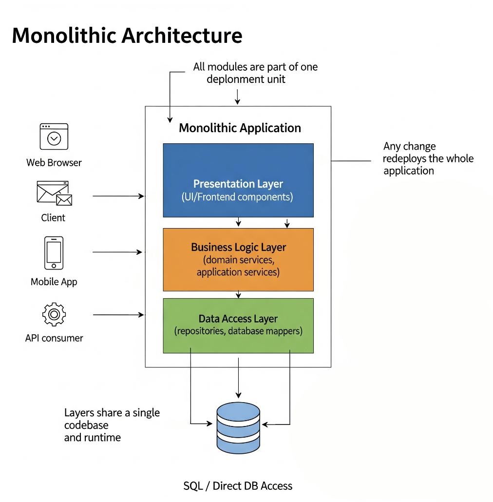

# Monolith

## About

A **Monolith Architecture** is a **single, unified codebase** where all components of an application - the user interface, business logic, and data access layers - are **tightly integrated** and deployed as **one executable or package**.

In this style, the system functions as a **self-contained unit**, meaning all features and services share the same:

* **Runtime environment** (same process or set of processes)
* **Database** (often a single schema)
* **Code repository** (single build and deployment pipeline)

Historically, monolithic architectures were the **default approach** because early computing environments lacked the distributed networking capabilities we have today. Systems were simpler, ran on a single machine, and were easier to develop as one cohesive block.

### **Key identity traits**&#x20;

* **Single Deployment Unit:** Any change (no matter how small) requires redeploying the entire application.
* **Shared Resources:** Components share memory space, configuration, and database connections.
* **Tight Coupling:** Modules are interdependent, often relying on direct function or class calls.
* **Centralized Control:** The whole system is governed by one set of runtime rules and security boundaries.

### **Why it still exists today ?**

* Simplicity in setup and development.
* Lower operational overhead for small teams or early-stage products.
* Direct communication between components without network calls, resulting in faster execution for many workloads.

## Core Principles

#### 1) Single Codebase, Unified Deployment - _the unit of change is the whole app_

**What it really means:**

* A monolith is defined by its **deployment boundary**, not by how many packages or modules it has. We may have many modules internally, but they compile/test/release as **one artifact**.
* This creates a **single version** of the system at any point in time - no cross-service version skew, no distributed release choreography.

**Why it matters:**

* **Operational simplicity:** one pipeline, one artifact, one runtime view.
* **Change atomicity:** schema + code evolve together; we avoid contract drift across services.
* **Cost of small changes:** even a trivial fix triggers a full rebuild, full test run, and full redeploy.

**Design implications & anti-patterns:**

* Keep **build graph** modular (e.g., gradle/maven modules) to avoid long incremental builds.
* Enforce modular boundaries with **package-level visibility** and **interface boundaries**, or the codebase drifts into a **Big Ball of Mud**.
* Use **monorepo practices** (code ownership, mandatory code reviews, fast CI) to keep velocity.

**Scaling the principle:**

* Adopt **modular monolith** practices: clear domain modules, internal APIs, and compile-time boundaries - still one deployable, but with strong internal separation.

#### 2) Tight Internal Coupling  - _in-process calls are cheap, but coupling is not_

**Forms of coupling to watch:**

* **Compile-time coupling:** a change in one module forces recompilation of many others (excessive imports, leaking internals).
* **Runtime coupling:** deep call chains and shared state increase fragility.
* **Temporal coupling:** modules must change/release together due to shared contracts.

**Why this is attractive:**

* **Latency & efficiency:** function calls + shared memory beat network hops.
* **Programming model:** unified error handling, tracing via a single call stack, simple transactions.

**The hidden cost:**

* **Change ripple effects:** cross-module edits become common.
* **Testing difficulty:** wide blast radius for regressions; unit tests drift into integration tests.
* **Team coupling:** organizational Conway’s Law pressure - teams step on each other’s toes.

**Mitigations:**

* **Cohesion over coupling:** organize by **domain** (DDD bounded contexts) instead of technical layers only.
* Define **internal contracts** (interfaces/ports) even within the monolith to make dependencies explicit.
* Track **afferent/efferent coupling** and **instability** metrics; refactor hotspots regularly.

#### 3) Shared Data Layer - _one database, many modules, one truth (and one bottleneck)_

**Strengths:**

* **ACID transactions** are straightforward; multi-module operations can share a transaction boundary.
* **Consistency:** no distributed consensus or sagas for most workflows.
* **Query power:** global joins/views across the entire schema.

**Risks and pitfalls:**

* **Schema coupling:** one table serves many modules; a column change can break the world.
* **Hot rows & lock contention:** centralized write paths throttle throughput.
* **Leaky abstractions:** cross-module joins embed domain knowledge in the DB, making refactors hard.

**Good practices:**

* **Data ownership:** even in a single DB, assign **table ownership** to modules; forbid random cross-module writes.
* **Expand–contract migrations:** additive changes first (expand), deploy code to use the new shape, then remove old columns (contract).
* **Read replicas & caching:** offload reads; use CQRS _internally_ (read models vs write models) while keeping one deployable.
* **Transaction discipline:** prefer **short, narrow transactions**; avoid long-running locks; choose isolation levels consciously.

#### 4) Centralized Build & Release Cycle - _one pipeline to rule them all_

**Benefits:**

* **Determinism:** one artifact is the truth; reproducible builds are simpler.
* **Holistic testing:** full-system integration tests run naturally in CI.

**Constraints:**

* **Release cadence coupling:** everything waits for slowest tests/modules.
* **Rollback semantics:** we roll back _the whole app_; partial rollbacks aren’t a thing.

**How to make it great:**

* **Trunk-based development** + short-lived branches → reduces merge hell.
* **Test pyramid:** heavy unit tests, lean integration tests, a few end-to-end smoke tests to keep CI fast.
* **Feature flags & toggles:** decouple deployment from release; ship dark code to reduce risky rollbacks.
* **Blue-green or canary at the app level:** even monoliths can canary - route small traffic to the new version before full cutover.

#### 5) Unified Technology Stack - _consistency over polyglot_

**Upsides:**

* **Cognitive load:** one language/runtime speeds onboarding and code reviews.
* **Tooling leverage:** shared linting, frameworks, observability, and security baselines.
* **Performance tuning:** one GC model, one thread model, one profiler.

**Trade-offs:**

* **Least-common-denominator effect:** we can’t pick the ideal language or runtime per domain.
* **Ecosystem inertia:** upgrading the framework/runtime is a **big-bang** event.

**Nuanced stance:**

* Monolith ≠ single language at all costs. **JVM polyglot** or **embedded runtimes** can work, but every added runtime increases operational complexity.
* Favor **library reuse** and **domain-specific modules** over introducing new stacks unless there’s a 10× gain.

**Guardrails:**

* Establish **tech radar** policies for introducing libs/frameworks.
* Bake **static analysis** and **dependency checks** into CI to prevent accidental drift.

#### 6) Synchronous Execution Flow - _fast path by default, async where it counts_

**Default behavior:**

* In-process calls are synchronous; the **request lifecycle** is a call stack across controllers → services → repositories → DB.

**Performance & reliability implications:**

* **Latency:** minimal; no serialization or network overhead.
* **Failure modes:** exceptions bubble predictably; fewer partial failure scenarios than in distributed systems.
* **Throughput ceiling:** the app’s thread pools, connection pools, and CPU/memory become key limits.

**Scaling myth-busting:**

* Monoliths can **scale horizontally** just fine if they’re **stateless** at the process level. Run N replicas behind a load balancer.
* When sessions are needed, use **external session stores** (Redis) or **sticky sessions** as a stop-gap.

**When to go async (inside the monolith):**

* **Outbox pattern** + internal message bus (e.g., DB-backed queue) for email, webhooks, long-running jobs.
* **Bulkheads & rate limits** to protect critical paths. Even in-process, we can apply **circuit breaker semantics** at module boundaries.

**Resource management:**

* Tune **thread pools**, **DB connection pools**, and **GC** settings.
* Apply **timeouts** and **backpressure** to avoid queue explosions under load.

## Architecture Diagram

<figure><figcaption></figcaption></figure>

#### **Layers in a Monolith Architecture**

#### **1. Presentation Layer (UI Layer)**

**Purpose:**

* Handles all **user interactions** and **request inputs**.
* Presents data to users in a **human-readable format** (web page, mobile UI, API response).

**Responsibilities:**

* Accept HTTP requests, WebSocket messages, or GUI events.
* Validate and format incoming data before passing to the business layer.
* Render responses (HTML, JSON, XML, etc.) for clients.
* Handle session management (if not externalized).

**Typical Components:**

* Web controllers, view templates, UI frameworks, frontend integration points.

**Why it matters in a monolith:**

* It’s tightly connected to the business logic - any UI change often triggers a rebuild of the entire application.
* Latency is minimal because it communicates in-process with business services.

#### **2. Business Logic Layer (Domain & Application Layer)**

**Purpose:**

* **Implements the core rules and workflows** of the application.
* Orchestrates operations across entities and integrates with other modules inside the monolith.

**Responsibilities:**

* Domain modeling (entities, aggregates, value objects).
* Application services (transaction boundaries, orchestration).
* Enforcing business rules and policies.
* Handling workflows and data transformations.

**Typical Components:**

* Service classes, domain models, validation rules, domain event handlers.

**Why it matters in a monolith:**

* All business logic is centralized, which makes it easier to maintain consistency but can lead to a “God Service” problem if not modularized.
* The **modular monolith** variation splits this layer into **bounded contexts** with internal APIs to reduce tight coupling.

#### **3. Data Access Layer (Persistence Layer)**

**Purpose:**

* Acts as the bridge between business logic and **persistent storage**.
* Encapsulates data-related operations so the business layer does not need to deal with SQL or low-level data management.

**Responsibilities:**

* CRUD operations for entities.
* Query optimization and indexing strategies.
* Transaction handling and connection pooling.
* Mapping between domain objects and database tables (ORM).

**Typical Components:**

* Repository classes, data mappers (e.g., Hibernate, MyBatis), SQL scripts.

**Why it matters in a monolith:**

* Usually tied to **one central database** - schema changes ripple through the entire system.
* Data integrity is easier to enforce since all writes happen through a single runtime.

#### **4. Central Database**

**Purpose:**

* Stores **all persistent data** for the application.
* Acts as a **single source of truth**.

**Responsibilities:**

* Maintain referential integrity.
* Support transactions for multi-entity operations.
* Provide query capability for reporting and analytics.

**Why it matters in a monolith:**

* A single schema often serves all layers and modules.
* Any migration or downtime impacts the entire application.

## Execution Flow

Think of the monolith execution flow as a **single-threaded narrative** where a request enters through one door and travels vertically down the layers, then back up with a response - all **within the same process**.


**Characteristics of This Flow**

* **Single Process Execution:** All steps happen in one process space without network hops.
* **Low Latency:** Direct method calls between layers keep performance high.
* **Tightly Coupled:** Any change in a lower layer can ripple up to affect controllers and higher layers.
* **Transactional Integrity:** Multi-step operations can be wrapped in a single DB transaction.
* **Scaling Pattern:** Typically scales by **replicating the whole application** across servers (horizontal scaling) or increasing server resources (vertical scaling).


#### **Step-by-Step Request Lifecycle**

**1. Client Initiates Request**

* A **client application** (web browser, mobile app, API consumer) sends a request to the server.
* This could be **HTTP/HTTPS**, WebSocket messages, or even CLI calls (in certain enterprise monoliths).
* The request arrives at a **single entry point** - usually a web server or application server (e.g., Tomcat, Spring Boot embedded server).

**2. Presentation Layer Processes Input**

* The **controller** (or similar component) in the Presentation Layer:
  * Parses incoming request parameters (query params, request body, headers).
  * Performs **basic validation** (format, required fields, authentication tokens).
  * Maps the request to a **business service method**.
* Communication here is **direct method invocation** - no serialization/deserialization between layers since it’s all in-process.

**3. Business Logic Layer Executes Rules & Orchestration**

* The **application service** in the Business Logic Layer receives the validated input.
* It applies **domain rules** for example:
  * Verify user permissions.
  * Validate business constraints (e.g., stock availability before processing an order).
* If multiple modules are involved, this layer orchestrates their interactions.
* It prepares **data retrieval or persistence requests** for the Data Access Layer.

**4. Data Access Layer Communicates with Database**

* The **repository** or **data mapper** executes queries to fetch or update data.
* All DB interactions are synchronous by default.
* **Transaction boundaries** are often managed at this layer or the service layer above it.
* If caching is used (e.g., in-memory cache, Redis), this layer checks the cache before hitting the DB.

**5. Database Responds**

* The central database returns query results or transaction confirmations.
* Results are mapped back into **domain objects** or DTOs (Data Transfer Objects).

**6. Business Logic Finalizes Output**

* The service layer processes the returned data:
  * Applies final transformations.
  * Enriches with computed fields or aggregates.
  * Triggers secondary actions if needed (e.g., sending confirmation emails, logging events).

**7. Presentation Layer Prepares Response**

* The processed result is passed back to the Presentation Layer.
* This layer:
  * Formats the response into the correct protocol (JSON, HTML, XML).
  * Sets HTTP status codes and headers.
* Sends the final response back to the client over the same connection.

## Advantages

#### **1. Simplicity of Development**

* **Single Codebase**: Developers work in one repository, making navigation and code comprehension straightforward.
* **Unified Build & Run**: Only one build pipeline and one deployment process, which reduces tooling complexity.
* **Lower Onboarding Overhead**: New developers don’t need to learn multiple service architectures or deployment targets before becoming productive.

#### **2. High Performance for In-Process Calls**

* **No Network Overhead**: All layer interactions happen via direct method calls, avoiding serialization, HTTP latency, or network retries.
* **Better Resource Utilization**: CPU and memory usage are more predictable since everything runs in the same process.
* **Optimized Transactions**: Business logic and database operations can be tightly synchronized without the need for distributed transaction protocols.

#### **3. Easier Testing & Debugging (for smaller codebases)**

* **Single Environment Testing**: Entire system can be started locally without simulating external dependencies.
* **Full-stack Debugging**: Developers can trace a request from UI to database in a single debugger session.
* **Simplified Test Data Setup**: One database schema and one runtime environment mean test data doesn’t have to be split across services.

#### **4. Straightforward Deployment**

* **Single Artifact**: One build artifact to deploy means fewer moving parts in release management.
* **Simple Rollbacks**: Reverting to a previous version is a matter of redeploying the last known good build.
* **Lower Ops Complexity**: No service discovery, API gateway, or distributed logging infrastructure is mandatory.

#### **5. Cost Efficiency (Early Stages)**

* **Lower Infrastructure Costs**: We can run a monolith on a single server or small VM.
* **Reduced DevOps Overhead**: Small teams can manage with basic CI/CD setups instead of complex service orchestration tools.
* **Faster Time-to-Market**: Minimal architecture allows more focus on delivering features.

#### **6. Easier to Maintain Consistency**

* **Single Source of Truth**: All modules share the same database schema, reducing data duplication.
* **Consistent Framework Use**: Same logging, security, and error handling approaches apply everywhere.
* **Unified Security Model**: Access control and authentication can be implemented once for the whole system.

#### **7. Good Fit for Certain Business Contexts**

* **Small to Medium-Sized Applications**: Ideal when the scope is limited and unlikely to require massive scale-out.
* **Rapid Prototyping**: Perfect for MVPs and proof-of-concepts where speed is more critical than long-term scalability.
* **Tightly Integrated Business Logic**: When most features rely heavily on each other, the overhead of service separation is not justified.

## Challenges / Limitations

#### **1. Scalability Constraints**

* **Whole-App Scaling**: We can’t scale just one feature or module - the entire application must be scaled together.
* **Inefficient Resource Use**: If only one small part of the system is under heavy load (e.g., reporting), we still have to allocate extra CPU/memory for the whole application.
* **Vertical Scaling Limitations**: Initially, scaling up (more CPU/RAM) works, but hardware limits and cost curves eventually make this impractical.

#### **2. Change Ripple Effects**

* **Tight Coupling**: A change in one module may require changes in multiple other parts due to deep interdependencies.
* **Fragile Deployments**: A bug in a small feature can bring down the entire application.
* **High Regression Risk**: Since all features share the same runtime, testing scope grows as the application grows.

#### **3. Slower Development at Scale**

* **Shared Codebase Conflicts**: More developers working in the same repo means more merge conflicts.
* **Longer Build Times**: As the codebase grows, compiling and running tests takes longer.
* **Synchronized Release Cycles**: All teams must coordinate deployments, slowing down time-to-market for individual features.

#### **4. Limited Technology Flexibility**

* **One Stack for All**: Adopting a new framework or language for a single feature is difficult, since the entire monolith must support it.
* **Upgrade Risks**: Framework or library upgrades affect all features at once, increasing testing requirements.

#### **5. Database Coupling Issues**

* **Shared Schema**: Database changes impact all parts of the application.
* **Risk of Data Access Violations**: Teams can accidentally read/write to tables owned by other modules since the DB is shared.
* **Migration Downtime**: Large schema changes may require taking the whole system offline.

#### **6. Deployment & Reliability Risks**

* **All-or-Nothing Deployments**: We can’t deploy just one feature - every release contains the entire system.
* **Rollback Complexity**: Rolling back a feature means rolling back all other changes made since the last release.
* **Single Point of Failure**: If the process crashes, the entire application becomes unavailable.

#### **7. Organizational Bottlenecks**

* **Team Dependencies**: Multiple teams often depend on the same shared modules, creating coordination overhead.
* **Hard to Parallelize Work**: Teams can’t work completely independently without risk of stepping on each other’s code.
* **Slower Onboarding in Large Monoliths**: Understanding the entire system takes longer as it grows.

## Use Cases

#### **1. Early-Stage Startups & MVPs (Minimum Viable Products)**

* **Why it fits**:
  * At this stage, speed of delivery matters more than architectural elegance.
  * A monolith allows teams to iterate rapidly without worrying about inter-service contracts, API gateways, or distributed systems complexity.
  * Feature development, integration, and deployment are simpler and cheaper.
* **Example**:
  * A new food delivery platform’s first version - quick to build, fast to pivot.

#### **2. Small-to-Medium Internal Tools**

* **Why it fits**:
  * These apps have a limited user base, moderate performance requirements, and low risk of extreme scaling needs.
  * Maintaining one deployable unit reduces operational overhead for IT teams.
* **Example**:
  * Internal HR leave tracking system.

#### **3. Applications with Tightly Coupled Business Logic**

* **Why it fits**:
  * If most components depend heavily on each other’s data and logic, separating them into microservices would cause constant cross-service calls.
  * A monolith keeps these dependencies in-process, ensuring higher performance and simpler transaction management.
* **Example**:
  * Banking core systems where transactions, ledgers, and balances are deeply intertwined.

#### **4. Systems with Predictable, Low Scaling Requirements**

* **Why it fits**:
  * If workload is stable and predictable, the scalability disadvantages of a monolith are less relevant.
  * Horizontal scaling with multiple identical instances is often sufficient.
* **Example**:
  * An internal reporting dashboard for a small company.

#### **5. Applications Requiring Strong Data Consistency**

* **Why it fits**:
  * Monoliths can wrap multi-step processes in a single ACID database transaction without involving distributed transaction protocols.
* **Example**:
  * E-commerce checkout process that must update inventory, payment status, and order history atomically.

#### **6. Legacy Applications That Still Serve Business Needs**

* **Why it fits**:
  * If an older monolith continues to perform well and scaling demands are modest, rewriting it into microservices may not be worth the risk or cost.
* **Example**:
  * A 15-year-old manufacturing plant control system that still meets operational needs.

#### **7. Proof-of-Concepts & Hackathon Projects**

* **Why it fits**:
  * We don’t invest in microservices for something that might not survive beyond a weekend.
* **Example**:
  * A hackathon prototype for a social networking app.

## Best Practices

#### **1. Embrace Modular Design (Even in a Monolith)**

* **Why**:
  * A monolith doesn’t have to be a tangled mess; it can be organized into well-defined modules with clear boundaries.
* **How**:
  * Apply **package-by-feature** (group by business capability) instead of package-by-layer only.
  * Use internal APIs or service-like abstractions between modules.
  * Avoid circular dependencies between modules.

#### **2. Enforce Clear Layered Architecture**

* **Why**:
  * Prevents business logic from leaking into presentation or data access layers, making future refactoring easier.
* **How**:
  * Presentation Layer → Service Layer → Data Layer → External Systems.
  * Restrict access so lower layers never call higher ones directly.

#### **3. Maintain Separation of Concerns**

* **Why**:
  * Keeps changes localized, reducing ripple effects.
* **How**:
  * Clearly define what belongs in each module/layer.
  * Use dependency injection to decouple components.

#### **4. Implement Automated Testing Early**

* **Why**:
  * Changes in one part of a monolith can unintentionally break other parts.
* **How**:
  * Unit tests for modules, integration tests for workflows, and end-to-end tests for critical paths.
  * Use CI to run tests automatically on every commit.

#### **5. Manage Build Times Proactively**

* **Why**:
  * As a monolith grows, slow builds kill developer productivity.
* **How**:
  * Use incremental builds and caching.
  * Modularize build scripts so not everything is rebuilt if only one module changes.

#### **6. Plan for Horizontal Scaling**

* **Why**:
  * Even monoliths may need scaling for increased load.
* **How**:
  * Ensure the application is stateless where possible so it can run across multiple instances.
  * Externalize session storage and caches (e.g., Redis).

#### **7. Isolate Shared Database Access**

* **Why**:
  * Prevents uncontrolled cross-module queries that make schema changes risky.
* **How**:
  * Use a data access layer (DAL) or repository pattern to centralize queries.
  * Avoid direct SQL calls scattered across the codebase.

#### **8. Prepare for Eventual Evolution**

* **Why**:
  * A healthy monolith can be incrementally split into services if business needs change.
* **How**:
  * Use internal APIs between modules so they can be externalized later.
  * Keep boundaries well-defined to ease future extraction.

#### **9. Maintain Strong Documentation**

* **Why**:
  * New developers can get lost in a large monolith without a clear map.
* **How**:
  * Maintain diagrams for architecture and module boundaries.
  * Keep README files in each major module.

#### **10. Monitor & Log Proactively**

* **Why**:
  * Without observability, debugging a monolith can be painful.
* **How**:
  * Centralized logging, structured logs, and application performance monitoring (APM).
  * Track module-level metrics, not just application-wide metrics.
