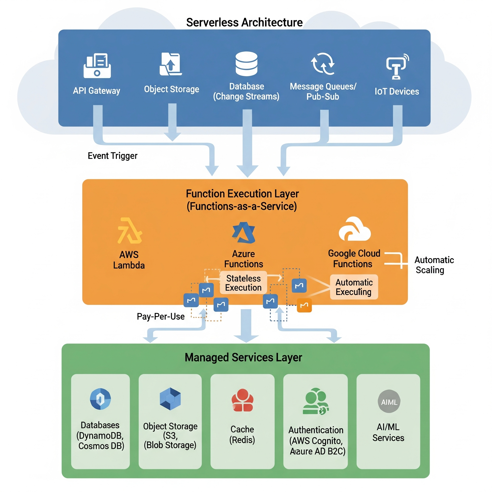

# Serverless

## About

Serverless architecture is a **cloud-native execution model** where we write application logic in **functions** (or small services) without managing servers.\
The cloud provider automatically provisions, scales, and maintains the infrastructure.\
You **only pay for execution time** - no charges for idle resources.

While “serverless” doesn’t mean “no servers,” it **abstracts away** server management, capacity planning, and scaling from the developer’s responsibilities.


**Position in the Architecture Landscape**

* **Compared to Monolith:** Extremely fine-grained; no central runtime.
* **Compared to Microservices:** Finer granularity, often single-purpose functions instead of small services.
* **Compared to Hexagonal:** Less about modularity within an app, more about decomposing into independent cloud functions.


#### **Key Characteristics**

1. **Event-Driven Execution**
   * Code is triggered by events - HTTP requests, file uploads, message queue events, database changes, IoT signals, etc.
   * Examples: AWS Lambda, Azure Functions, Google Cloud Functions.
2. **Ephemeral Compute**
   * Functions start and stop dynamically; they don’t run continuously.
   * State is **externalized** to databases, caches, or object storage.
3. **Automatic Scaling**
   * Scaling is **per event**, not per server.
   * No pre-provisioning required - the provider scales instances instantly based on load.
4. **Pay-as-You-Go Pricing**
   * Billed by **invocation count** and **execution time**.
   * This can drastically reduce costs for low-to-medium traffic workloads.
5. **Polyglot Flexibility**
   * Functions can be written in multiple languages supported by the provider.

## Core Principles

Serverless is not just about “running functions in the cloud.” It’s built on a set of architectural principles that ensure applications remain **scalable, cost-efficient, and resilient** without explicit server management.

#### **1) Stateless Functions**

* **What it means:**
  * Each function invocation is **independent** - it doesn’t rely on in-memory variables from previous executions.
  * All state is externalized to persistent storage like **databases**, **caches**, or **object stores**.
* **Why it matters:**
  * Enables **horizontal scaling** since any function instance can handle any request.
  * Prevents data loss when functions terminate.
* **Example:**
  * An AWS Lambda processing an image stores metadata in DynamoDB, not in memory.

#### **2) Event-Driven Triggers**

* **What it means:**
  * Functions are invoked **only when specific events occur** - HTTP requests, queue messages, database changes, file uploads, IoT events, etc.
* **Why it matters:**
  * Allows us to integrate functions directly with cloud services without polling.
* **Example:**
  * An Azure Function automatically processes a file when uploaded to Blob Storage.

#### **3) Automatic Scaling**

* **What it means:**
  * Cloud providers **scale functions per request** - no manual configuration of VM sizes or instance counts.
* **Why it matters:**
  * Prevents over-provisioning and supports unpredictable workloads.
* **Example:**
  * During a flash sale, an e-commerce checkout function scales from 10 to 10,000 concurrent invocations automatically.

#### **4) Ephemeral Execution**

* **What it means:**
  * Functions have **short lifetimes** - often measured in seconds or minutes and terminate after completing a task.
* **Why it matters:**
  * Frees up cloud resources and keeps costs tied to usage.
  * Requires fast initialization (but beware of **cold start latency**).

#### **5) Fine-Grained Costing**

* **What it means:**
  * We pay **only for execution time and memory used**, not for idle infrastructure.
* **Why it matters:**
  * Can lead to major cost savings, especially for **bursty workloads**.
* **Example:**
  * A reporting function runs once a day for 10 seconds; we are only billed for those 10 seconds.

#### **6) Vendor Service Composition**

* **What it means:**
  * Functions often act as **glue code**, connecting managed services like storage, databases, authentication, and ML APIs.
* **Why it matters:**
  * Lets developers build applications quickly by leveraging the provider’s ecosystem.

#### **7) Built-in High Availability**

* **What it means:**
  * The provider manages replication, fault tolerance, and availability zones.
* **Why it matters:**
  * Removes the burden of designing complex failover systems for most use cases.

## Architecture Diagram

A **serverless architecture** diagram typically contains three main layers:

<figure><figcaption></figcaption></figure>

#### **1) Event Sources Layer**

* **Purpose:** Triggers function execution without a continuously running process.
* **Examples:**
  * **HTTP/API calls:** Via an API Gateway (e.g., AWS API Gateway, Azure API Management).
  * **File uploads:** Object storage events (S3, Blob Storage).
  * **Database updates:** Change streams or triggers (e.g., DynamoDB Streams, Cosmos DB Change Feed).
  * **Messaging systems:** Queues or pub/sub (e.g., SQS, Kafka, Azure Service Bus).
  * **IoT events:** Device telemetry triggers functions.

#### **2) Function Execution Layer (FaaS)**

* **Purpose:** Core business logic, executed only when triggered.
* **Characteristics:**
  * Stateless and short-lived.
  * Can be written in multiple languages.
  * Scales per request automatically.
* **Examples:**
  * AWS Lambda, Azure Functions, Google Cloud Functions.

#### **3) Managed Services Layer**

* **Purpose:** Store state, integrate with third-party APIs, and perform specialized processing.
* **Examples:**
  * **Databases:** DynamoDB, Aurora Serverless, Cosmos DB.
  * **Storage:** S3, Blob Storage.
  * **Cache:** Redis, MemoryStore.
  * **Auth:** AWS Cognito, Azure AD B2C.
  * **Specialized APIs:** AI/ML services, analytics pipelines, notification systems.

#### **4) Scaling and Fault Tolerance**

* **Auto-Scaling:** Functions spin up/down instantly based on load.
* **Fault Tolerance:** Cloud provider manages failover and redundancy across regions.

## Execution Flow

A serverless execution flow describes **how a request or event travels** from an initial trigger to a completed response, all without direct server management.

#### **Step 1 - Event Trigger**

* **What happens:**
  * An **external event** initiates the flow.
  * Common triggers:
    * HTTP request via **API Gateway**.
    * File upload to **object storage**.
    * Message arrival in a **queue or pub/sub**.
    * Database change event.
    * IoT device telemetry.
* **Key principle:** The system is idle until this event happens — zero cost for idle time.

#### **Step 2 - API Gateway or Event Router**

* **What happens:**
  * If the event is an HTTP/API call, it passes through an **API Gateway** (e.g., AWS API Gateway, Azure API Management).
  * If it’s a non-HTTP event (e.g., S3 upload, queue message), the **event source service** directly routes it to the function.
* **Responsibilities:**
  * Request validation & transformation.
  * Authentication & authorization (integration with Cognito, Azure AD B2C, etc.).
  * Rate limiting, throttling, and monitoring.

#### **Step 3 - Function Invocation**

* **What happens:**
  * The cloud provider launches a **function instance** in the Functions-as-a-Service (FaaS) layer.
  * If no instance is running, it creates one (cold start); if one is warm, it reuses it.
  * Function executes **stateless business logic**.
* **Characteristics:**
  * Ephemeral execution (seconds to minutes).
  * Isolation between invocations for security.

#### **Step 4 - Integration with Managed Services**

* **What happens:**
  * Function interacts with cloud-managed services for data persistence, caching, or external API calls.
  * Examples:
    * Write to DynamoDB or Cosmos DB.
    * Store file in S3/Blob Storage.
    * Fetch cached data from Redis.
    * Call AI/ML inference API.
* **Benefit:**
  * Offloads complexity of maintaining storage, scaling, and security to provider.

#### **Step 5 - Scaling Behavior**

* **What happens:**
  * For high-traffic events, **multiple function instances** spin up in parallel.
  * Load is distributed automatically; developers don’t need to configure scaling rules.
* **Key benefit:**
  * **True elasticity** - the system adapts to demand instantly.

#### **Step 6 - Response Delivery**

* **What happens:**
  * If it’s an API request, the function returns a response via the API Gateway to the client.
  * If it’s an asynchronous event (e.g., file processing), output is stored or another event is triggered.
* **Additional actions:**
  * Logging to CloudWatch, Application Insights, or Stackdriver.
  * Metrics reporting to monitoring tools.

#### **Step 7 - Function Termination**

* **What happens:**
  * After execution, the function instance is terminated (unless kept warm briefly).
  * No ongoing resource usage or cost.

## Advantages

Serverless is not just about “no servers” - it’s about **abstracting server management** so developers focus entirely on business logic while the cloud provider handles scaling, infrastructure, and availability.

#### **1) No Server Management**

* **Meaning:**
  * Developers don’t provision, patch, or monitor servers.
  * No OS-level updates, no hardware scaling, no VM orchestration.
* **Impact:**
  * Reduces operational overhead.
  * Ideal for small teams without DevOps-heavy capabilities.

#### **2) Automatic Scaling (Elasticity)**

* **How it works:**
  * Functions scale **horizontally and instantly** based on request volume.
  * Each request may spin up a separate execution environment.
* **Benefit:**
  * Handles unpredictable traffic spikes seamlessly.
  * No need to pre-provision capacity.

#### **3) Pay-Per-Use Pricing**

* **How it works:**
  * We are billed **only for execution time** and memory used.
  * No cost for idle resources.
* **Example:**
  * A function that runs once a week for 5 seconds costs almost nothing.
* **Benefit:**
  * Significant savings for workloads with variable or infrequent traffic.

#### **4) Reduced Time-to-Market**

* **Reason:**
  * Developers focus only on core business logic.
  * Cloud provider offers managed integrations (e.g., databases, AI services, authentication).
* **Result:**
  * Faster feature releases and iterations.

#### **5) Event-Driven by Design**

* **Why it matters:**
  * Serverless naturally fits modern **event-driven** and **microservices** architectures.
  * Works well for asynchronous workflows like file processing, data pipelines, and real-time notifications.

#### **6) High Availability & Fault Tolerance**

* **Reason:**
  * Cloud providers automatically distribute workloads across multiple data centers and regions.
* **Impact:**
  * Zero effort for disaster recovery planning.

#### **7) Built-In Security Benefits**

* **Reason:**
  * Isolation between function invocations.
  * Providers handle patching of underlying infrastructure.
* **Caveat:**
  * Developers still need to secure **application logic** and **data access**.

## Challenges / Limitations

While serverless offers **scalability and reduced operational burden**, it’s not without trade-offs. Many of these challenges arise from its **on-demand, fully managed, and event-driven nature**.

#### **1) Cold Starts**

* **What it is:**
  * Delay in function execution when a new container instance needs to be created for handling an event.
* **Why it happens:**
  * Functions are stateless and not constantly running; the first request after inactivity requires setup time.
* **Impact:**
  * Noticeable latency for latency-sensitive APIs (e.g., < 100ms requirements).
* **Mitigation:**
  * Use **provisioned concurrency** (AWS Lambda) or **always-on functions** (Azure Premium Plan) — but increases cost.

#### **2) Vendor Lock-In**

* **Reason:**
  * Deep integration with one cloud provider’s proprietary services (e.g., AWS DynamoDB, GCP Pub/Sub).
* **Risk:**
  * Difficult migration to another provider without rewriting code.
* **Mitigation:**
  * Use open standards (e.g., OpenFaaS, Knative) or abstraction layers.

#### **3) Limited Execution Time & Resource Constraints**

* **Example:**
  * AWS Lambda limits execution time to 15 minutes, memory to 10 GB.
* **Impact:**
  * Unsuitable for **long-running tasks** or **heavy computation** workloads.
* **Mitigation:**
  * Break tasks into smaller functions and use workflows (e.g., AWS Step Functions).

#### **4) Debugging & Monitoring Complexity**

* **Why:**
  * Stateless, distributed execution across ephemeral environments makes tracing errors harder.
* **Challenge:**
  * Traditional debugging tools (breakpoints, local stepping) don’t work easily.
* **Mitigation:**
  * Use cloud-native observability tools (CloudWatch, Azure Monitor, GCP Cloud Trace).

#### **5) State Management Difficulties**

* **Reason:**
  * Functions can’t store session data between invocations.
* **Impact:**
  * State must be stored externally (DB, cache), increasing latency and complexity.

#### **6) Not Ideal for Heavy Real-Time Workloads**

* **Why:**
  * Overhead of cold starts and network latency can impact real-time streaming/gaming.
* **Mitigation:**
  * Use hybrid architecture: serverless for burstable tasks, dedicated compute for real-time cores.

#### **7) Cost Spikes Under High Constant Load**

* **Paradox:**
  * Pay-per-use is great for intermittent workloads, but **constant high traffic** may cost more than reserved compute.
* **Mitigation:**
  * Monitor billing closely; switch to provisioned instances for steady workloads.

## Use Cases

Serverless is best suited for **event-driven, intermittent, and highly scalable workloads** where infrastructure management should be minimal. Its strengths shine when dealing with **asynchronous tasks, unpredictable traffic, and service integrations**.

#### **1) API Backends**

* **Why it works:**
  * Functions can serve as REST/GraphQL endpoints triggered via API Gateway.
  * Scales automatically with user requests.
* **Example:**
  * A mobile app backend that handles authentication, data CRUD, and analytics on demand.

#### **2) Data Processing Pipelines**

* **Pattern:** Event → Function → Process → Store
* **Examples:**
  * Image/video transcoding after upload.
  * Log parsing and aggregation.
  * Data cleaning and transformation for analytics.
* **Why Serverless:**
  * Can parallelize work across many function instances for faster processing.

#### **3) Real-Time File Processing**

* **Trigger:** Object storage events (e.g., S3 upload) invoke a function.
* **Example:**
  * Automatic PDF generation after form submission.
  * Image compression or watermarking after upload.

#### **4) IoT Event Handling**

* **Why it works:**
  * Functions can respond instantly to sensor/device events without keeping a server always running.
* **Example:**
  * Smart home automation based on sensor triggers.
  * Industrial IoT alerts and analytics.

#### **5) Chatbots & Voice Assistants**

* **Trigger:** Messaging platforms or voice services send an event to the function.
* **Example:**
  * Slack bot that responds to commands.
  * Alexa skill processing voice inputs via Lambda.

#### **6) Scheduled Tasks (Cron Jobs)**

* **Trigger:** Cloud scheduler service invokes the function periodically.
* **Example:**
  * Daily data sync with external APIs.
  * Automated backups and reporting.

#### **7) Machine Learning Inference**

* **Why Serverless:**
  * Can run inference on-demand without maintaining expensive GPU instances continuously.
* **Example:**
  * Sentiment analysis for incoming chat messages.
  * Object detection in uploaded images.

#### **8) Event-Driven Integrations**

* **Pattern:** External system event → Function → Call downstream service.
* **Example:**
  * CRM webhook triggering customer email campaigns.
  * Payment gateway events triggering accounting updates.

## Best Practices

To truly harness serverless benefits while avoiding pitfalls, we need to **design, monitor, and secure functions intentionally**.

#### **1) Optimize for Cold Starts**

* **Why:** Minimizes latency when functions scale from zero.
* **How:**
  * Use **provisioned concurrency** for critical APIs.
  * Keep function packages small to reduce startup time.
  * Prefer lightweight runtimes (Node.js, Go) over heavier ones (.NET, Java) for fast initialization.

#### **2) Keep Functions Small & Focused (Single Responsibility)**

* **Reason:** Easier debugging, better maintainability, and faster execution.
* **Guideline:**
  * One function = one logical task.
  * Avoid “god functions” that handle multiple workflows.

#### **3) Use Asynchronous Processing for Long Tasks**

* **Why:** Functions have execution time limits.
* **Approach:**
  * Offload long jobs to queues (SQS, Pub/Sub) or workflows (Step Functions, Cloud Workflows).
  * Use event-driven chaining to break big jobs into smaller tasks.

#### **4) Secure Functions & Data**

* **Key Steps:**
  * Apply **principle of least privilege** for IAM roles.
  * Secure sensitive config via **secrets manager** (not environment variables).
  * Validate all inputs - serverless still faces injection and XSS attacks.

#### **5) Implement Observability Early**

* **Why:** Serverless is distributed and ephemeral - debugging after production issues is hard.
* **Tools:**
  * Use structured logging (JSON format).
  * Add tracing (AWS X-Ray, Azure App Insights, GCP Cloud Trace).
  * Monitor key metrics: invocation count, duration, errors, cold starts.

#### **6) Control Costs Proactively**

* **Why:** Pay-per-use can surprise us with high bills under heavy load.
* **Steps:**
  * Set budgets & alerts.
  * Monitor memory allocation - more memory = higher cost, but may also reduce runtime.
  * Consider reserved/provisioned instances for predictable workloads.

#### **7) Plan for Vendor Lock-In Mitigation**

* **Approach:**
  * Use frameworks like **Serverless Framework**, **Knative**, or **OpenFaaS** for portability.
  * Keep business logic separate from cloud provider-specific services.

#### **8) Handle State with External Services**

* **Why:** Functions are stateless by design.
* **Options:**
  * Databases (RDS, DynamoDB, Firestore).
  * Distributed cache (Redis, Memcached).

