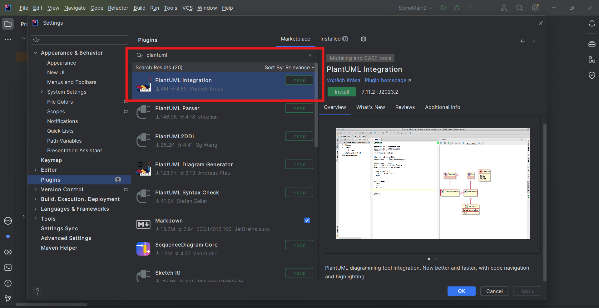
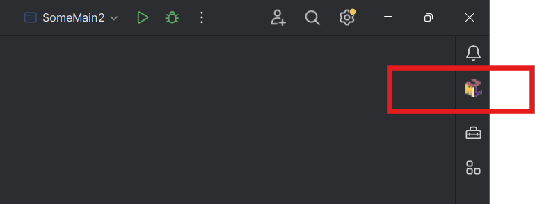
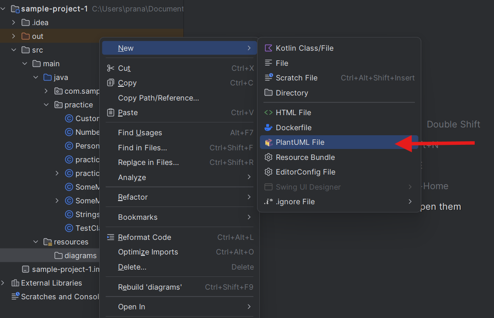

# PlantUML

## About

PlantUML is a tool that allows users to define UML diagrams using a plain text description. It generates visual diagrams from these descriptions, making it a preferred choice for software developers and documentation writers.

## **Features**

* **Text-Based UML**: Diagrams are written in plain text and converted into images.
* **Supports Multiple UML Diagrams**: Class, Sequence, Use Case, State, Activity, and more.
* **Integration with Code and Documentation**: Works with Markdown, AsciiDoc, LaTeX, etc.
* **Automation and Version Control**: Easy to track changes in diagrams using Git.
* **Cross-Platform**: Works on Windows, macOS, and Linux.
* **Lightweight and Fast**: Requires minimal system resources.

## **Installation and Setup**

PlantUML requires Java (JDK 8 or higher) to run. It can be used in different ways:

### **Option 1: Using the Standalone JAR File**

1. Install Java (if not installed).
2. Download the PlantUML JAR file from [PlantUML’s official site](https://plantuml.com/download).
3.  Run it using:

    ```sh
    java -jar plantuml.jar your-diagram.puml
    ```

### **Option 2: Using Online Editors**

* PlantUML Online Server
* [Kroki.io](https://kroki.io) (supports multiple diagram types)

### **Option 3: Using VS Code Plugin**

1. Install the **PlantUML** extension from the VS Code marketplace.
2.  Install **Graphviz** (needed for rendering):

    ```sh
    sudo apt install graphviz  # Linux
    brew install graphviz      # macOS
    ```
3. Create a `.puml` file and start writing UML diagrams!

### **Option 4: Using IntelliJ IDEA Plugin**

* Install the **PlantUML Integration** plugin from the IntelliJ Plugin Marketplace.


**Create a New PlantUML File**

1. Open IntelliJ IDEA project.
2. Right-click on the `src` or desired directory.
3. Select **New** → **File**.
4. Name the file **diagram.puml** (or any `.puml` extension).



<figure><figcaption></figcaption></figure>

<figure><figcaption></figcaption></figure>

<figure><figcaption></figcaption></figure>


## **UML Diagrams Supported in PlantUML**

PlantUML supports almost all major UML diagram types:

<table data-header-hidden data-full-width="true"><thead><tr><th></th><th></th><th></th></tr></thead><tbody><tr><td><strong>Diagram Type</strong></td><td><strong>Description</strong></td><td><strong>Example Syntax</strong></td></tr><tr><td><strong>Class Diagram</strong></td><td>Represents classes and their relationships</td><td><code>class User { +name: String }</code></td></tr><tr><td><strong>Sequence Diagram</strong></td><td>Shows interaction between objects over time</td><td><code>Alice -> Bob: Hello</code></td></tr><tr><td><strong>Use Case Diagram</strong></td><td>Represents system functionalities and user interactions</td><td><code>User -> (Login)</code></td></tr><tr><td><strong>Activity Diagram</strong></td><td>Models workflows and decision-making</td><td><code>start --> if (Condition?) then</code></td></tr><tr><td><strong>State Diagram</strong></td><td>Shows state transitions in a system</td><td><code>[*] --> Active</code></td></tr><tr><td><strong>Component Diagram</strong></td><td>Represents system components and dependencies</td><td><code>component Database</code></td></tr><tr><td><strong>Deployment Diagram</strong></td><td>Shows hardware and software deployment</td><td><code>node Server { component App }</code></td></tr><tr><td><strong>Object Diagram</strong></td><td>Represents instances of classes at runtime</td><td><code>object user1: User</code></td></tr></tbody></table>


