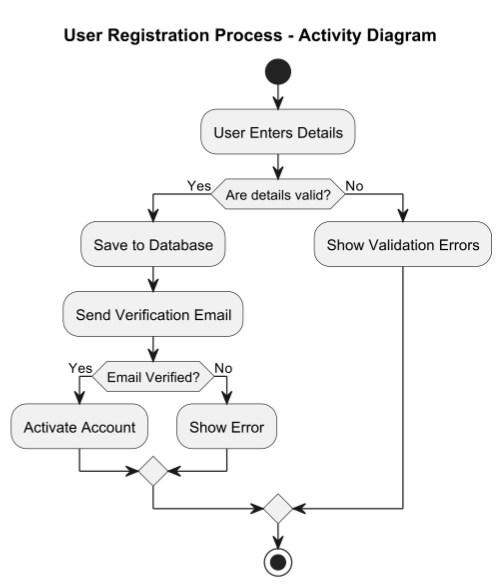

# Activity Diagram

## About

An Activity Diagram represents workflow or process flow in a system, describing sequential and parallel actions. It is widely used for business logic modeling and process visualization.


Refer to the official documentation for more details - [https://plantuml.com/activity-diagram-beta](https://plantuml.com/activity-diagram-beta)


### **Key Elements**

1. **Start & End Nodes**
   * Represented by a **black circle (start)** and **encircled black dot (end)**.
2. **Actions (Activities)**&#x20;
   * Represented as **rounded rectangles**.
   * Each action represents **a step in the workflow**.
3. **Transitions (Arrows)**&#x20;
   * Show the **flow of execution** between activities.
4. **Decision Nodes**&#x20;
   * Diamond shape, used for **if-else conditions**.
5. **Fork & Join Nodes**&#x20;
   * Represent **parallel processing** (splitting/joining flows).
6. **Swimlanes**&#x20;
   * Separate **responsibilities of different entities** in the process.


## 1. User Registration Process

This represents the **User Registration Process** in a web application.


* **Start (`start`)** and **End (`stop`)** nodes.
* **Decision (`if ... then ... else`)**: Validates user input.
* **Actions (`: ActionName;`)**: Represents different activities.


```plant-uml
@startuml
title User Registration Process - Activity Diagram

start
:User Enters Details;
if (Are details valid?) then (Yes)
    :Save to Database;
    :Send Verification Email;
    if (Email Verified?) then (Yes)
        :Activate Account;
    else (No)
        :Show Error;
    endif
else (No)
    :Show Validation Errors;
endif
stop

@enduml
```

<figure><figcaption></figcaption></figure>


