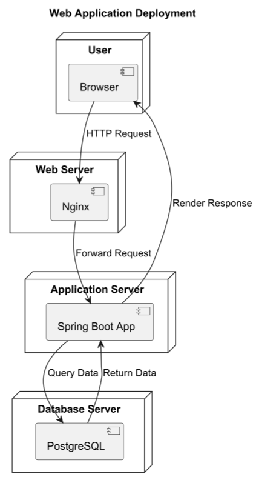
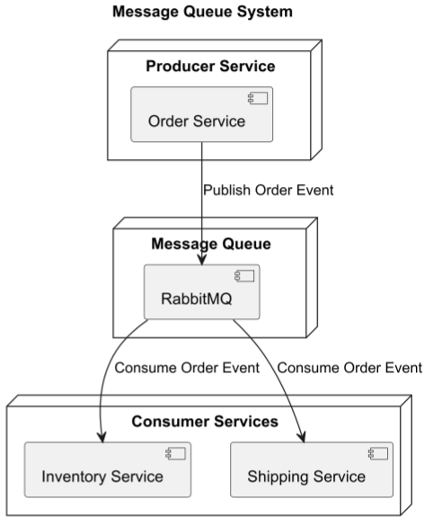
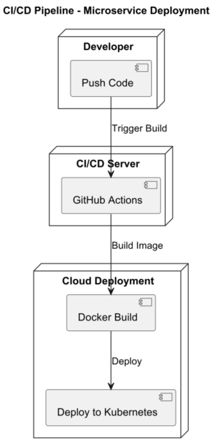
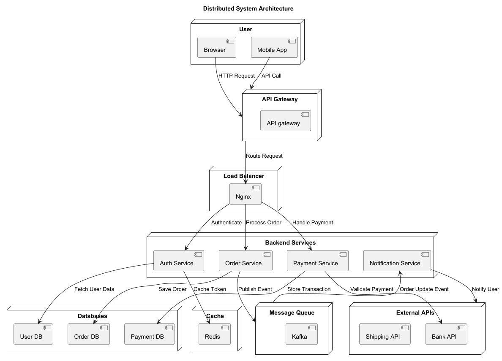

# Architecture Diagram

## About

An **Architecture Diagram** represents the **high-level structure of a system**, including **components, services, and their interactions**. In a **Distributed System**, it shows how components communicate across multiple nodes.


Refer to the official documentation for more details - [https://plantuml.com/archimate-diagram](https://plantuml.com/archimate-diagram)


#### **Key Elements**

1. **Nodes (Servers, Databases, Clients)**&#x20;
   * Represent **physical or virtual machines** in the system.
2. **Microservices / Components**&#x20;
   * Logical groupings of **functional modules** (e.g., Authentication, API Gateway).
3. **Communication Protocols**&#x20;
   * Defines how components interact (e.g., REST, gRPC, Kafka).
4. **Load Balancers & Caches**&#x20;
   * Used for **scalability and performance optimization**.
5. **External Dependencies**&#x20;
   * Cloud services, third-party APIs, or message queues.

## 1. Web Application Deployment

This represents a **Web Application Deployment** with multiple nodes (web server, app server, database).


* **Nodes (`node "Name" { }`)**: Represents physical/virtual machines.
* **Components (`[Component]`)**: Represents deployed components.
* **Connections (`-->`)**: Shows data flow.


```plant-uml
@startuml
title Web Application Deployment

node "User" {
    [Browser]
}

node "Web Server" {
    [Nginx]
}

node "Application Server" {
    [Spring Boot App]
}

node "Database Server" {
    [PostgreSQL]
}

Browser --> Nginx : HTTP Request
Nginx --> "Spring Boot App" : Forward Request
"Spring Boot App" --> PostgreSQL : Query Data
PostgreSQL --> "Spring Boot App" : Return Data
"Spring Boot App" --> Browser : Render Response

@enduml
```

<figure><figcaption></figcaption></figure>

## **2. Message Queue System**

This represents **a microservice-based messaging system using RabbitMQ**.


* **Nodes representing services and message queues**.
* **Message flow (`-->`)**.


```plant-uml
@startuml
title Message Queue System

node "Producer Service" {
    [Order Service]
}

node "Message Queue" {
    [RabbitMQ]
}

node "Consumer Services" {
    [Inventory Service]
    [Shipping Service]
}

"Order Service" --> "RabbitMQ" : Publish Order Event
"RabbitMQ" --> "Inventory Service" : Consume Order Event
"RabbitMQ" --> "Shipping Service" : Consume Order Event

@enduml
```

<figure><figcaption></figcaption></figure>

## **3. CI/CD Pipeline Diagram**

This represents **a GitHub Actions CI/CD pipeline for deploying a microservice**.


* **Stages of CI/CD pipeline**.
* **Deployment flow (`-->`)**


```plant-uml
@startuml
title CI/CD Pipeline - Microservice Deployment

node "Developer" {
    [Push Code]
}

node "CI/CD Server" {
    [GitHub Actions]
}

node "Cloud Deployment" {
    [Docker Build]
    [Deploy to Kubernetes]
}

"Push Code" --> "GitHub Actions" : Trigger Build
"GitHub Actions" --> "Docker Build" : Build Image
"Docker Build" --> "Deploy to Kubernetes" : Deploy

@enduml
```

<figure><figcaption></figcaption></figure>

## **4. Distributed System**

This represents **a distributed system with load balancing, microservices, and databases**.

```plant-uml
@startuml
title Distributed System Architecture

' User interacts with the system
node "User" {
    [Browser]
    [Mobile App]
}

' Entry point for requests
node "API Gateway" {
    [API gateway]
}

' Load Balancer for backend services
node "Load Balancer" {
    [Nginx]
}

' Backend Microservices
node "Backend Services" {
    [Auth Service]
    [Order Service]
    [Payment Service]
    [Notification Service]
}

' Databases for storing data
node "Databases" {
    [User DB]
    [Order DB]
    [Payment DB]
}

' Caching Layer
node "Cache" {
    [Redis]
}

' Message Queue System for async processing
node "Message Queue" {
    [Kafka]
}

' External Services
node "External APIs" {
    [Bank API]
    [Shipping API]
}

' Connections
Browser --> "API Gateway" : HTTP Request
"Mobile App" --> "API Gateway" : API Call
"API Gateway" --> Nginx : Route Request

Nginx --> "Auth Service" : Authenticate
"Auth Service" --> "User DB" : Fetch User Data
"Auth Service" --> Redis : Cache Token

Nginx --> "Order Service" : Process Order
"Order Service" --> "Order DB" : Save Order
"Order Service" --> "Message Queue" : Publish Event

Nginx --> "Payment Service" : Handle Payment
"Payment Service" --> "Payment DB" : Store Transaction
"Payment Service" --> "Bank API" : Validate Payment

"Message Queue" --> "Notification Service" : Order Update Event
"Notification Service" --> "External APIs" : Notify User

@enduml
```

<figure><figcaption></figcaption></figure>


