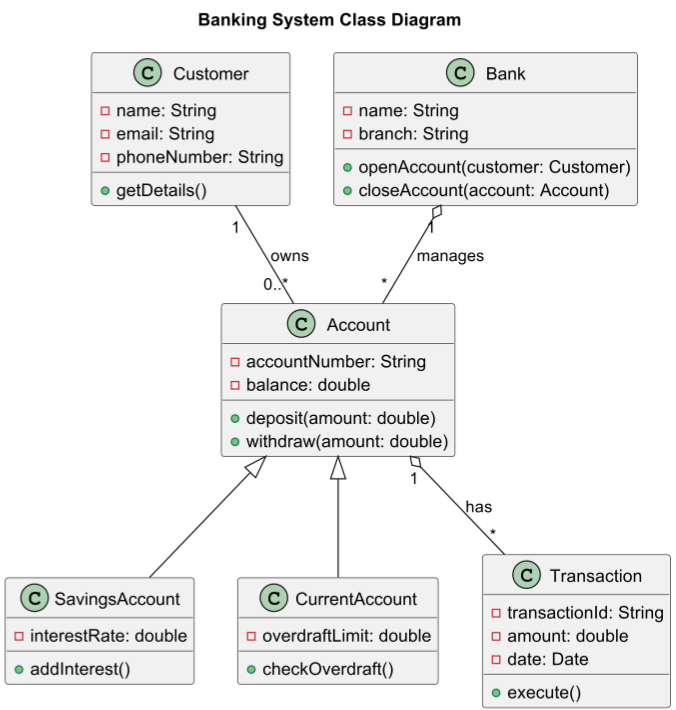

# Class Diagram

## 1. Banking System

This diagram represents a **Banking System**, including multiple relationships such as **inheritance, composition, aggregation, and dependencies**.


* **Inheritance (`<|--`)**: `SavingsAccount` and `CurrentAccount` inherit from `Account`.
* **Association (`--`)**: `Customer` owns multiple `Accounts`.
* **Composition (`o--`)**: `Bank` is composed of multiple `Accounts`.
* **Multiplicity (`0..*`, `1`)**: Defines relationships between classes.


```plant-uml
@startuml
title Banking System Class Diagram

class Account {
  - accountNumber: String
  - balance: double
  + deposit(amount: double)
  + withdraw(amount: double)
}

class SavingsAccount {
  - interestRate: double
  + addInterest()
}

class CurrentAccount {
  - overdraftLimit: double
  + checkOverdraft()
}

class Transaction {
  - transactionId: String
  - amount: double
  - date: Date
  + execute()
}

class Customer {
  - name: String
  - email: String
  - phoneNumber: String
  + getDetails()
}

class Bank {
  - name: String
  - branch: String
  + openAccount(customer: Customer)
  + closeAccount(account: Account)
}

Account <|-- SavingsAccount
Account <|-- CurrentAccount
Customer "1" -- "0..*" Account : owns
Account "1" o-- "*" Transaction : has
Bank "1" o-- "*" Account : manages

@enduml

```

<figure><figcaption></figcaption></figure>


