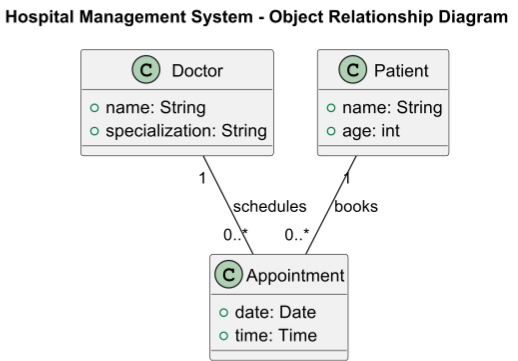

# Class Diagram

## About

A Class Diagram is a structural UML (Unified Modeling Language) diagram that visually represents the blueprint of a system's classes, their attributes, methods, and relationships. It is widely used in object-oriented programming to design and document system architecture.


Refer to the official documentation for more details - [https://plantuml.com/class-diagram](https://plantuml.com/class-diagram)


### **Elements of a Class Diagram**

1. **Classes**
   * Represented as a **rectangle** with three sections:
     * **Class Name** (e.g., `Customer`)
     * **Attributes** (e.g., `+name: String`)
     * **Methods** (e.g., `+getCustomerDetails(): String`)
   *   Example:

       ```
       +-----------------+
       |   Customer      |
       +-----------------+
       | - id: int       |
       | - name: String  |
       | - email: String |
       +-----------------+
       | +getDetails()   |
       | +updateEmail()  |
       +-----------------+
       ```
2. **Relationships**
   * Defines how classes interact with each other.
   * **Association** (`--`): Direct connection between classes.
   * **Aggregation** (`<>--`): A whole-part relationship where the part can exist independently.
   * **Composition** (`*--`): A stronger form of aggregation; the part cannot exist independently.
   * **Inheritance** (`<|--`): Denotes that one class is a subtype of another.
   * **Dependency** (`..>`): A weak relationship where one class depends on another.
3. **Modifiers**
   * **Public (`+`)**: Accessible from anywhere.
   * **Private (`-`)**: Accessible only within the class.
   * **Protected (`#`)**: Accessible within the class and its subclasses.
   * **Package (`~`)**: Accessible within the same package.

## 1. Banking System

This diagram represents a **Banking System**, including multiple relationships such as **inheritance, composition, aggregation, and dependencies**.


* **Inheritance (`<|--`)**: `SavingsAccount` and `CurrentAccount` inherit from `Account`.
* **Association (`--`)**: `Customer` owns multiple `Accounts`.
* **Composition (`o--`)**: `Bank` is composed of multiple `Accounts`.
* **Multiplicity (`0..*`, `1`)**: Defines relationships between classes.


```plant-uml
@startuml
title Banking System Class Diagram

class Account {
  - accountNumber: String
  - balance: double
  + deposit(amount: double)
  + withdraw(amount: double)
}

class SavingsAccount {
  - interestRate: double
  + addInterest()
}

class CurrentAccount {
  - overdraftLimit: double
  + checkOverdraft()
}

class Transaction {
  - transactionId: String
  - amount: double
  - date: Date
  + execute()
}

class Customer {
  - name: String
  - email: String
  - phoneNumber: String
  + getDetails()
}

class Bank {
  - name: String
  - branch: String
  + openAccount(customer: Customer)
  + closeAccount(account: Account)
}

Account <|-- SavingsAccount
Account <|-- CurrentAccount
Customer "1" -- "0..*" Account : owns
Account "1" o-- "*" Transaction : has
Bank "1" o-- "*" Account : manages

@enduml

```

<figure><figcaption></figcaption></figure>

## 2. Hospital Management System

This represents **relationships between classes** in a **Hospital Management System**.

```plant-uml
@startuml
title Hospital Management System - Object Relationship Diagram

class Doctor {
    +name: String
    +specialization: String
}

class Patient {
    +name: String
    +age: int
}

class Appointment {
    +date: Date
    +time: Time
}

Doctor "1" -- "0..*" Appointment : schedules
Patient "1" -- "0..*" Appointment : books

@enduml
```

<figure><figcaption></figcaption></figure>

