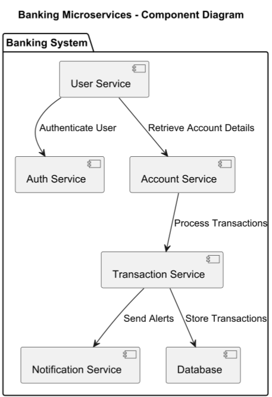

# Component Diagram

## About

A Component Diagram represents the high-level structure of a system, showing software components, their dependencies, and interfaces. It is used to visualize module-level architecture and how components interact within a system.


Refer to the official documentation for more details - [https://plantuml.com/component-diagram](https://plantuml.com/component-diagram)


### **Key Elements**

1. **Components**
   * Represented as **rectangles with a small box** (or `<<component>>` stereotype).
   * Define **independent modules** of a system (e.g., `UserService`, `PaymentService`).
2. **Interfaces**
   * Represented as **circles** or `<<interface>>` notation.
   * Show **exposed functionalities** of components.
3. **Dependencies**
   * **Dashed arrows** indicate dependency relationships (e.g., one component depends on another).
4. **Relationships**
   * **Provided/Required Interfaces** – Shows **what a component offers or consumes**.
   * **Direct Communication** – Arrows representing **message passing**.

## 1. Banking System

This represents a **Microservices Architecture** in a banking system.

```java
@startuml
title Banking Microservices - Component Diagram

package "Banking System" {
    [User Service] --> [Auth Service] : Authenticate User
    [User Service] --> [Account Service] : Retrieve Account Details
    [Account Service] --> [Transaction Service] : Process Transactions
    [Transaction Service] --> [Notification Service] : Send Alerts
    [Transaction Service] --> [Database] : Store Transactions
}

@enduml
```

<figure><figcaption></figcaption></figure>


