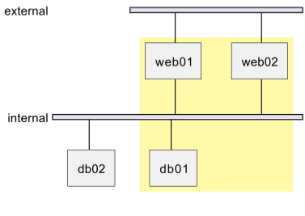

# Network Diagram

## About

A Network Diagram represents the architecture and communication flow between different network components such as servers, clients, routers, firewalls, and databases. It is widely used for network infrastructure planning, cloud architecture, and distributed systems.


Refer to the official documentation for more details - [https://plantuml.com/nwdiag](https://plantuml.com/nwdiag)


### **Key Elements**

* **Nodes (Devices & Components)**
  * Represented as **rectangles or labeled icons**.
  * Examples: `Client`, `Web Server`, `Database`, `Load Balancer`.
* **Connections (Communication Links)**
  * Represented as **solid or dashed lines**.
  * Can indicate **protocols (e.g., HTTP, TCP/IP)**.
* **Firewalls & Security Layers**
  * Represented as a **shield or labeled box**.
  * Shows **network security boundaries**.
* **Cloud Services & External Systems**
  * Used to **represent external APIs, cloud storage, or third-party integrations**.
* **Clusters & Zones**
  * Represent **subnets, VLANs, data centers, or availability zones**.

## 1. Sample Network Diagram

```plant-uml
@startuml
nwdiag {
  // Group outside of network definitions
  group {
    color = "#FFFAAA";

    web01;
    web02;
    db01;
  }

  network external {
    web01;
    web02;
  }
  network internal {
    web01;
    web02;
    db01;
    db02;
  }
}
@enduml
```

<figure><figcaption></figcaption></figure>

