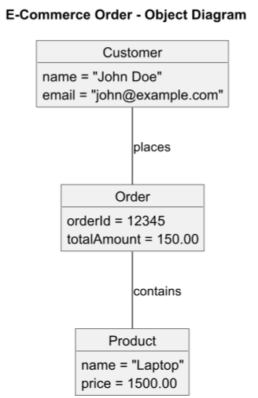

# Object Diagram

## About

An Object Diagram in UML represents a snapshot of instances (objects) and their relationships at a particular moment in time. It is a real-world instantiation of a Class Diagram, showing actual values instead of abstract structures. Object Diagrams help in visualizing runtime scenarios of a system, such as debugging, testing, or understanding object interactions.


Refer to the official documentation for more details - [https://plantuml.com/object-diagram](https://plantuml.com/object-diagram)


### **Key Elements**

1. **Objects (Instances)**&#x20;
   * Represented as rectangles with an **underlined name** (e.g., `order1: Order`).
   * Shows real-time values of attributes.
2. **Links (Associations)**&#x20;
   * Lines connecting objects to represent **relationships**.
   * These are actual **instance-level** associations, unlike general class associations.
3. **Attributes & Values**&#x20;
   * Shows **specific values** of attributes at runtime (e.g., `status = "Processing"`).
4. **Multiplicity & Relationships**&#x20;
   * Displays **one-to-one, one-to-many, or many-to-many** relationships.
5. **Aggregation & Composition**&#x20;
   * Can illustrate **part-whole relationships** between objects.


## 1. E-commerce system

This represents the **state of objects at runtime** in an e-commerce system.


* **Objects (`object ObjectName { }`)**.
* **Relationships (`--`)**: Shows how objects are related at runtime.


```plant-uml
@startuml
title E-Commerce Order - Object Diagram

object Customer {
    name = "John Doe"
    email = "john@example.com"
}

object Order {
    orderId = 12345
    totalAmount = 150.00
}

object Product {
    name = "Laptop"
    price = 1500.00
}

Customer -- Order : places
Order -- Product : contains

@enduml
```

<figure><figcaption></figcaption></figure>


