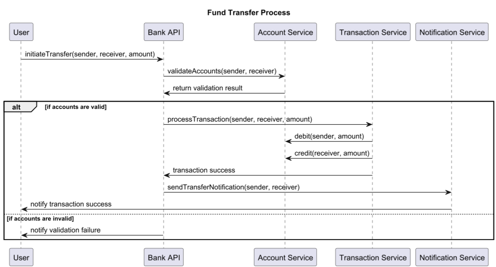

# Sequence Diagram

## About

A **Sequence Diagram** in UML represents **how objects interact in a particular sequence over time**. It is primarily used to **illustrate the flow of messages between different components** in a system. This diagram is essential for understanding **dynamic behavior** and how different parts of a system communicate.


Refer to the official documentation for more details - [https://plantuml.com/sequence-diagram](https://plantuml.com/sequence-diagram)


#### **Key Elements**

1. **Actors & Objects**&#x20;
   * Represented as **stick figures (Actors)** or **rectangles (Objects)**.
   * Actors interact with the system (e.g., User, External System).
2. **Lifelines**&#x20;
   * Dashed vertical lines indicating **the object's existence over time**.
   * Shows how long an object is active in the sequence.
3. **Messages**&#x20;
   * Arrows representing **method calls, responses, and interactions**.
   * Types:
     * **Synchronous** (`-->`) – Caller waits for a response.
     * **Asynchronous** (`->`) – Caller continues execution without waiting.
4. **Activation Bars**&#x20;
   * Vertical rectangles on lifelines showing **when an object is active/executing**.
   * Indicate processing time for a message.
5. **Return Messages**&#x20;
   * Dashed arrows (`-->>`) representing **responses or results** sent back.
6. **Loops & Conditions**&#x20;
   * Used to **model iterations or conditional logic** (e.g., `alt`, `loop`).
7. **Destroying Objects**&#x20;
   * Represented by **‘X’** at the bottom of a lifeline when an object is deleted.

## 1. Fund Transfer

This sequence diagram represents a **user performing a fund transfer** in a banking system.


* **Actors (`participant`)**: Represent different entities in the system.
* **Messages (`->`)**: Show interactions between entities.
* **Alternative (`alt ... else`)**: Conditional logic for valid/invalid accounts.
* **Self-calls (`->`)**: Represents internal method calls within the same participant.


```plant-uml
@startuml
title Fund Transfer Process

participant User
participant "Bank API" as BankAPI
participant "Account Service" as AccountService
participant "Transaction Service" as TransactionService
participant "Notification Service" as NotificationService

User -> BankAPI: initiateTransfer(sender, receiver, amount)
BankAPI -> AccountService: validateAccounts(sender, receiver)
AccountService -> BankAPI: return validation result

alt if accounts are valid
    BankAPI -> TransactionService: processTransaction(sender, receiver, amount)
    TransactionService -> AccountService: debit(sender, amount)
    TransactionService -> AccountService: credit(receiver, amount)
    TransactionService -> BankAPI: transaction success

    BankAPI -> NotificationService: sendTransferNotification(sender, receiver)
    NotificationService -> User: notify transaction success
else if accounts are invalid
    BankAPI -> User: notify validation failure
end

@enduml
```

<figure><figcaption></figcaption></figure>


