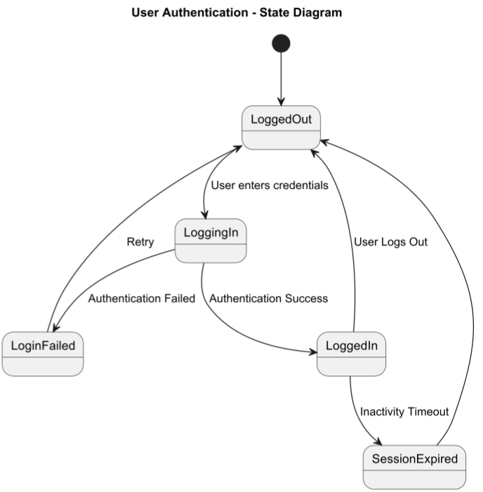

# State Diagram

## About

A **State Diagram** represents an object's **lifecycle states** and transitions between them based on **events or conditions**. It helps model **real-world behaviour** of objects.


Refer to the official documentation for more details - [https://plantuml.com/state-diagram](https://plantuml.com/state-diagram)


### **Key Elements**

1. **States**&#x20;
   * Represented as **rounded rectangles** (e.g., "Idle", "Processing").
2. **Transitions**&#x20;
   * Arrows indicating **state changes due to events**.
3. **Initial & Final States**&#x20;
   * **Black circle (initial state)** marks the starting point.
   * **Encircled black dot (final state)** indicates the end.
4. **Events & Conditions**&#x20;
   * Triggers for transitions (e.g., "User logs in").

## 1. User Authentication Flow

This represents a **User Authentication Flow** in a system.


* **Initial State (`[*]`)** and **Transitions (`-->`)**.
* **Different States (`StateName`)**: `LoggedOut`, `LoggingIn`, etc.
* **Looping (`Retry`)**: Allows reattempting login.


```plant-uml
@startuml
title User Authentication - State Diagram

[*] --> LoggedOut

LoggedOut --> LoggingIn : User enters credentials
LoggingIn --> LoggedIn : Authentication Success
LoggingIn --> LoginFailed : Authentication Failed

LoginFailed --> LoggedOut : Retry
LoggedIn --> LoggedOut : User Logs Out
LoggedIn --> SessionExpired : Inactivity Timeout

SessionExpired --> LoggedOut

@enduml
```

<figure><figcaption></figcaption></figure>

