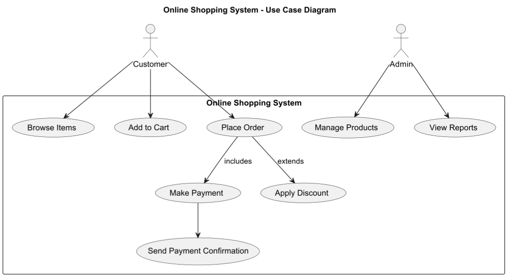

# Use Case Diagram

## 1. Online Shopping System

This diagram represents an **Online Shopping System** with different actors and use cases.


* **Actors (`actor`)**: Represent `Customer` and `Admin`.
* **Use Cases (`(UseCase)`)**: Define system functionalities.
* **Relationships:**
  * **Direct association (`-->`)**
  * **Include (`-->`)**: `Place Order` includes `Make Payment`.
  * **Extend (`-->`)**: `Apply Discount` is optional.


```plant-uml
@startuml
title Online Shopping System - Use Case Diagram

actor Customer
actor Admin

rectangle "Online Shopping System" {
    Customer --> (Browse Items)
    Customer --> (Add to Cart)
    Customer --> (Place Order)
    (Place Order) --> (Make Payment) : includes
    (Place Order) --> (Apply Discount) : extends
    (Make Payment) --> (Send Payment Confirmation)

    Admin --> (Manage Products)
    Admin --> (View Reports)
}

@enduml
```

<figure><figcaption></figcaption></figure>


