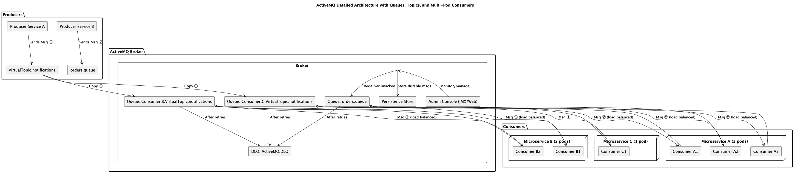

# Architecture Details

## About

Apache ActiveMQ is a sophisticated, open-source message broker designed to enable reliable, asynchronous communication between distributed systems. Understanding its architecture is key to leveraging its full potential in event-driven and messaging systems.

ActiveMQ is built around the **Message Broker** concept, which acts as an intermediary that routes, stores, and delivers messages between producers (senders) and consumers (receivers).

* **Producer**: An application or service that creates and sends messages.
* **Consumer**: An application or service that receives and processes messages.
* **Broker**: The central server managing queues, topics, message routing, persistence, and delivery.

ActiveMQ supports multiple messaging models and protocols to accommodate diverse use cases.

## Core Architectural Components

### 1. Broker

The broker is the heart of ActiveMQ. It handles:

* Receiving messages from producers
* Storing messages persistently or in memory
* Routing messages to appropriate destinations
* Delivering messages to consumers
* Managing transactions, acknowledgments, and redelivery

The broker can run as a standalone server or embedded within applications.

### 2. Destinations: Queues and Topics

ActiveMQ supports two main types of destinations where messages are sent:

* **Queues**: Used for point-to-point messaging. Each message sent to a queue is delivered to **exactly one** consumer. If multiple consumers listen on the same queue, messages are load-balanced among them.
* **Topics**: Used for publish-subscribe messaging. A message sent to a topic is broadcast to **all active subscribers**. Each subscriber receives a copy of every message.

### 3. Virtual Topics

Virtual Topics combine features of both queues and topics to provide flexible routing. Producers send messages to a Virtual Topic as if it were a regular topic. ActiveMQ internally copies each message to multiple physical queues that consumers listen to.

This allows multiple consumer groups to consume the same messages independently and at their own pace.

### 4. Message Producers and Consumers

* **Producer**: Creates messages and sends them to a broker’s destination.
* **Consumer**: Subscribes to a destination to receive messages.

Consumers can be **synchronous** (polling for messages) or **asynchronous** (receiving via callbacks/listeners).

## Diagram

<figure><figcaption></figcaption></figure>

<table data-full-width="true"><thead><tr><th width="144.08203125">Message Source</th><th width="249.46484375">Destination</th><th width="156.0703125">Who Receives Message</th><th>Behavior</th></tr></thead><tbody><tr><td><strong>Producer A</strong> sends to <code>VirtualTopic.notifications</code></td><td>Copied to <code>Consumer.B.VirtualTopic.notifications</code> and <code>Consumer.C.VirtualTopic.notifications</code></td><td>- B1 <strong>or</strong> B2 (not both) - C1</td><td><strong>Virtual Topic Pattern</strong>: separate queues per consumer group; each gets a copy. Messages inside those queues are load-balanced among pods.</td></tr><tr><td><strong>Producer B</strong> sends to <code>orders.queue</code></td><td><code>orders.queue</code></td><td>One of A1, A2, A3</td><td><strong>Point-to-Point Queue</strong>: message is delivered to only one consumer per message.</td></tr><tr><td>If consumer crashes or doesn't ack</td><td>Message is redelivered or sent to <code>ActiveMQ.DLQ</code></td><td>-</td><td><strong>Redelivery + DLQ fallback</strong></td></tr><tr><td>Admin / JMX Console</td><td>Connects to Broker</td><td>Monitoring</td><td>Manage queues, view DLQ, consumers, metrics</td></tr></tbody></table>

## Message Lifecycle in ActiveMQ

1. **Message Creation**: Producer creates a message and sends it to a broker.
2. **Message Reception**: Broker receives the message and places it into the specified destination (queue/topic).
3. **Message Persistence** (optional): The message is stored persistently for reliability (if configured).
4. **Message Dispatch**: Broker dispatches the message to one or more consumers.
5. **Message Acknowledgment**: Consumer acknowledges receipt, enabling broker to remove the message.
6. **Redelivery (if necessary)**: If acknowledgment is not received within configured timeout, message can be redelivered.

## Messaging Patterns Supported by ActiveMQ

ActiveMQ supports multiple messaging patterns essential for building flexible distributed systems:

### 1. Point-to-Point (Queue)

* One producer sends a message to a queue.
* One consumer receives and processes the message.
* Messages are load-balanced if multiple consumers subscribe to the same queue.

### 2. Publish-Subscribe (Topic)

* One producer publishes a message to a topic.
* All active subscribers receive a copy of the message.
* Durable subscribers can receive messages even if they were offline when messages were sent.

### 3. Virtual Topics

* Producers send messages to a virtual topic.
* Multiple consumer groups subscribe to physical queues mapped from the virtual topic.
* Each consumer group processes messages independently.

### 4. Request-Reply

* A producer sends a request message to a queue or topic.
* A consumer processes the request and sends a reply message back to a temporary or predefined destination.
* This pattern supports synchronous-like communication with asynchronous messaging benefits.

### 5. Composite Destinations

* Allows producers to send messages to multiple destinations (queues/topics) simultaneously with a single send operation.

## Delivery Semantics and Reliability

ActiveMQ supports several message delivery guarantees:

* **At-most-once**: Message may be lost but never duplicated.
* **At-least-once**: Message delivery is guaranteed, but duplicates may occur.
* **Exactly-once** (with transactions): Messages are delivered once and only once.

To achieve these, ActiveMQ offers:

* **Transactions**: Group multiple message operations into atomic units.
* **Acknowledgments**: Consumers confirm message receipt to the broker.
* **Persistent Storage**: Messages are stored on disk (using KahaDB, JDBC, or other stores) for durability.
* **Dead Letter Queues (DLQ)**: Messages that fail delivery after retries are sent to DLQs for inspection.
* **Redelivery Policies**: Configurable retry attempts and delay strategies.

## Broker Clustering and High Availability

ActiveMQ supports clustering to improve scalability and fault tolerance:

* **Master/Slave Failover**: One active broker (master) with one or more standby brokers (slaves) that take over if master fails.
* **Network of Brokers**: Multiple brokers interconnected to form a federated system. Messages can route between brokers transparently.
* **Store-and-Forward**: Brokers can buffer messages when connected brokers are temporarily unavailable.

This allows ActiveMQ deployments to be resilient and horizontally scalable.

## Protocols and Client Support

ActiveMQ supports multiple protocols to enable cross-platform interoperability:

* **OpenWire**: Native protocol optimized for Java clients.
* **AMQP**: Advanced Message Queuing Protocol, an open standard.
* **MQTT**: Lightweight protocol often used in IoT environments.
* **STOMP**: Simple Text Oriented Messaging Protocol for easy integration with non-Java clients.
* **REST & WebSocket**: For web-friendly messaging and browser clients.

Clients exist for many languages: Java, C#, Python, JavaScript, Ruby, etc.

## Security Features

ActiveMQ includes:

* **Authentication**: User/password-based authentication.
* **Authorization**: Fine-grained access control on queues/topics.
* **SSL/TLS**: Encrypt communication between clients and broker.
* **JAAS integration**: Support for pluggable authentication modules.

## Management and Monitoring

ActiveMQ offers:

* A web-based **Admin Console** for monitoring brokers, queues, and topics.
* **JMX (Java Management Extensions)** support for integration with monitoring tools.
* APIs for programmatic management (REST, Jolokia).
* Metrics on message rates, consumer counts, memory usage, etc.
