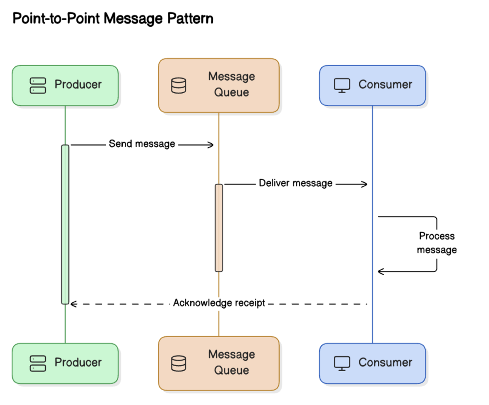
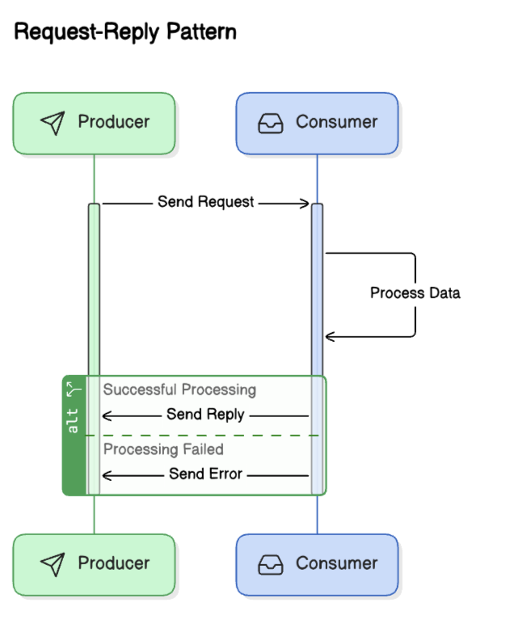
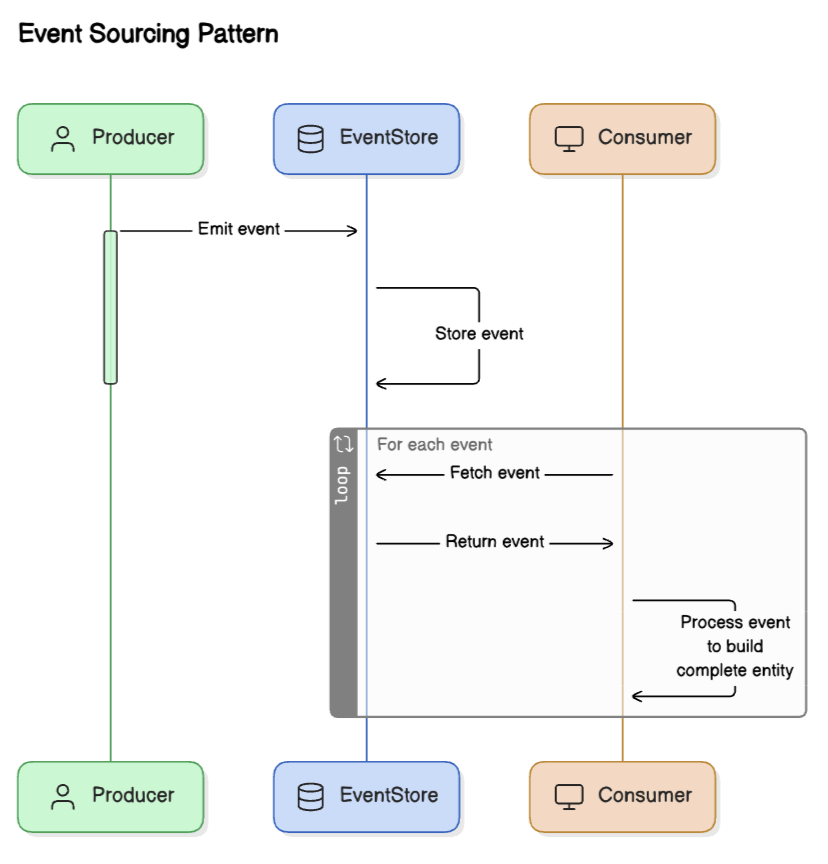

# Event Driven Architecture

## About

Event Driven Architecture (EDA) is a software architectural pattern where the flow of the application is determined by events. An event can be anything that happens in the system, such as a user interaction, a change in data, or the completion of a process.

In EDA, components communicate with each other primarily through events, rather than through direct function calls or requests. This allows for a decoupled, flexible, and scalable system.&#x20;

<figure><figcaption></figcaption></figure>

## Key Components

**Events:** A significant change or action within a system that other components might need to react to. For example, a user submits a form, a new order is placed, or a sensor detects a change in temperature.

**Event Producers:** These are components that generate events when something significant happens in the system. For example, a payment system generating an event when a payment is completed.

**Event Consumers:** These are components that listen for events and take action when an event occurs. For example, a notification system that sends an email when a payment event is received.

**Event Channels :** An event channel is a mechanism for transmitting events from producers to consumers. This can be implemented using:

* **Message queues** (e.g., Kafka, RabbitMQ)
* **Event streams** (e.g., Apache Kafka, AWS EventBridge)
* **Webhooks** or **REST APIs** for direct communication

**Event Handlers:** Event handlers are responsible for processing the events. They determine how to react based on the event type. For example, a payment service could be an event handler that processes the payment event.

## Message Patterns

In event-driven architecture (EDA), message patterns are the ways in which messages (or events) are communicated between different components or services. These patterns define the interactions and flow of messages, ensuring that the system behaves in a predictable and reliable manner.

### 1. **Publish-Subscribe (Topic Based) Pattern**

* **Description**: In this pattern, event producers (publishers) emit events/messages to different "topics." Consumers can subscribe to specific topics based on their interest. A message broker or event bus is typically used to decouple producers and consumers.
* **How it works**:
  * **Producers** publish messages to specific topics (e.g., `order-created`, `user-logged-in`).
  * **Consumers** subscribe to relevant topics based on their needs.
* **Example**: A notification system where different consumers are interested in different types of messages, such as new product alerts or user sign-ins.
* **Example technologies**: <mark style="color:blue;">Kafka, PubSub (Google Cloud), AWS SNS</mark>.

**Advantages**:

* Allows fine-grained control over the events consumers receive.
* Reduces unnecessary processing for consumers by filtering irrelevant events.
* Decouples producers and consumers.
* Allows for multiple consumers to listen to the same event.
* Scalable, as new consumers can be added without affecting the publisher.

<figure><figcaption></figcaption></figure>

### 2. **Point-to-Point (Queue-Based) Pattern**

* **Description**: In this pattern, messages are sent from one producer to one consumer via a message queue. The message is consumed by exactly one consumer, and once it is processed, it is removed from the queue.
* **How it works**:
  * **Producers** send messages to a queue.
  * **Consumers** pull messages from the queue, process them, and acknowledge receipt.
* **Example**: A task processing system where a job is added to a queue and a worker processes one job at a time.
* **Example technologies**: <mark style="color:blue;">RabbitMQ, Amazon SQS, ActiveMQ</mark>.

**Advantages**:

* Ensures that each message is processed only once.
* Useful for load balancing, where multiple consumers share the same queue.

<figure><figcaption></figcaption></figure>

### 3. **Request-Reply Pattern**

* **Description**: In this pattern, a producer sends a message to a consumer and waits for a reply. It is typically used in synchronous communication where the producer expects a response before continuing.
* **How it works**:
  * **Producer** sends a message (request).
  * **Consumer** processes the message and sends a response (reply) back to the producer.
* **Example**: An API service where a client sends a request (e.g., data retrieval) and waits for a response from the server.
* **Example technologies**: <mark style="color:blue;">HTTP, SOAP, gRPC</mark>.

**Advantages**:

* Provides a clear request-response cycle.
* Suitable for situations where a reply is necessary for continuing a workflow.

<figure><figcaption></figcaption></figure>

### 4. **Event Sourcing Pattern**

* **Description**: Event sourcing involves persisting all changes in the system as a sequence of events. Rather than storing the current state of an entity, each state change is stored as an event, which can be replayed to reconstruct the current state.
* **How it works**:
  * **Producers** generate events that describe changes to an entity (e.g., a customer’s account balance is updated).
  * These events are stored in an event store (a persistent log of events).
  * **Consumers** can replay events to rebuild the state of the system.
* **Example**: A banking system where all transactions (deposits, withdrawals) are stored as events and can be replayed to compute the account balance.
* **Example technologies**: <mark style="color:blue;">EventStoreDB, Kafka (used for event logging)</mark>.

**Advantages**:

* Full audit trail of all changes.
* Ability to rebuild state by replaying events, useful for debugging and recovering from failures.
* Scalable and flexible, as changes can be processed independently.

<figure><figcaption></figcaption></figure>

## Benefits of Event-Driven Architecture

Event-Driven Architecture (EDA) offers several benefits, making it a popular choice for designing scalable, flexible, and responsive systems. Here are some of the key benefits:

### 1. **Loose Coupling**

* **Independent Components**: In an EDA, producers and consumers of events are decoupled. This means that the producers do not need to know about the consumers, and vice versa. They interact only through events, allowing independent evolution of components.
* **Flexibility**: Services can be modified, replaced, or added without disrupting the overall system, leading to a more flexible architecture.

### 2. **Scalability**

* **Horizontal Scaling**: EDA systems can scale easily by adding more consumers or producers as needed. Event queues or streams can handle high-throughput environments and large numbers of events efficiently.
* **Asynchronous Processing**: Since events are processed asynchronously, systems can handle spikes in demand without blocking or slowing down the application. This is ideal for high-volume systems, such as e-commerce, IoT, or financial services.

### 3. **Real-Time Processing**

* **Instant Reactions**: Events trigger immediate actions, which is particularly useful for applications that require real-time processing, such as stock trading systems, fraud detection, and monitoring systems.
* **Low Latency**: By decoupling event generation from consumption, event-driven systems can provide low-latency responses to user interactions or changes in state.

### 4. **Improved Fault Tolerance and Reliability**

* **Resilience**: In an EDA system, event producers and consumers are decoupled, so if one part of the system fails, other parts can continue to function. For example, if an event consumer is unavailable, events can be stored in a queue and consumed once the system recovers.
* **Retry Mechanisms**: Events can be reprocessed if necessary, and errors can be managed asynchronously, reducing the impact on other parts of the system.

### 5. **Flexibility and Extensibility**

* **Easily Add New Features**: Since consumers and producers are decoupled, adding new features or modifying existing ones does not require changes to the entire system. New consumers can be added to listen to events, and existing consumers can evolve without breaking the system.
* **Multiple Consumers**: Multiple consumers can process the same event in different ways, enabling flexible workflows and complex event processing.

### 6. **Real-Time Data Streams and Analytics**

* **Stream Processing**: Events provide a real-time stream of data that can be processed for insights, such as in monitoring or analytics dashboards. It allows businesses to analyze data as it comes in and take immediate action based on the insights.
* **Event Sourcing**: Using event sourcing, a system can store every state change as an event, making it possible to re-build the state of the application by replaying the events. This improves traceability and auditing.

### **7. Simplified Integration with External Systems**

* **Event-Driven Communication**: EDA simplifies the integration of various microservices or external systems by using event-driven communication. For example, external systems can listen for specific events and trigger actions or updates without the need for direct API calls or tight coupling.
* **Interoperability**: Since EDA relies on events rather than synchronous communication, it enables easier integration between systems with different communication protocols, technologies, or architectures.

### 8. **Support for Distributed Systems**

* **Microservices and Distributed Systems**: EDA naturally supports distributed architectures and microservices, where independent services or components communicate through events. It allows for loosely coupled systems that can be independently deployed, updated, and scaled.

