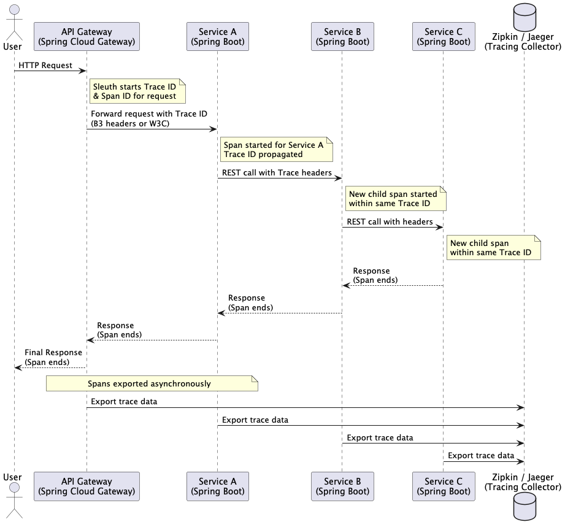

# Distributed Tracing

## About

**Distributed Tracing** is a technique for monitoring and debugging microservices-based architectures by tracking the flow of requests across service boundaries. It helps identify bottlenecks, errors, or performance issues by tracing each request as it propagates through the system.

<div data-full-width="false"><figure><figcaption></figcaption></figure></div>

## Flow of a Distributed Tracing in a Springboot Application

### **1. Request Initiation**

* A request enters the system, such as an HTTP request to Service A.
* A trace ID is generated, and the first span (root span) is created.

### **2. Context Propagation**

* Service A calls Service B using HTTP, Kafka, or another protocol.
* The trace ID and span ID are propagated as headers or metadata.

### **3. Span Creation**

* Service B creates a new span as a child of the span from Service A.
* This process repeats across all services involved in handling the request.

### **4. Data Collection**

* Each span records details such as:
  * Start and end timestamps.
  * Tags (metadata) like method name, status code, and error messages.
  * Logs for events during the span.

### **5. Data Export**

* Spans are exported to a distributed tracing system (e.g., Zipkin or Jaeger) via HTTP or gRPC.

### **6. Trace Visualization**

* The tracing system aggregates spans into traces and provides a UI to visualize the flow of requests across services.


**Scenario**

A user submits a request to an e-commerce platform's **Order Service**, which interacts with the **Inventory Service** and **Payment Service**.

1. **Order Service**:
   * Receives the user request and initiates the trace.
   * Calls Inventory Service and Payment Service.
2. **Inventory Service**:
   * Checks product availability.
3. **Payment Service**:
   * Processes the payment.

```
Request with Trace ID: `12345` and Span ID: `a1`
   |
[Order Service]
   |-- Trace ID: `12345`, Span ID: `a1` (Root Span)
   |-- Calls Inventory Service
   |
[Inventory Service]
   |-- Trace ID: `12345`, Span ID: `b2` (Child Span of `a1`)
   |-- Records Inventory Check
   |
[Order Service]
   |-- Calls Payment Service
   |
[Payment Service]
   |-- Trace ID: `12345`, Span ID: `c3` (Child Span of `a1`)
   |-- Records Payment Processing
```


## Context Propagation Standards

Context propagation is a critical aspect of distributed tracing, ensuring that trace identifiers (like **trace ID** and **span ID**) are transmitted between services as a request flows through a distributed system. Standards for context propagation define how this trace context is structured and passed between services, enabling interoperability across different tracing tools and platforms.

### **1. W3C Trace Context**

* **Overview**:
  * A vendor-neutral standard for distributed tracing context propagation.
  * Supported by major observability tools (OpenTelemetry, Jaeger, etc.).
* **Headers Used**:
  * `traceparent`: Encodes trace ID, parent span ID, sampling flags, and version.
  * `tracestate`: Allows vendors to include additional metadata, enhancing traceparent.
*   **Example**:

    ```
    traceparent: 00-4bf92f3577b34da6a3ce929d0e0e4736-00f067aa0ba902b7-01
    tracestate: vendor1=opaqueValue,vendor2=opaqueValue
    ```

### **2. B3 Propagation**

* **Overview**:
  * Developed by the Zipkin team, it is one of the oldest and most widely used propagation standards.
  * Encodes trace context in a set of HTTP headers.
* **Headers Used**:
  * `X-B3-TraceId`: The trace identifier.
  * `X-B3-SpanId`: The span identifier.
  * `X-B3-ParentSpanId`: The parent span ID (optional).
  * `X-B3-Sampled`: Indicates whether the request is sampled (0 or 1).
  * `X-B3-Flags`: Debug flag (optional).
*   **Example**:

    ```makefile
    X-B3-TraceId: 463ac35c9f6413ad48485a3953bb6124
    X-B3-SpanId: a2fb4a1d1a96d312
    X-B3-ParentSpanId: 0020000000000001
    X-B3-Sampled: 1
    ```

### **3. Jaeger Propagation**

* **Overview**:
  * A custom propagation format used by the Jaeger tracing system.
  * Encodes trace context in a single HTTP header.
* **Header Used**:
  * `uber-trace-id`: Contains the trace ID, span ID, parent span ID, and sampling flags.
*   **Example**:

    ```makefile
    uber-trace-id: 4bf92f3577b34da6a3ce929d0e0e4736:00f067aa0ba902b7:0000000000000000:01
    ```

### **4. Custom Context Propagation**

* Some organizations implement their own context propagation standards tailored to their unique needs.
* Typically involves encoding trace data in proprietary headers or metadata formats.

## Tools used for Distributed Tracing

### **Distributed Tracing Libraries**

Libraries integrate tracing capabilities into applications by instrumenting code and propagating trace context.

* **Spring Cloud Sleuth**:
  * A Spring Boot-specific library that adds tracing to microservices.
  * Generates trace and span IDs automatically.
  * Integrates seamlessly with tools like Zipkin, Jaeger, and OpenTelemetry.
* **OpenTelemetry**:
  * A vendor-neutral observability framework.
  * Supports distributed tracing, metrics, and logging.
  * Works with multiple backends such as Jaeger, Zipkin, and Prometheus.
* **Brave**:
  * The tracing library used internally by Zipkin.
  * Provides instrumentation for HTTP clients, servers, and messaging systems.

### **Distributed Tracing Platforms**

These platforms collect, store, and visualize traces.

* **Zipkin**:
  * Open-source tracing system designed for low latency.
  * Displays a dependency graph and timelines of traces.
  * Supports HTTP, Kafka, and RabbitMQ for collecting spans.
* **Jaeger**:
  * Open-source, originally developed by Uber.
  * Offers advanced capabilities like root cause analysis, service dependency visualization, and context propagation debugging.
  * Integrates with OpenTelemetry.
* **AWS X-Ray**:
  * A distributed tracing service from Amazon Web Services.
  * Provides end-to-end request tracing for applications running on AWS.
  * Supports integration with AWS Lambda, EC2, and ECS.
* **Google Cloud Trace**:
  * A managed service for distributed tracing in Google Cloud.
  * Offers native integration with Google Cloud services like App Engine and Kubernetes.
* **Elastic APM**:
  * Part of the Elastic Stack (ELK).
  * Provides distributed tracing, error tracking, and performance metrics.
  * Integrates seamlessly with Elasticsearch and Kibana.

### **Monitoring and Visualization Tools**

Complement tracing platforms by providing dashboards and additional insights.

* **Kibana**:
  * A visualization tool that works with Elastic APM.
  * Offers trace summaries and detailed views of request paths.
* **Grafana Tempo**:
  * Distributed tracing backend compatible with OpenTelemetry, Jaeger, and Zipkin.
  * Integrated with Grafana for visualization.
* **New Relic Distributed Tracing**:
  * A commercial monitoring and tracing solution.
  * Offers dashboards, alerts, and AI-powered root cause analysis.

### **Log Aggregation with Tracing**

Combining logs with trace context for better observability.

* **Splunk Observability Cloud**:
  * Offers tracing, logging, and monitoring in one platform.
  * Provides AI-driven analytics and dashboards.
* **Datadog APM**:
  * Integrates tracing with logs and metrics.
  * Supports real-time dashboards and anomaly detection.

## Benefits of Distributed Tracing

### **Improved Observability**

* **What it means**: Distributed tracing provides visibility into the journey of a request across all services.
* **Impact**:
  * Identifies how each service contributes to the overall request lifecycle.
  * Reveals dependencies between services and their interactions.

### **Efficient Debugging and Root Cause Analysis**

* **What it means**: Pinpoints where failures or bottlenecks occur within a complex system.
* **Impact**:
  * Quickly identify slow or failing services.
  * Reduce mean time to resolution (MTTR) by highlighting problematic spans (e.g., failed API calls, timeouts).

### **Performance Optimization**

* **What it means**: Highlights latency hotspots and underperforming components.
* **Impact**:
  * Detect services with high response times or resource usage.
  * Optimize database queries, external API calls, or internal service interactions.

### **Better Understanding of Service Dependencies**

* **What it means**: Tracing maps out all upstream and downstream dependencies of a service.
* **Impact**:
  * Understand how changes in one service affect others.
  * Helps in impact analysis during development or deployment of new features.

### **Ease of Collaboration Across Teams**

* **What it means**: Provides a unified view of a request's flow, useful for cross-functional debugging.
* **Impact**:
  * Reduces blame-shifting between teams (e.g., backend vs. database teams).
  * Provides a common language (traces, spans, tags) for discussion and analysis.

### **Compliance and Auditing**

* **What it means**: Detailed traces can be used for auditing purposes.
* **Impact**:
  * Provide evidence of system behavior in response to requests.
  * Useful for compliance in industries with strict monitoring requirements (e.g., finance, healthcare).

### **Foundation for AI Operations and Automation**

* **What it means**: The data from distributed tracing can feed into automated tools for intelligent monitoring.
* **Impact**:
  * Predict failures using historical tracing data.
  * Enable self-healing systems by linking trace metrics with automated remediation.
