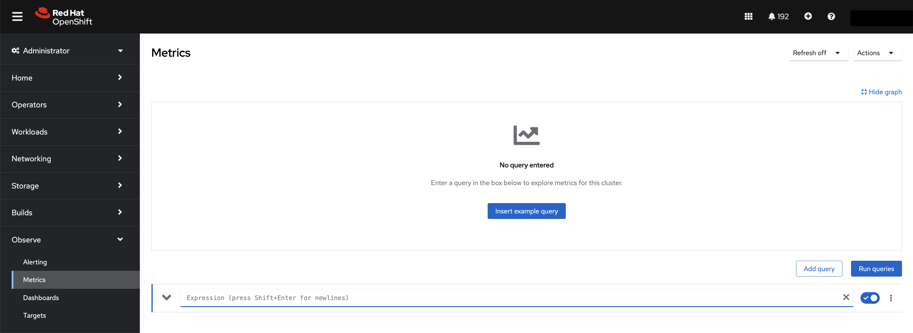
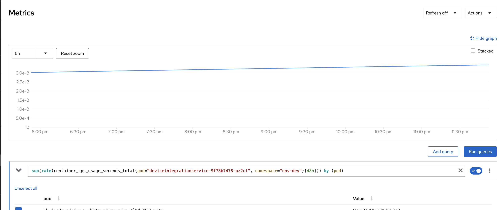
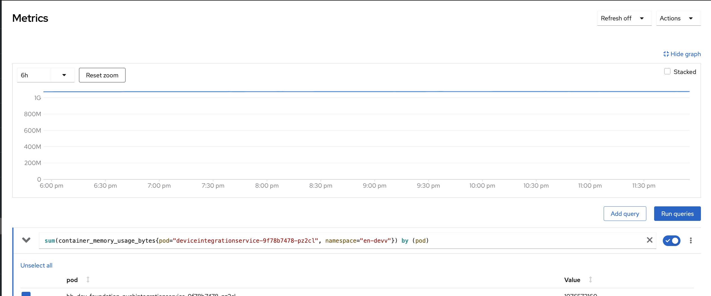
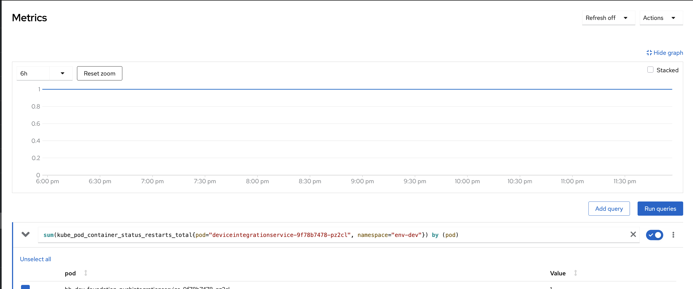
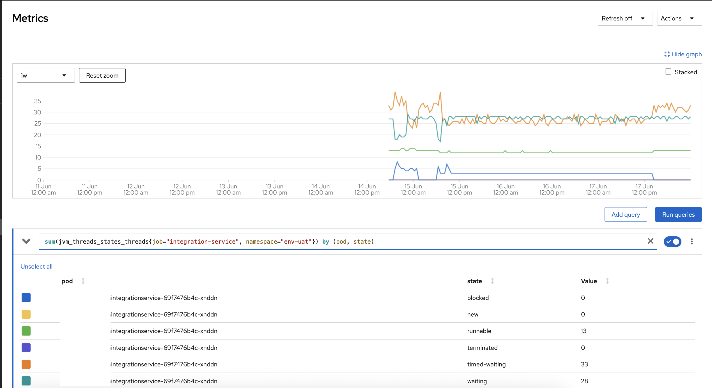
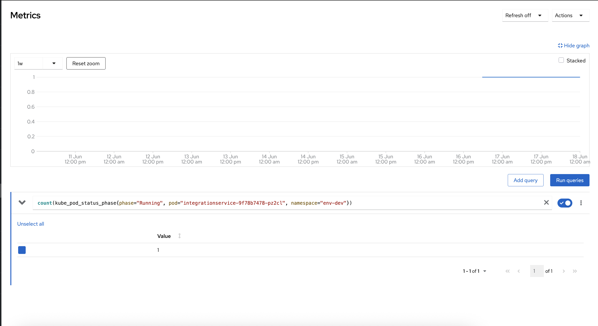

# PromQL

## About

Prometheus is a time-series database and monitoring system that collects metrics from our applications and infrastructure. It uses a powerful query language called **PromQL (Prometheus Query Language)** to extract, filter, and aggregate metrics over time.

In OpenShift, Prometheus is often used as the backend for monitoring the cluster, workloads, nodes, and custom applications. We can execute PromQL queries directly from the **OpenShift Web Console** (under _Observe → Metrics_) or via the Prometheus UI.

## **Purpose of Prometheus Queries in OpenShift**

* Monitor pod or node CPU/memory usage
* Track container restarts or failures
* Measure request rates, latencies, and errors
* Create custom dashboards or alerts
* Troubleshoot performance or resource issues

## **Basic Structure of PromQL**

Prometheus queries work on **metrics**, each optionally labeled with key-value pairs for filtering. A query generally looks like:

```
metric_name{label1="value1", label2="value2"} [range]
```

You can use:

* **Instant vector** queries (current value): `metric_name{...}`
* **Range vector** queries (over time): `metric_name{...}[5m]`
* **Functions** for aggregation, rates, comparisons, etc.

## **Executing Queries in OpenShift Console**

1. **Open OpenShift Console**
2. Navigate to: **Observe → Metrics**
3. In the **"Expression"** box, enter your PromQL query
4. Choose:
   * **“Run”** to get instant values
   * **“Show Graph”** for visual trends over time
5. Optional: Filter by **namespace**, **label**, or **duration**

<figure><figcaption></figcaption></figure>

## Common Prometheus Queries in OpenShift

### 1. **CPU Usage**

**Query:**


```promql
sum(rate(container_cpu_usage_seconds_total{pod="deviceintegrationservice-9f78b7478-pz2cl", namespace="env-dev"}[48h])) by (pod)
```


Returns the average CPU usage (in cores) over 5 minutes for the pod. Helps detect if the pod is under or over-utilizing CPU. Useful for auto-scaling and performance monitoring.

<figure><figcaption></figcaption></figure>

### 2. **Memory Usage**

**Query:**


```promql
sum(container_memory_usage_bytes{pod="deviceintegrationservice-9f78b7478-pz2cl", namespace="en-devv"}) by (pod)
```


Shows how much memory (in bytes) the pod is using. Helps detect memory leaks, over-consumption, or the need for adjusting memory requests/limits.

<figure><figcaption></figcaption></figure>

### 3. **Pod Restarts**

**Query:**


```promql
sum(kube_pod_container_status_restarts_total{pod="deviceintegrationservice-9f78b7478-pz2cl", namespace="env-dev"}) by (pod)
```


Displays the total number of container restarts for the pod. Useful for identifying unstable or crash-looping containers.

<figure><figcaption></figcaption></figure>

### 4. **Thread Count per JVM State**

**Query:**


```promql
sum(jvm_threads_states_threads{job="integration-service", namespace="env-uat"}) by (pod, state)
```


Breaks down the number of JVM threads by state (e.g., RUNNABLE, BLOCKED, TIMED\_WAITING). This is useful for diagnosing thread leaks or blocked thread pools in Java applications.

<figure><figcaption></figcaption></figure>

### 5. **Running Pods (for cross-check)**

**Query:**


```promql
count(kube_pod_status_phase{phase="Running", pod="integrationservice-8f78b7478-pz2cl", namespace="env-dev"})
```


Ensures the pod is currently running. You can use this to validate rollout status, pod health, or replicas during deployments.

<figure><figcaption></figcaption></figure>

### 6. **CPU Requests vs Usage**

**Requested CPU:**


```promql
sum(kube_pod_container_resource_requests_cpu_cores{pod="integrationservice-8f78b7478-pz2cl", namespace="env-uat"}) by (pod)
```


**Used CPU:**


```promql
sum(rate(container_cpu_usage_seconds_total{pod="integrationservice-8f78b7478-pz2cl", namespace="env-uat"}[5m])) by (pod)
```


These queries help compare how much CPU was requested vs how much is being used. Critical for detecting over-requesting or under-provisioning.

### 7. **Memory Requests vs Usage**

**Requested Memory:**


```promql
sum(kube_pod_container_resource_requests_memory_bytes{pod="integrationservice-8f78b7478-pz2cl", namespace="env-uat"}) by (pod)
```


**Used Memory:**


```promql
sum(container_memory_usage_bytes{pod="integrationservice-8f78b7478-pz2cl", namespace="env-uat"}) by (pod)
```


Helps understand whether our pod is requesting more or less memory than it actually needs. Important for resource optimization and avoiding OOM errors.

### 8. **Network Usage**

**Receive:**


```promql
sum(rate(container_network_receive_bytes_total{pod="integrationservice-8f78b7478-pz2cl", namespace="env-uat"}[5m])) by (pod)
```


**Transmit:**


```promql
sum(rate(container_network_transmit_bytes_total{pod="integrationservice-8f78b7478-pz2cl", namespace="env-uat"}[5m])) by (pod)
```


Monitors how much network traffic (in bytes/sec) the pod is receiving and sending. Useful for identifying chatty services, bottlenecks, or unexpected spikes in network load.

### 9. **Container Restarts Over Time**

**Query:**


```promql
increase(kube_pod_container_status_restarts_total{pod="integrationservice-8f78b7478-pz2cl", namespace="env-uat"}[5m])
```


Tracks restart count increases over time. Helps correlate instability with specific time windows or deployments.

### 10. **Error Rate (If We Have HTTP Metrics)**

**Query (example, requires instrumentation):**


```promql
rate(http_server_requests_seconds_count{status=~"5..", pod="integrationservice-8f78b7478-pz2cl", namespace="env-uat"}[5m])
```


Shows how many 5xx errors occurred in the last 5 minutes. Helps identify backend failures, circuit breaker trips, or timeouts in dependent services.
