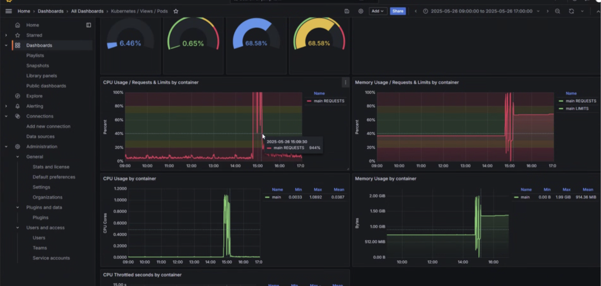

# OOM: Unable to Create Native Thread

## **System Context**

We are running a set of microservices on **OpenShift**, built with **Spring Boot**.\
The setup includes:

* **Service A**: Publishes messages to **ActiveMQ**.
* **Service B**: Subscribes to the queue and processes those messages.
* Both services run as **pods** in OpenShift, with defined CPU and memory limits.
* **ActiveMQ** is used for asynchronous communication between services.
* The system is under production load.

## **Observed Problem**

During sustained high throughput:

* **Service B (consumer pod)** started throwing the following error:

<details>

<summary>Error</summary>

```
java.lang.OutOfMemoryError: unable to create native thread: possibly out of memory or process/resource limits reached
  java.base/java.lang.Thread.start0(Native Method)
  java.base/java.lang.Thread.start(Unknown Source)
  java.base/sun.security.ssl.TransportContext.finishHandshake(Unknown Source)
  java.base/sun.security.ssl.Finished$T13FinishedProducer.onProduceFinished(Unknown Source)
  java.base/sun.security.ssl.Finished$T13FinishedProducer.produce(Unknown Source)
  java.base/sun.security.ssl.SSLHandshake.produce(Unknown Source)
  java.base/sun.security.ssl.Finished$T13FinishedConsumer.onConsumeFinished(Unknown Source)
  java.base/sun.security.ssl.Finished$T13FinishedConsumer.consume(Unknown Source)
  java.base/sun.security.ssl.SSLHandshake.consume(Unknown Source)
  java.base/sun.security.ssl.HandshakeContext.dispatch(Unknown Source)
  java.base/sun.security.ssl.HandshakeContext.dispatch(Unknown Source)
  java.base/sun.security.ssl.TransportContext.dispatch(Unknown Source)
  java.base/sun.security.ssl.SSLTransport.decode(Unknown Source)
  java.base/sun.security.ssl.SSLSocketImpl.decode(Unknown Source)
  java.base/sun.security.ssl.SSLSocketImpl.readHandshakeRecord(Unknown Source)
  java.base/sun.security.ssl.SSLSocketImpl.startHandshake(Unknown Source)
  java.base/sun.security.ssl.SSLSocketImpl.startHandshake(Unknown Source)
  java.base/sun.net.www.protocol.https.HttpsClient.afterConnect(Unknown Source)
  java.base/sun.net.www.protocol.https.AbstractDelegateHttpsURLConnection.connect(Unknown Source)
  java.base/sun.net.www.protocol.http.HttpURLConnection.getOutputStream0(Unknown Source)
  java.base/sun.net.www.protocol.http.HttpURLConnection.getOutputStream(Unknown Source)
  java.base/sun.net.www.protocol.https.HttpsURLConnectionImpl.getOutputStream(Unknown Source)
  com.google.api.client.http.javanet.NetHttpRequest.execute(NetHttpRequest.java:113)
  com.google.api.client.http.javanet.NetHttpRequest.execute(NetHttpRequest.java:84)
  com.google.api.client.http.HttpRequest.execute(HttpRequest.java:1012)
  com.google.firebase.internal.ErrorHandlingHttpClient.send(ErrorHandlingHttpClient.java:96)
  com.google.firebase.internal.ErrorHandlingHttpClient.sendAndParse(ErrorHandlingHttpClient.java:72)
  com.google.firebase.messaging.FirebaseMessagingClientImpl.sendSingleRequest(FirebaseMessagingClientImpl.java:127)
  com.google.firebase.messaging.FirebaseMessagingClientImpl.send(FirebaseMessagingClientImpl.java:113)
  com.google.firebase.messaging.FirebaseMessaging$3.execute(FirebaseMessaging.java:248)
  com.google.firebase.messaging.FirebaseMessaging$3.execute(FirebaseMessaging.java:244)
  com.google.firebase.internal.CallableOperation.call(CallableOperation.java:36)
  com.google.common.util.concurrent.TrustedListenableFutureTask$TrustedFutureInterruptibleTask.runInterruptibly(TrustedListenableFutureTask.java:131)
  com.google.common.util.concurrent.InterruptibleTask.run(InterruptibleTask.java:76)
  com.google.common.util.concurrent.TrustedListenableFutureTask.run(TrustedListenableFutureTask.java:82)
  java.base/java.util.concurrent.ThreadPoolExecutor.runWorker(Unknown Source)
  java.base/java.util.concurrent.ThreadPoolExecutor$Worker.run(Unknown Source)
  java.base/java.lang.Thread.run(Unknown Source)\n
```

</details>

* The application did not recover and health of the pod deteriorated going to 0/1.
* The pod became unresponsive or started failing processing tasks intermittently before crashing.

**Grafana Screenshot**

<figure><figcaption><p>Understanding the Error</p></figcaption></figure>

## Understanding the Error

When a Java application throws the error means the **Java Virtual Machine (JVM)** attempted to create a **new thread**, but the **underlying operating system (OS)** **refused** the request. This is not due to the Java heap being exhausted, but rather due to **native-level resource exhaustion**.

#### 1. **Difference Between Heap Memory and Native Memory**

* The Java heap (controlled by `-Xms` and `-Xmx`) is used to allocate objects.
* Thread creation, however, requires **native memory** — which is memory managed by the OS, not the JVM heap.
* Each thread typically allocates a **stack** (default \~1 MB per thread) in native memory.

> So even if we have free heap memory, the OS might still deny new threads if there’s insufficient native memory.

#### 2. **How Thread Creation Works Internally**

When the JVM creates a thread:

* It asks the OS to allocate a new native thread (`pthread_create` on Linux).
* The OS allocates memory for the thread’s **stack**, often 1 MB unless overridden (via `-Xss`).
* The OS maintains metadata for each thread, which consumes additional process space.

If any of these steps fail, the thread creation fails, and the JVM throws:

```
OutOfMemoryError: unable to create native thread
```

#### **3. How This Differs from Regular `OutOfMemoryError`**

<table><thead><tr><th width="225.35418701171875">Type</th><th>Meaning</th><th>Root Cause</th></tr></thead><tbody><tr><td><code>java.lang.OutOfMemoryError: Java heap space</code></td><td>Heap is full</td><td>Object allocation exhausted the configured heap (<code>-Xmx</code>)</td></tr><tr><td><code>java.lang.OutOfMemoryError: Metaspace</code></td><td>Metaspace full</td><td>Class metadata memory exhausted</td></tr><tr><td><code>java.lang.OutOfMemoryError: unable to create native thread</code></td><td>OS refused to create a thread</td><td>Native memory exhausted, too many threads, or OS limits reached</td></tr></tbody></table>

## **Likely Cause in This Scenario**

This error is a result of **resource exhaustion at the OS or JVM-native level**, not due to Java heap memory.

#### 1. **Unbounded Thread Creation in the Consumer Service**

* In Spring Boot, background work (like message processing) is typically handled using `@Async`, `ExecutorService`, or JMS listeners (e.g., via `@JmsListener`).
* If our thread pool is configured without bounds — e.g., using `Executors.newCachedThreadPool()` or defaults without tuning — the application will create a new thread for each task.
* Under sustained or bursty traffic from ActiveMQ, the consumer creates threads as fast as messages arrive.
* These threads may not terminate quickly (due to slow downstream processing, retries, DB IO, etc.).
* Eventually, the OS or JVM hits its thread or memory limits, triggering the native thread error.

#### 2. **No Backpressure in the Message Flow**

* ActiveMQ, by default, uses **prefetching** — where a consumer can receive a large number of messages in advance (e.g., 1000).
* If our consumer processes all these messages in parallel using threads:
  * Message backlog turns into thread explosion.
  * This increases memory and CPU pressure rapidly.
* Since ActiveMQ doesn’t apply backpressure to producers (unless configured), messages keep flowing in even when the consumer is overwhelmed.
* The system is effectively overloaded by design unless flow control is introduced.

#### 3. **High Thread Stack Memory Consumption**

* Every thread consumes native memory — mostly for its **stack**.
* Default stack size is usually **512 KB to 1 MB per thread**, depending on JVM and OS.
* For example:
  * If we have 1500 threads, that’s around 1.5 GB of native memory used _just for thread stacks_.
* In containerized environments like OpenShift, total pod memory is capped (e.g., 2 GB), and this memory includes:
  * Heap
  * Metaspace
  * Thread stacks
  * Off-heap buffers
* As the thread count grows, this native memory is exhausted even if heap is within limits.

#### 4. **OpenShift Pod Memory Limitations**

* On OpenShift, each pod runs within a **memory-constrained container**.
* JVM process in that pod shares the memory with thread stacks and native allocations.
* Once the pod hits the limit (e.g., 2 GB), thread creation fails.
*   The JVM doesn't know about Linux cgroup/container memory directly unless it's configured with:

    ```bash
    -XX:+UseContainerSupport
    ```

#### 5. **OS-Level Limits on Threads/Processes**

* Linux has a per-user thread/process limit (`ulimit -u`) which may be as low as 1024 on many systems.
* Kubernetes/OpenShift may also inherit or enforce these limits.
*   When our application tries to create a thread and crosses this limit, the JVM throws:

    ```
    java.lang.OutOfMemoryError: unable to create native thread
    ```

#### 6. **Retry Storms or Tight Loops in the Message Handler**

* If our consumer retries failed processing immediately (e.g., DB down, service unavailable), it can enter a **retry storm**:
  * Each retry spawns a new task/thread.
  * No backoff, circuit-breaker, or queuing mechanism exists.
* This further accelerates thread creation, often unnoticed during testing, but devastating under real load.


