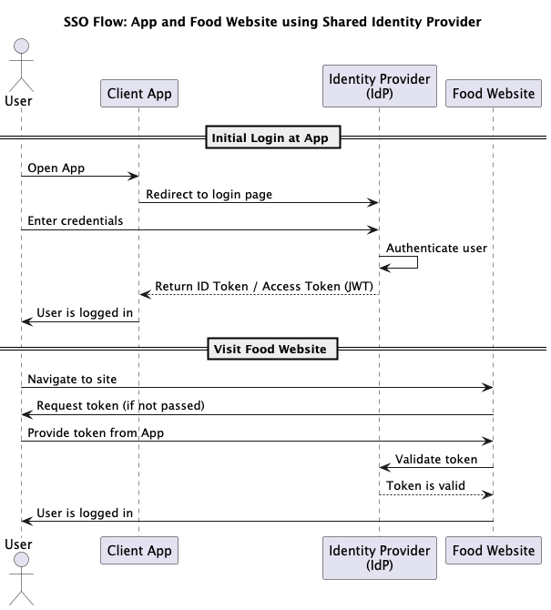

# Single Sign-On (SSO)

## About

Single Sign-On (SSO) is an **authentication mechanism** that enables users to log in **once** and gain access to **multiple related applications** without being asked to log in again for each of them.

Instead of each application having its own login system, **authentication is centralized** through a shared system called an **Identity Provider (IdP)**.

**Example: App and Food Website**

Consider a **banking app** and a **partnered food delivery website**. When a user logs into the banking app, they are authenticated by a central identity provider. Later, if they visit the food website (also integrated with the same identity provider), they are automatically recognized and logged in — no need to enter the username or password again.

## **SSO Flow**

<figure><figcaption></figcaption></figure>

1. **User logs in to the main app**
   * The app redirects the login request to an **Identity Provider** (IdP).
   * The user enters credentials.
   * The IdP authenticates the user and creates a **session**.
2. **Token is issued**
   * The IdP generates an **access token** and possibly an **ID token** (e.g., JWT).
   * These tokens contain claims about the user (username, email, roles, etc.).
3. **App stores the token**
   * The app stores the token temporarily (e.g., in memory or secure local storage).
4. **User clicks link to the food website**
   * The user is redirected to the food website.
   * The app passes the token (either through query param, cookie, or header).
5. **Food website validates the token**
   * The food website checks if the token is valid.
   * It may call the IdP or verify the JWT signature locally.
   * If valid, the user is authenticated without logging in again.

## Key Components

<table><thead><tr><th width="201.712646484375">Component</th><th>Description</th></tr></thead><tbody><tr><td><strong>Identity Provider (IdP)</strong></td><td>A centralized authentication system that all apps trust (e.g., Keycloak, Okta, Azure AD)</td></tr><tr><td><strong>Service Provider (SP)</strong></td><td>The app or website that delegates authentication to the IdP (e.g., your banking app or food site)</td></tr><tr><td><strong>Token (JWT/Opaque)</strong></td><td>A digital proof that the user has been authenticated</td></tr><tr><td><strong>Protocol</strong></td><td>The standard used to communicate authentication: OAuth2.0, OpenID Connect (OIDC), or SAML</td></tr></tbody></table>

## **Common Protocols Used**

<table><thead><tr><th width="203.8133544921875">Protocol</th><th>Purpose</th></tr></thead><tbody><tr><td><strong>OAuth2.0</strong></td><td>Authorization protocol, issues access tokens</td></tr><tr><td><strong>OpenID Connect (OIDC)</strong></td><td>Built on top of OAuth2, used for Authentication (includes ID token)</td></tr><tr><td><strong>SAML 2.0</strong></td><td>XML-based protocol, often used in enterprise SSO (e.g., for HR systems)</td></tr></tbody></table>

## **Token Types**


* **Access Token** is used to access APIs and must be presented in every request (usually in the `Authorization: Bearer` header).
* **ID Token** is only used in OpenID Connect and meant for identity — not for accessing APIs.
* **Refresh Token** is kept secure and **never exposed to frontend apps** in public clients like browsers.


<table data-full-width="true"><thead><tr><th width="142.529541015625">Token Type</th><th>Purpose</th><th>Contains</th><th width="197.0059814453125">Used By</th><th>Lifespan</th></tr></thead><tbody><tr><td><strong>Access Token</strong></td><td>Grants access to protected resources</td><td>User ID, scopes/permissions, expiry, audience</td><td>Resource servers (APIs, microservices)</td><td>Short-lived (minutes)</td></tr><tr><td><strong>ID Token</strong></td><td>Verifies the identity of the authenticated user</td><td>User info (email, name, username), issued time, expiry</td><td>Client applications (e.g., frontend, app)</td><td>Short-lived (minutes)</td></tr><tr><td><strong>Refresh Token</strong></td><td>Issues a new access token without re-login</td><td>Client ID, user ID, token expiry</td><td>Authorization server (IdP)</td><td>Long-lived (hours/days)</td></tr></tbody></table>

## **Token Propagation in Microservices**

When using SSO in microservices:

* The **token is forwarded** between services (usually HTTP headers).
* Each service must validate the token.
* Centralized token verification reduces duplicated logic.

For example:

* App → API Gateway → Order Service → Delivery Service
* The access token must be passed through each layer.

## **Security Considerations**

1. **Token Security**
   * Use **short-lived access tokens** and **refresh tokens**.
   * Store tokens securely (e.g., not in local storage for web apps).
   * Tokens must be signed (e.g., using RSA or HMAC) and verified on each request.
2. **Token Expiration & Revocation**
   * Tokens should expire quickly to limit impact if stolen.
   * Include a **revocation mechanism** (e.g., token blacklist or introspection endpoint).
3. **Logout**
   * Implement **Single Logout (SLO)** to end sessions across all systems when user logs out from one.
   * This is harder in practice and needs careful handling via the IdP.
4. **CSRF & CORS**
   * Handle cross-origin scenarios properly (especially when passing tokens between domains).
   * Use secure cookies and CSRF tokens where needed.
5. **TLS Everywhere**
   * All communication between client, IdP, and service providers must use HTTPS.

## **Common Tools for Implementing SSO**

<table data-full-width="true"><thead><tr><th width="305.8228759765625">Tool</th><th>Purpose</th></tr></thead><tbody><tr><td><strong>Keycloak</strong></td><td>Open-source identity provider with OAuth2, OIDC, SAML support</td></tr><tr><td><strong>Okta</strong></td><td>Cloud-based IdP for enterprise SSO</td></tr><tr><td><strong>Spring Security + OAuth2 Client</strong></td><td>Common in Java Spring Boot applications</td></tr><tr><td><strong>Azure AD / Google Identity</strong></td><td>Common external IdPs for SSO</td></tr><tr><td><strong>API Gateway (e.g., Kong, NGINX)</strong></td><td>Used for token validation and enforcement</td></tr></tbody></table>

## **Advantages**

* **Improved user experience**: One login for many services.
* **Centralized authentication**: Easier to enforce security policies.
* **Reduced password fatigue**: Users don’t have to remember multiple credentials.
* **Auditability and logging**: Track access across all systems from one place.
* **Faster onboarding/offboarding**: Add or remove access from a central system.

