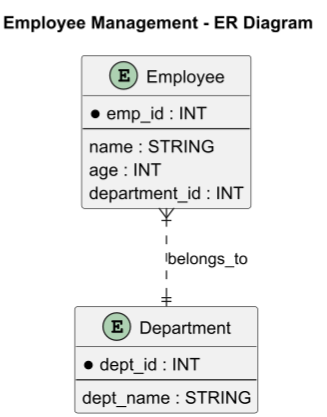
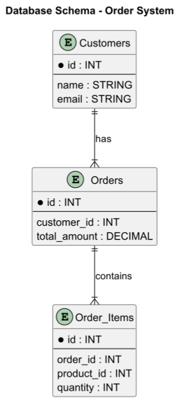

# ER Diagram (Entity-Relationship)

## About

An ER Diagram represents data models and relationships between entities in a database. It is widely used in database design and schema planning.


Refer to the official documentation for more details - [https://plantuml.com/er-diagram](https://plantuml.com/er-diagram)



[entity-relationship-diagram-erd](../../../../../database/sql-databases/rdbms/entity-relationship-diagram-erd/)


### **Key Elements**

1. **Entities**
   * Represented as **rectangles**, denoting **real-world objects** (e.g., `Customer`, `Order`).
2. **Attributes**
   * Represented as **ellipses** connected to entities.
   * **Primary Key (PK)** – Unique identifier (underlined).
   * **Foreign Key (FK)** – Connects to another entity.
3. **Relationships**
   * Represented as **diamonds** between entities (e.g., `Places Order`).
   * **1:1, 1:M, M:N** relationships specify cardinality.
4. **Cardinality & Participation**
   * **(1,1), (0,N), (M,N)** define relationship constraints.

## 1. **Employee Management System**

This represents **database entities and relationships** for an **Employee Management System**.


* **Entities (`entity Name { }`)**.
* **Primary Keys (`* field : type`)**.
* **Relationships (`}|..||`)**.


```java
@startuml
title Employee Management - ER Diagram

entity Employee {
    * emp_id : INT
    --
    name : STRING
    age : INT
    department_id : INT
}

entity Department {
    * dept_id : INT
    --
    dept_name : STRING
}

Employee }|..|| Department : belongs_to

@enduml
```

<figure><figcaption></figcaption></figure>

## 2. Order System

This represents **tables and their foreign key constraints**.

```plant-uml
@startuml
title Database Schema - Order System

entity Customers {
    * id : INT
    --
    name : STRING
    email : STRING
}

entity Orders {
    * id : INT
    --
    customer_id : INT
    total_amount : DECIMAL
}

entity Order_Items {
    * id : INT
    --
    order_id : INT
    product_id : INT
    quantity : INT
}

Customers ||--|{ Orders : has
Orders ||--|{ Order_Items : contains

@enduml
```

<figure><figcaption></figcaption></figure>


