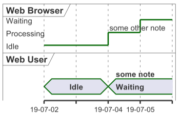

# Timing Diagram

## About

A Timing Diagram models the state of objects over time, focusing on time-based changes in interactions. It is useful for real-time systems, embedded systems, and protocol modeling.


Refer to the official documentation for more details - [https://plantuml.com/timing-diagram](https://plantuml.com/timing-diagram)


### **Key Elements**

1. **Lifelines (Objects or Entities)**
   * Represented as **horizontal lines**, showing how an entity behaves over time.
2. **States**
   * Represented as **labels** along the timeline (e.g., "Idle", "Processing", "Completed").
3. **Time Axis**
   * Represented as **a horizontal timeline** tracking event occurrences.
4. **State Changes**
   * **Vertical transitions** show state changes at specific time intervals.
5. **Messages**
   * Represented as **arrows** between lifelines.

## 1. Task Execution Over Time

```plant-uml
@startuml
robust "Web Browser" as WB
concise "Web User" as WU

use date format "YY-MM-dd"

@2019/07/02
WU is Idle
WB is Idle

@2019/07/04
WU is Waiting : some note
WB is Processing : some other note

@2019/07/05
WB is Waiting
@enduml
```

<figure><figcaption></figcaption></figure>

