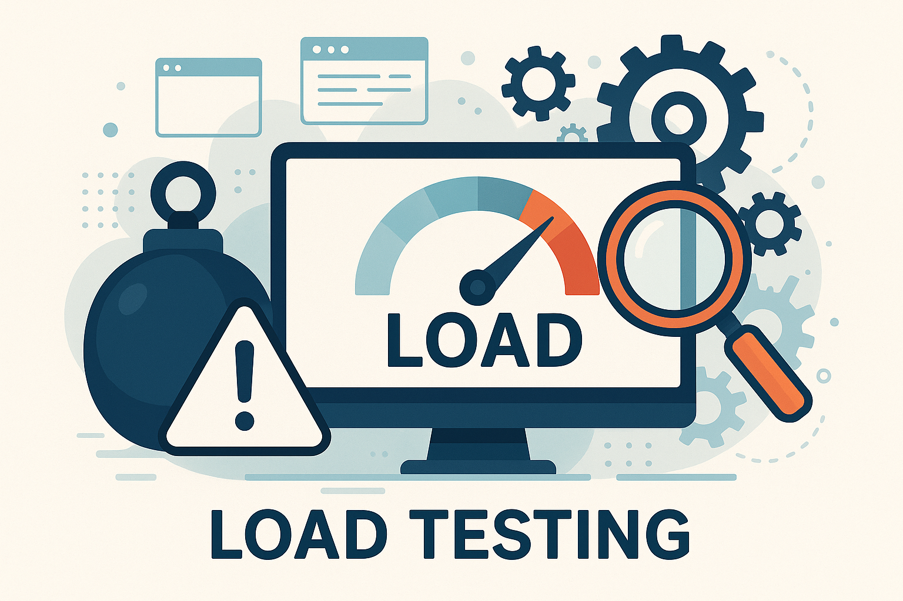

# Load Testing

## About

**Load Testing** is a type of performance testing where a system is tested under a specific expected load to measure its behavior. The goal is to determine how the system performs when multiple users or processes access it simultaneously under normal or peak conditions.

It focuses on validating:

* Response time
* System stability
* Resource usage (CPU, memory, bandwidth, etc.)
* Throughput (requests per second)
* Error rates or failure under expected load

<figure><figcaption></figcaption></figure>

## **Purpose**

The objective of load testing is not to break the system but to verify that it can **handle expected traffic gracefully**.

Typical goals:

* Determine the maximum number of concurrent users the system can support.
* Identify performance bottlenecks in infrastructure or application logic.
* Validate Service Level Agreements (SLAs) like response time < 2s for 95% of users.
* Check resource consumption patterns to tune auto-scaling and capacity planning.

## **When to Perform Load Testing ?**

* Before major product releases
* During performance optimization phases
* After infrastructure upgrades or migrations (e.g., database version change)
* Periodically during CI/CD cycles to detect regressions
* Before marketing events or high-traffic campaigns

## **What Components can be Load Tested ?**

* **APIs**: REST, GraphQL, gRPC services
* **Web UIs**: Login pages, dashboards, e-commerce checkout flows
* **Databases**: Read/write throughput, connection pool handling
* **Backend Services**: Queues, caches, authentication services
* **Third-party Integrations**: External payment gateways, APIs (with caution)

## **Typical Load Test Scenario**

* Simulate 100 concurrent users logging in and fetching dashboard data.
* Gradually ramp from 0 to 100 users over 5 minutes.
* Maintain steady load for 15 minutes.
* Collect response time, error count, and CPU/memory usage during the test.

